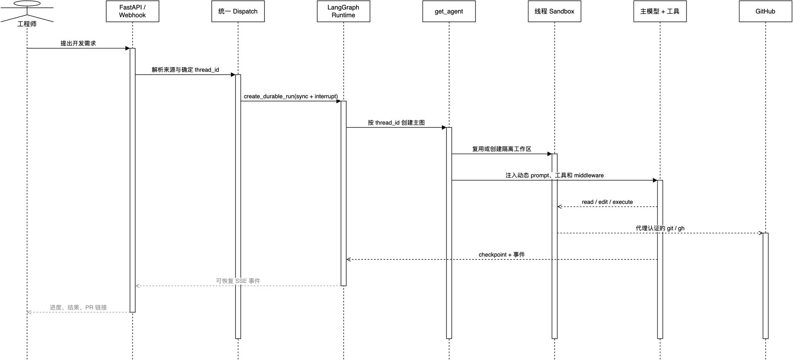

# 02. 把请求做成可恢复任务

## 学习目标

理解 `thread_id`、`run`、checkpoint 和 SSE 的分工，能解释为什么长任务不应绑死在一次浏览器 HTTP 连接上。

## 概念全解

一次 Agent 任务常常持续数分钟：读代码、跑测试、等待外部 API、处理用户补充消息。普通 HTTP 请求一断，服务器重启或浏览器刷新就可能让“正在干什么”消失。

Open SWE 把概念拆开：

- Thread：同一件事的长期对话档案袋。同一个 Slack 线程、Linear Issue 或 PR 会回到同一上下文。
- Run：档案袋里的一次实际开工。一条输入会触发一次可执行的图运行。
- Checkpoint：每一步的存档点。崩溃、重启或打断后可从最近状态恢复。
- Stream：面向 UI 的事件直播。用户可看进度、停止运行并在重新连接后回放。

## 架构图



[Draw.io](architecture/03-main-run-sequence.drawio) · [HTML](architecture/html/03-main-run-sequence.html)

读图方向从上到下。实线是调用，虚线是异步事件或返回。它抽掉了多余平台细节，保留了“入口 -> durable run -> 工厂 -> Sandbox/工具 -> 事件回传”。

- 统一派发：[agent/dispatch.py](../../agent/dispatch.py:113) 的 `create_durable_run` 默认使用 `durability="sync"`、`multitask_strategy="interrupt"` 和 `stream_resumable=True`。
- Dashboard 命令代理：[agent/dashboard/thread_api.py](../../agent/dashboard/thread_api.py:2038) 的 `proxy_dashboard_thread_commands` 负责鉴权、补充元数据并转发 Runtime 命令。
- 消息续接：[agent/utils/thread_ops.py](../../agent/utils/thread_ops.py:20) 的 `queue_message_for_thread` 保存 Dashboard 发给运行中线程的后续消息。

## 项目中的完整路径

`dispatch_agent_run` 把 Slack、Linear、GitHub、Dashboard 的触发统一落到 `create_durable_run`。这避免每个入口自己发明“是否忙、如何重试、如何保存”的逻辑。

```python
# 与 agent/dispatch.py 的控制流对应的伪代码
run = client.runs.create(
    thread_id,
    assistant_id,
    input={"messages": [new_message]},
    multitask_strategy="interrupt",
    durability="sync",
    stream_resumable=True,
)
```

`interrupt` 不是丢弃工作：它让新消息中断当前执行，在同步 checkpoint 的基础上带着完整历史继续。适合“你先别改那个文件，先检查另一个错误”这类追问。

## 最小可运行示例

设计自己的 Run 合同时，至少固定以下字段：

```json
{
  "thread_id": "issue-123",
  "assistant_id": "coding-agent",
  "input": {"messages": [{"role": "user", "content": "修复测试"}]},
  "durability": "sync",
  "idempotency_key": "可选：同一外部事件的唯一标识"
}
```

验证问题：浏览器刷新后，你能否根据 `thread_id` 重新订阅事件并显示当前 run？服务重启后，最近一次成功步骤还在不在？

## 常见误区与反例

1. 只在内存保存消息：多 worker、重启、横向扩容时上下文立刻丢失。
2. 用“正在运行”布尔锁处理追问：容易竞态。应让 Runtime 的并发/中断语义成为单一事实来源。
3. 只保存最终答案：中途工具结果、修改状态和失败原因不可恢复，也不可审计。

## 扩展边界与练习

- 低风险短任务可先只有 `thread_id + job table`，不必一开始自建工作流引擎。
- 外部 Webhook 还需加事件去重键，防止平台重投造成重复副作用。

练习：为“每天扫描失败 PR”设计 thread 命名规则。它应该按仓库、PR 还是触发时间聚合？解释你的恢复和去重理由。
