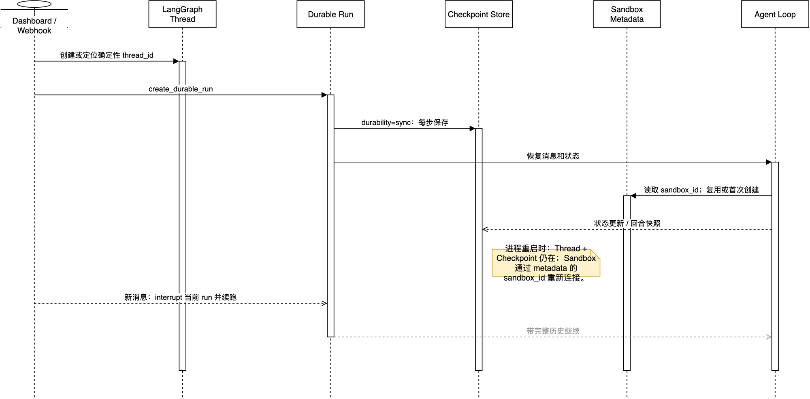

# 05. 让代码执行隔离且可续跑

## 学习目标

分清 Agent 的“对话状态”“运行状态”“文件工作区”分别放在哪里，理解为什么 Sandbox 断开时本项目宁可报错也不静默新建一个。

## 概念全解

很多 Agent 项目把所有东西都叫“memory”，这会导致恢复策略混乱。至少要分为四层：

- 对话/图状态：保存消息、工具结果和图执行位置；应跨服务进程；放在 LangGraph Thread / Checkpoint。
- 线程元数据：保存 `sandbox_id`、模型、来源和回合 git ref；应跨服务进程；放在 LangGraph Thread metadata。
- 工作区状态：保存 clone 的仓库、未提交修改和测试产物；应跨服务进程，但由每线程 Sandbox 承载。
- 进程缓存：保存已连接的 Sandbox backend；不应跨服务进程；本项目放在 `SANDBOX_BACKENDS` 内存字典。

这四层不能互相冒充。内存缓存丢了可以根据 `sandbox_id` 重连；Sandbox 真丢了则可能带走未提交修改，不能假装“恢复成功”。

## 架构图



[Draw.io](architecture/04-state-lifecycle.drawio) · [HTML](architecture/html/04-state-lifecycle.html)

图的重点是箭头方向：Run 把每一步交给 checkpoint，Agent 从 Run 恢复消息；Sandbox 的身份通过 Thread metadata 关联，而不是把整个文件系统塞进图状态。

- Sandbox 生命周期：[agent/server.py](../../agent/server.py:429) 的 `ensure_sandbox_for_thread` 在缓存命中时 ping、仅有 ID 时重连、二者都无时才创建。
- 状态缓存：[agent/utils/sandbox_state.py](../../agent/utils/sandbox_state.py:1) 的 `SANDBOX_BACKENDS` 用于进程内快速复用，不是持久化真相。
- 回合快照：[agent/server.py](../../agent/server.py:803) 的 `_record_turn_checkpoint` 用 git ref 记录每个用户回合的工作区起点。
- 运行派发：[agent/dispatch.py](../../agent/dispatch.py:113) 使用 `durability="sync"` 在每步同步 checkpoint。

## 项目中的完整路径

`ensure_sandbox_for_thread` 的三种情况非常值得照抄：

```text
有内存 backend -> ping 成功 -> 刷新 GitHub Proxy -> 复用
无内存 backend，但 metadata 有 sandbox_id -> 重连 -> 刷新 Proxy -> 复用
二者都没有 -> 创建 Sandbox -> 将 sandbox_id 写回 metadata
已有 Sandbox 但不可达 -> 主 Agent 报 SandboxUnreachableError，不自动替换
```

最后一条看似“不够自动化”，实际是在保护用户。新 Sandbox 是空的；自动换一个会让用户以为旧工作仍在，结果未提交代码已经没了。Reviewer 是例外，因为它的 checkout 每次都可从 PR 重新构造，因此 `allow_replacement=True`。

## 最小可运行示例

为你自己的“可执行 Agent”至少持久化一个工作区句柄：

```json
{
  "thread_id": "ticket-42",
  "workspace": {
    "provider": "sandbox",
    "id": "sbx_abc",
    "repo": "acme/app",
    "base_sha": "..."
  }
}
```

恢复时先尝试连接该 `id`，失败时返回“工作区不可达”。只有用户明确选择“从干净工作区重建”时才创建新的，并保留旧 ID 和原因用于审计。

## 常见误区与反例

1. “每次任务都新建容器”：简单但昂贵，且追问无法看到上一轮改动。
2. “连不上就自动新建”：最危险，容易悄悄丢工作。
3. 把未提交的文件改动只存在模型消息中：模型无法可靠还原 shell 做过的变更。

## 扩展边界与练习

- 只读问答 Agent 不需要 Sandbox；Open SWE 的 PR Chat 就使用虚拟 `/pr/` 文件和只读 GitHub 工具。
- 高价值改动可周期性把补丁或 git ref 备份到独立存储，降低 Sandbox 生命周期风险。

练习：假设 Sandbox 保留 24 小时。请定义第 25 小时用户回来追问时的页面提示和两种可选恢复方案。
