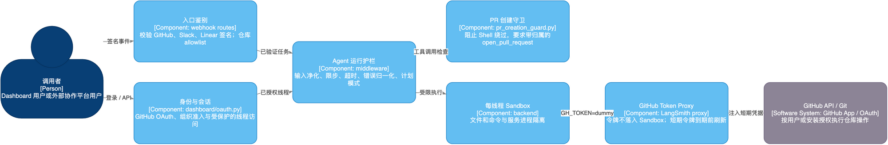

# 06. 安全不是一句提示词

## 学习目标

理解 Agent 系统的三道安全问题：谁发起任务、模型能调用什么、执行时用谁的身份；能据此设计最小权限方案。

## 概念全解

Agent 的风险不只在“模型会不会胡说”，而在它能代表谁调用哪些系统。至少分别处理：

- 请求是否真来自平台：由 Webhook 入口回答，本项目验证 GitHub、Slack、Linear 签名。
- 用户是否有权访问线程或仓库：由 Dashboard/API 回答，本项目使用 GitHub OAuth、组织准入和线程所有权检查。
- Agent 这次可以做哪些动作：由工具与中间件回答，本项目使用 curated tools、计划模式和 PR 守卫。
- Sandbox 如何访问 GitHub：由凭据代理回答，本项目在 Sandbox 内只使用 `GH_TOKEN=dummy`，由代理注入真实短期 token。

## 架构图



[Draw.io](architecture/05-safety-components.drawio) · [HTML](architecture/html/05-safety-components.html)

这是边界图，不是网络拓扑图。它说明可信输入逐层获得权限：签名事件和 OAuth 会话都先被验证；真正执行 GitHub 操作时，Sandbox 不直接保存真实令牌。

- GitHub 签名：[agent/utils/github_comments.py](../../agent/utils/github_comments.py:51) 的 `verify_github_signature` 会在未配置 secret 或签名无效时拒绝 Webhook。
- Slack 签名：[agent/utils/slack.py](../../agent/utils/slack.py:107) 的 `verify_slack_signature` 验证请求时间戳和签名。
- Linear 签名：[agent/webhooks/common.py](../../agent/webhooks/common.py:1001) 的 `verify_linear_signature` 验证 Linear Webhook。
- 用户令牌解析：[agent/utils/auth.py](../../agent/utils/auth.py:432) 的 `resolve_github_token` 优先用用户 OAuth，必要时使用 App 安装令牌。
- 令牌刷新：[agent/utils/github_proxy.py](../../agent/utils/github_proxy.py:1) 的 `maybe_refresh_proxy_token` 在临近过期时刷新 Sandbox Proxy token。

## 项目中的完整路径

当主 Agent 需要在 Sandbox 中运行 `git` 或 `gh` 时，系统不是把真实 GitHub token 写入环境变量，而是由 LangSmith Sandbox 的 GitHub proxy 对 GitHub 流量注入认证。提示词要求命令写成 `GH_TOKEN=dummy gh ...`，这个 dummy 只为通过 CLI 本地检查；代理负责真正授权。

```text
用户 OAuth / GitHub App 短期令牌
  -> 服务进程解析并缓存到本次线程
  -> 配置 Sandbox GitHub Proxy
  -> Sandbox 执行 GH_TOKEN=dummy gh ...
  -> Proxy 仅对 GitHub 流量注入真实凭据
```

这降低了“模型读文件或 shell 输出时拿到长期真实 token”的风险，但不等于没有风险：Sandbox 的网络出口、GitHub App 权限、可执行命令和日志脱敏仍需部署方配置。

## 最小可运行示例

从最小权限矩阵开始：

- 读取公开仓库：默认允许，由系统批准。
- 修改隔离工作区：默认允许，由系统批准。
- 推送分支：按仓库 allowlist 控制，由组织或仓库管理员批准。
- 创建 PR：必须通过专用工具，由触发用户或策略批准。
- 删除云资源、转账、发正式邮件：不暴露给模型，必须人工审批。

## 常见误区与反例

1. “OAuth 登录了就可以无限权限”：登录只证明身份，不能替代资源和动作级授权。
2. 把长期 API Key 放进提示词、文件或 Sandbox 环境：模型、工具输出和日志都可能泄露它。
3. 对公网 Webhook 只校验 JSON 字段：任何人都能伪造请求，应校验官方签名。

## 扩展边界与练习

- 生产部署要将 Runtime 放到 HTTPS、API Gateway/WAF 或私网之后；[INSTALLATION.md](../INSTALLATION.md:680) 明确警告 `LANGGRAPH_AUTH_TYPE=noop` 不能裸露公网。
- 高风险系统可加入基于策略的授权、双人审批、不可篡改审计日志和网络 egress allowlist。

练习：给“删除用户数据”的 Agent 动作设计审批协议。说明模型提交什么、审批者看什么、工具最终验证什么。
