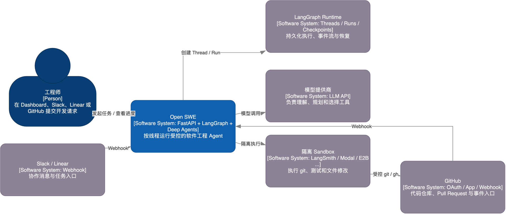

# 07. 什么时候拆专用 Agent

## 学习目标

能判断何时应从主 Agent 拆出 Reviewer、Analyzer、只读 Chat；理解“多 Agent”不是让更多模型互相聊天，而是把不同目标和权限放进不同图。

## 概念全解

主 Agent 的目标是完成软件工程任务，因此它需要写工作区、跑测试、推送分支、开 PR 等能力。代码审查的目标不同：找出可证明的 PR 问题，绝不能顺手改代码。把二者塞进一个工具集里，会让审查 Agent 获得不必要的写权限，也会让主 Agent 的提示词混入审查评分标准。

Open SWE 的拆分方式很务实：

- `agent`：目标是交付开发任务；可写 Sandbox、调用平台工具、开 PR；因为需要完整开发循环而独立。
- `reviewer`：目标是对一个 PR 发布审查结果；只有只读审查工具，没有 commit、push、开 PR；因此将“发现问题”和“修改问题”分离。
- `analyzer`：目标是学习每个仓库的审查偏好；读取历史/结果并保存 style prompt；后台学习不干扰实际开发 run。
- `chat`：目标是回答 PR 相关问题；没有 Sandbox，使用虚拟 PR 文件和只读 GitHub 工具；问答不应拥有代码执行能力。

## 架构图



[Draw.io](architecture/01-system-context.drawio) · [HTML](architecture/html/01-system-context.html)

在该图的 Components 页，`专用图`是一个明确边界：它们共享 LangGraph Runtime 的线程/运行机制，但不是主 Agent 的“不同 prompt 模式”。

- Reviewer：[agent/reviewer.py](../../agent/reviewer.py:1402) 的 `get_reviewer_agent` 仅添加、更新、发布 finding，不接入写代码工具。
- Analyzer：[agent/analyzer.py](../../agent/analyzer.py:167) 的 `get_analyzer` 用 skill 指导 bootstrap/continual 两种审查风格学习。
- PR Chat：[agent/chat.py](../../agent/chat.py:220) 的 `get_chat_agent` 显式排除 `execute`、`write_file`、`edit_file`、`delete`。
- 图注册：[langgraph.json](../../langgraph.json:1) 的 `graphs` 将它们以不同 assistant id 注册给 Runtime。

## 项目中的完整路径

Reviewer 是很好的“按风险裁剪”例子：

```text
PR 事件 -> reviewer graph
  -> 准备仓库和受限 diff
  -> 模型只调用 finding 工具
  -> publish_review 发布单次审查

PR 问答 -> chat graph
  -> 将 diff/findings 作为虚拟 /pr/ 文件
  -> 只读文件/代码搜索/GitHub 工具
  -> 回答，不执行命令
```

这比“主 Agent 接到审查任务时自己记得别改”可靠得多，因为工具能力本身已经不同。

## 最小可运行示例

若你的产品同时要“退款处理”和“退款解释”，可以这样切：

```text
refund-explainer：只读订单、解释规则、不能写库
refund-operator：创建退款申请、必须携带审批状态
```

不必为了名字好听创建五个 Agent。只有目标、权限、上下文、失败处理四项中至少两项明显不同，拆分才值得。

## 常见误区与反例

1. 把多个 Agent 当作提高准确率的万能药：如果它们权限和上下文相同，只是在增加成本和沟通噪音。
2. 子 Agent 继承父 Agent 的所有工具：子 Agent 往往更难观察，默认应缩小权限。
3. 用“角色 prompt”代替工具隔离：模型仍然可能误调用写工具。

## 扩展边界与练习

- 需要并行探索时，主 Agent 可以通过 Deep Agents 的 `task` 工具委派子任务；父 Agent 负责最终整合与外部副作用。
- 用户真正需要人工判断时，优先进入审批/队列，而不是再叠一层“裁判 Agent”。

练习：写出你现有主 Agent 的三个任务类型。按“目标、权限、上下文、失败处理”比较，判断是否至少应拆一个只读 Agent。
