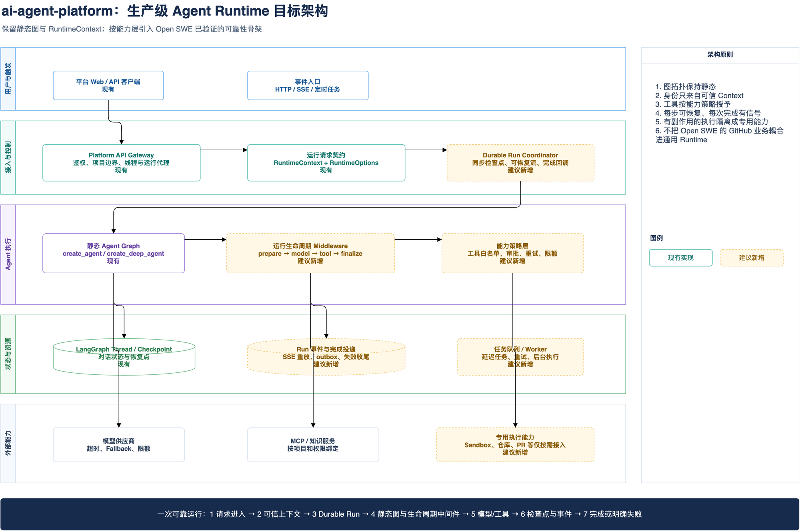
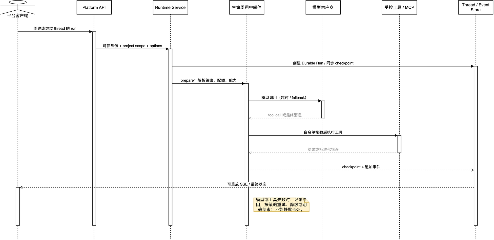

# 把 Open SWE 的生产骨架迁移到 ai-agent-platform

## 结论先说

可以迁移，但**不能把 Open SWE 整个搬过去**。

正确做法是：保留 `ai-agent-platform/apps/runtime-service` 已有的静态图、`RuntimeContext`和`RuntimeRequestMiddleware`；把 Open SWE 中与业务无关的可靠运行机制，拆成独立的生命周期、调度、策略和观测能力后逐步引入。

Open SWE 是一个完整的 Coding Agent 产品，GitHub、PR、Sandbox、Slack、Linear、代码审查和 CI 自动修复彼此协作。`ai-agent-platform`是多 Agent 平台。直接复制 Open SWE 的`agent/` 目录，会把代码研发场景的身份、工具、提示词和工作区假设带进所有业务 Agent，最后只会得到一坨难维护的耦合。

目标不是“让 ai-agent-platform 变成 Open SWE”，而是让它具备 Open SWE 的生产级运行品质：**可控、可恢复、可观测、失败有结论、外部副作用可隔离。**

## 分阶段专题文档

本文只负责迁移总览、边界和路线图。具体设计已经按实施顺序拆到下面 5 篇专题文档，后续实现时按阶段阅读和验收，不要把所有机制一次性塞进通用 Runtime。

| 阶段 | 文档 | 先解决什么问题 |
| --- | --- | --- |
| 0 | [运行契约、身份与幂等](10-migration-phase-0-contract-and-idempotency-zh.md) | 请求身份、配置快照、Thread/Run 关系和重复执行 |
| 1 | [Run 可靠性、Inbox 与失败收敛](11-migration-phase-1-run-reliability-and-inbox-zh.md) | 超时、Fallback、工具错误、运行中追加消息和僵尸 Run |
| 2 | [Durable Run、命令/SSE 与恢复](12-migration-phase-2-durable-run-and-stream-zh.md) | 后台运行、断线恢复、命令与事件分离 |
| 3 | [工具能力、审批与副作用隔离](13-migration-phase-3-capability-and-side-effects-zh.md) | 工具权限、写操作幂等、审批和 Sandbox 边界 |
| 4 | [观测、质量反馈与发布门槛](14-migration-phase-4-observability-and-quality-zh.md) | Trace、指标、质量反馈、灰度和回滚 |

推荐顺序是 0 -> 1 -> 2 -> 3 -> 4。阶段 0 和 1 是运行基础，阶段 2 才切生产流式协议，阶段 3 处理高副作用能力，阶段 4 最后建立可量化的发布门槛。

## 两边各自应该保留什么

| 来源 | 应保留的核心 | 原因 |
| --- | --- | --- |
| `ai-agent-platform/runtime-service`| 静态`create_agent`/`create_deep_agent` 图 | 图拓扑稳定，部署、测试和版本演进可预测。 |
| `ai-agent-platform/runtime-service`|`RuntimeContext` | 用户、租户、角色、权限、项目范围来自可信身份，不让请求体伪造。 |
| `ai-agent-platform/runtime-service`|`RuntimeRequestMiddleware` | 在不重建图的前提下，于请求期解析模型、提示词、工具。 |
| Open SWE | Durable Run 的统一派发 | 将线程、同步 checkpoint、可恢复流和完成通知收敛为一个契约。 |
| Open SWE | 生命周期和可靠性中间件 | 处理模型超时、工具异常、重试、限步、Fallback、消息格式兼容等横切问题。 |
| Open SWE | 高副作用能力的专用隔离 | Sandbox、仓库和凭据代理只属于 Coding Agent，不属于所有 Agent。 |

## 目标架构



[可编辑 Draw.io 源文件](architecture/09-ai-platform-production-agent-target.drawio) · [可缩放 HTML 查看器](architecture/html/09-ai-platform-production-agent-target.html)

读图方式：从上到下看职责边界，从左到右看一次运行的控制流。白色实线卡片表示 `ai-agent-platform` 已有的设计方向；浅琥珀虚线卡片表示应按阶段新增的通用能力。图中的 Sandbox、PR 等只作为“专用执行能力”出现，明确不进入通用 Runtime 的默认工具集合。

| 图元素 | 当前源码或迁移来源 | 作用 |
| --- | --- | --- |
| 运行请求契约 | `apps/runtime-service/runtime_service/runtime/context.py` | 把可信身份与可变运行选项分离。 |
| 请求解析中间件 | `apps/runtime-service/runtime_service/middlewares/runtime_request.py` | 为本次模型调用注入实际模型、提示词和工具。 |
| 静态 Agent 图 | `apps/runtime-service/runtime_service/agents/*/graph.py`、`services/*/graph.py` | 固定图拓扑，避免为每次请求临时重建业务图。 |
| Durable Run | `agent/dispatch.py:create_durable_run`| 将`thread_id`、`durability="sync"`、中断策略、事件重放和完成通知统一。 |
| 生命周期准备 | `agent/middleware/prepare_run.py`、`agent/server.py:PrepareAgentRunMiddleware` | 在模型前准备环境与上下文，在执行前后处理状态。 |
| 可靠性中间件 | `agent/middleware/model_call_timeout.py`、`tool_error_handler.py` 等 | 将“卡死或崩溃”变成可观测、可处理的结果。 |

## 最重要的设计取舍

### 1. 静态图不等于静态能力

`runtime-service`当前的好设计是图只创建一次。例如`deepagent_agent/graph.py`在模块加载时创建`graph`，但 `RuntimeRequestMiddleware` 会在每个模型调用时解析当前的模型、提示词和可选工具。

这比“每次运行根据配置重新 `create_deep_agent()`”更适合通用平台：图的结构可测试、可缓存、可发布；用户差异被限制在上下文与策略层。

Open SWE 的动态工厂并不是错误。它必须按线程取得 Sandbox、GitHub 身份、仓库指令、团队模型和 PR 策略，因此 `agent/server.py:get_agent` 在执行时才组装 Agent。把这套模式照搬到普通 SQL、测试用例或知识问答 Agent，复杂度没有收益。

### 2. RuntimeContext 是权限边界，不是方便传参的字典

当前 `RuntimeContext`包含`user_id`、`tenant_id`、`role`、`permissions`、`project_id`。`coerce_runtime_options()`会拒绝把身份字段混入`platform_runtime` 选项。

这条边界必须保留并加强：

```text
可信身份：只能由 Platform API 签发并写入 RuntimeContext
执行控制：thread_id、run 配置、可观测性开关
业务选项：model_id、system_prompt、工具名称、token 参数
机密信息：仅部署环境或服务端凭据存储，绝不进入上下文和模型消息
```

不要为了迁移方便，把 Open SWE 的 `configurable` 大字典整体透传到模型、工具或 MCP。它在 Open SWE 中承载了很多仓库和事件上下文；在多租户平台中必须被拆成明确的契约对象。

### 3. 生产可靠性应该成为平台能力，而不是每张图自己补

Open SWE 的价值主要不在某一个 Agent 提示词，而在中间件顺序和统一调度：工具异常转换为 `ToolMessage`、模型调用设置墙钟超时、运行有同步 checkpoint、事件流可重放、完成或失败均回调通知。

这些能力应成为 `runtime-service` 的共享“可靠性内核”。业务 Agent 只声明自己的必需工具、公开工具、私有中间件和输出契约。

## 目标运行链路



[可编辑 Draw.io 源文件](architecture/10-reliable-run-sequence.drawio) · [可缩放 HTML 查看器](architecture/html/10-reliable-run-sequence.html)

这张图描述的是**目标链路**，不是现状声明。实线同步箭头是本次运行的控制流；虚线箭头是持久化和事件流。关键原则是：模型超时、工具失败、客户端断线都不能让运行变成“没有消息的黑洞”。

```text
客户端请求
  -> Platform API 认证并注入 RuntimeContext
  -> Runtime 创建或恢复 Durable Run
  -> 生命周期中间件加载策略并记录 checkpoint
  -> 静态图调用模型
  -> 工具策略校验后执行
  -> 每个关键步骤写 checkpoint / 事件
  -> SSE 重放或完成状态回到客户端
```

## LangGraph 调用与 SSE 迁移决策

### 先划清内部调试与生产边界

`runtime-web` 是内部调试工具，可以直连 LangGraph Runtime、绕过 Platform API 权限，用于查看原始事件和调试 Graph。它不发布到线上，因此不参与生产接口兼容、鉴权设计或租户隔离设计。

生产端只保留一条路径：

```text
生产前端
  -> Platform API：认证、项目授权、配额、审计
  -> 构建 RuntimeContext + RuntimeOptions
  -> Run Coordinator
  -> LangGraph Runtime / 静态 Graph
  -> checkpoint、Run 状态、SSE 事件
```

`configurable` 继续承载 LangGraph 原生的 `thread_id`、checkpoint 路由和经校验的运行选项；`RuntimeContext` 承载 actor、tenant、project、权限等可信事实。两者都能传数据，但只有后者是业务安全边界。

### 目标生产协议：不保留旧兼容层

本次不兼容旧服务和旧使用方式，直接暴露统一 Run API：

| 接口 | 语义 |
| --- | --- |
| `POST /threads/{thread_id}/runs` | 创建或按幂等键返回已有 Run，返回 `run_id` |
| `GET /threads/{thread_id}/runs/{run_id}` | 查询 Run 状态和安全摘要 |
| `GET /threads/{thread_id}/runs/{run_id}/events` | 订阅或恢复 SSE 事件 |
| `POST /threads/{thread_id}/runs/{run_id}/cancel` | 停止 Run |
| `POST /threads/{thread_id}/runs/{run_id}/resume` | 审批或 interrupt 后继续 Run |

浏览器先创建 Run，再订阅事件；断线时查询同一 Run 并带 `Last-Event-ID` 重新订阅。不能因为 SSE 少了一帧就再次创建 Run。

内部可以继续用 Python `langgraph_sdk` 的 `client.runs.create` 创建 Runtime Run，但所有生产入口必须经过 Coordinator，统一幂等、`durability="sync"`、`stream_resumable=True`、版本快照、完成通知和错误码。

### 迁移实施顺序

1. 固化 `RuntimeContext`、`RuntimeOptions`、`RunnableConfig.configurable` 和 Run 状态的边界。
2. 实现唯一 Run Coordinator，所有生产 Run 从这里创建、取消和恢复。
3. 实现 Run 查询和可恢复 SSE；代理层只负责授权、脱敏和透明转发。
4. 生产前端直接接新接口，不维护 `runs.stream`、旧 commands 或旧事件格式。
5. `runtime-web` 保持内部直连调试，不进入线上网关和发布物。
6. 最后接入高副作用 Capability、质量观测和发布门槛。

### 最终建议

`ai-agent-platform` 的最小正确目标是：

```text
平台治理与 RuntimeContext
  + 版本化静态 Graph
  + Open SWE 的 Durable Run、同步 checkpoint、恢复流和可靠性 Middleware
  + 一套 Run API 与可恢复 SSE
  + 专用 Capability 隔离高副作用工具
```

没有旧兼容负担时，不要再保留 `runs.stream` 薄适配器、旧页面灰度或双状态机。这样可以把实现重点放在幂等、恢复、权限和可观测性上。


## 阶段路线图

09 只负责回答“迁移什么、为什么迁移、边界在哪里”。具体实现、字段、验收场景和禁止事项分别放在阶段文档中：

| 阶段 | 实施重点 | 详细文档 |
| --- | --- | --- |
| 0 | 运行契约、身份、Thread/Run 关系和幂等 | [阶段 0](10-migration-phase-0-contract-and-idempotency-zh.md) |
| 1 | Middleware 可靠性、超时、Fallback、Inbox 和失败收敛 | [阶段 1](11-migration-phase-1-run-reliability-and-inbox-zh.md) |
| 2 | Durable Run、Coordinator、统一 Run API/SSE 和断线恢复 | [阶段 2](12-migration-phase-2-durable-run-and-stream-zh.md) |
| 3 | Capability Profile、审批、写操作幂等和 Sandbox 隔离 | [阶段 3](13-migration-phase-3-capability-and-side-effects-zh.md) |
| 4 | Trace、指标、质量反馈、灰度发布和回滚 | [阶段 4](14-migration-phase-4-observability-and-quality-zh.md) |

推荐只按 `0 -> 1 -> 2 -> 3 -> 4` 推进：

```text
先让请求和身份稳定
  -> 再让 Run 在失败和断线下有确定行为
  -> 再切换生产级命令/事件协议
  -> 再接入高副作用能力
  -> 最后用观测和质量门槛控制发布
```

每个阶段都要先完成自己的验收测试，再进入下一阶段。不要在阶段 0 同时接入 Sandbox、复杂多 Agent 或全量工具；那会让失败原因无法归属。

迁移时只抽取 Open SWE 的通用语义：

- `RuntimeContext`和平台权限仍由`ai-agent-platform` 控制；
- Durable Run、checkpoint、恢复流和生命周期成为共享 Runtime 能力；
- 工具、Sandbox、GitHub、PR 等高副作用能力保留在专用 Capability；
- 09 的具体源码证据只用于解释设计来源，真正实现要按目标项目的依赖版本和数据模型重写。


## 验证边界

- 本文基于两边的源码静态核对，没有调用真实模型、MCP、Sandbox 或生产服务，因此不产生外部副作用。
- 目标图中的“建议新增”组件是设计路线，不是当前 `ai-agent-platform` 已实现功能。
- 在实施阶段 1 前，应先确认当前 LangChain、LangGraph、DeepAgents 版本的 middleware hook 兼容性，再移植任何 Open SWE middleware 代码。
