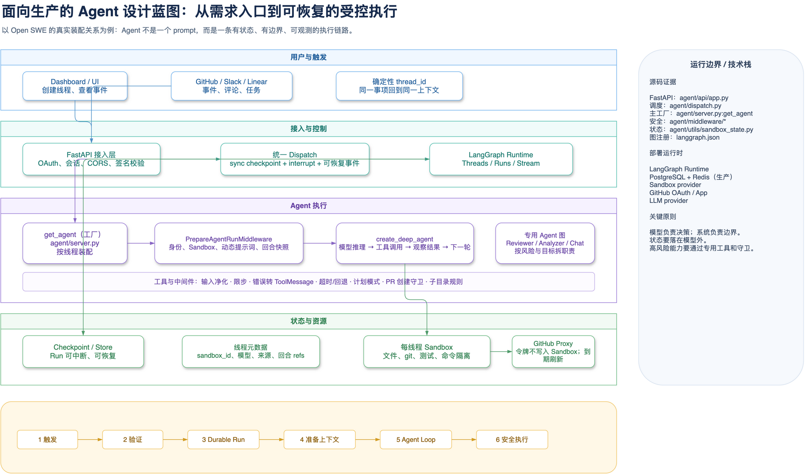

# 从 Open SWE 学习生产化 Agent 设计

这不是“如何写一个聊天机器人”的教程。这里要学的是：当 Agent 可以读代码、执行命令、调用外部 API、创建 PR 时，怎样把它设计成一个**可控制、可恢复、可审计**的系统。

Open SWE 是一个很好的研究样本：主开发 Agent 使用 `deepagents.create_deep_agent`，由 LangGraph Runtime 运行；FastAPI 负责业务入口；每个线程绑定一个隔离 Sandbox；Reviewer、Analyzer、PR Chat 被拆成独立图。它有生产化设计，但不意味着每个项目都需要原样复制。

## 先记住一句话

> **模型负责在任务内做判断；系统负责规定它能看什么、能做什么、失败后怎么办。**

只靠提示词让模型“谨慎一点”，不叫工程设计。真正的边界要落在工具、权限、状态和中间件上。

## 学习范围

- 权威源码范围：`agent/`、`ui/`、`langgraph.json`、`docs/INSTALLATION.md`。
- 当前项目使用：LangGraph、Deep Agents、LangChain middleware、FastAPI、LangGraph Runtime、Sandbox provider、GitHub OAuth/App。
- 本课程不把项目未证明使用的组件说成事实。例如 Kubernetes、消息队列、复杂多活架构都不是本仓库的现成实现。
- 图中的“生产 Runtime 需要 PostgreSQL 和 Redis”来自 [INSTALLATION.md](../INSTALLATION.md:657) 的生产部署说明；本地开发可使用 `langgraph dev`。

## 课程地图

1. [01-先划清产品边界](01-product-boundary.md)：一个 Agent 到底该负责什么，不该负责什么？
2. [02-把请求做成可恢复任务](02-durable-request-flow.md)：为什么要有 thread、run、checkpoint，而不是一次 HTTP 请求？
3. [03-让 Agent 成为可装配产品](03-agent-factory-and-context.md)：模型、提示词、工具、状态为什么在每次运行时组装？
4. [04-把能力关进工具与中间件](04-tools-and-middleware.md)：如何让 Agent 能干活又不会“想干啥就干啥”？
5. [05-让代码执行隔离且可续跑](05-state-and-sandbox.md)：Sandbox、工作区和检查点分别保存什么？
6. [06-安全不是一句提示词](06-security-and-permissions.md)：Webhook、OAuth、令牌代理、最小权限怎样配合？
7. [07-什么时候拆专用 Agent](07-specialist-agents.md)：主 Agent、Reviewer、Analyzer、Chat 为什么不能混成一个？
8. [08-生产化落地清单](08-production-and-roadmap.md)：从最小 Agent 到生产系统，哪些能力应按阶段增加？

## Open SWE 迁移专题

下面这组文档专门回答“哪些生产化设计值得迁移到 `ai-agent-platform`”。09 只讲整体边界、目标架构和路线图；具体借鉴点按实施阶段拆开，避免一个文档过长。

| 文档 | 重点 |
| --- | --- |
| [09-迁移总览](09-ai-platform-production-agent-migration-zh.md) | 两个项目的边界、目标架构、迁移原则和阶段入口 |
| [10-阶段 0：运行契约、身份与幂等](10-migration-phase-0-contract-and-idempotency-zh.md) | `RuntimeContext`、配置快照、确定性 Thread ID、PrepareRun 幂等、Run 状态 |
| [11-阶段 1：Run 可靠性、Inbox 与失败收敛](11-migration-phase-1-run-reliability-and-inbox-zh.md) | Middleware 顺序、超时、Fallback、工具错误、消息 Inbox、Stale Run Watchdog |
| [12-阶段 2：Durable Run、Run API/SSE 与恢复](12-migration-phase-2-durable-run-and-stream-zh.md) | Coordinator、统一 Run API、可恢复 SSE、完成通知 |
| [13-阶段 3：工具能力、审批与副作用隔离](13-migration-phase-3-capability-and-side-effects-zh.md) | Capability Profile、工具策略、写操作幂等、审批、Sandbox 隔离 |
| [14-阶段 4：观测、质量反馈与发布门槛](14-migration-phase-4-observability-and-quality-zh.md) | Trace、Run metadata、指标、质量反馈、子 Agent 观测、灰度和回滚 |
| [15-静态图、动态分支与动态图工厂](15-static-and-dynamic-graphs-zh.md) | 图拓扑、条件边、动态装配、`configurable` 与 `RuntimeContext` 的选择 |

## 总体蓝图



[可编辑 Draw.io 源文件](architecture/02-agent-design-blueprint.drawio) · [可缩放 HTML 查看器](architecture/html/02-agent-design-blueprint.html)

读图方法：从上到下读职责层，从左到右读一次请求；箭头表示控制或数据流。右侧栏是本仓库可核对的技术边界。图做了教学简化，例如没有把每个工具和每个 Dashboard 路由全部塞进去。

```text
需求/事件 -> 验证入口 -> Durable Run -> 准备上下文
         -> 模型决定下一步 -> 受控工具执行 -> checkpoint/事件 -> 用户看到结果
```

## 覆盖矩阵

- 多入口与系统边界：源码为 `agent/api/app.py`、`agent/webhooks/`；对应第 01 章；已完成静态源码/图校验；可继续扩展 API Gateway/WAF；状态为“讲义完成”。
- Thread、Run、恢复：源码为 `agent/dispatch.py:create_durable_run`；对应第 02 章；已完成静态源码/图校验；可继续扩展幂等消费；状态为“讲义完成”。
- Agent 工厂与上下文：源码为 `agent/server.py:get_agent`；对应第 03 章；验证为 `test_agent_assembly_context.py`；可继续扩展 Feature flag；状态为“讲义完成”。
- 工具与中间件：源码为 `agent/middleware/`、`agent/tools/`；对应第 04 章；已完成静态源码/图校验；可继续扩展策略引擎；状态为“讲义完成”。
- Sandbox 生命周期：源码为 `agent/server.py:ensure_sandbox_for_thread`；对应第 05 章；已完成静态源码/图校验；可继续扩展工作区快照仓库；状态为“讲义完成”。
- 身份、令牌、入口校验：源码为 `agent/dashboard/oauth.py`、`agent/utils/auth.py`；对应第 06 章；已完成静态源码/图校验；可继续扩展 OPA/审计系统；状态为“讲义完成”。
- 专用 Agent 图：源码为 `agent/reviewer.py`、`agent/analyzer.py`、`agent/chat.py`；对应第 07 章；已完成静态源码/图校验；可继续扩展人工队列；状态为“讲义完成”。
- 部署、监控、发布：源码为 `docs/INSTALLATION.md`、`Dockerfile`、测试/CI；对应第 08 章；已完成文档与配置检查；可继续扩展 SLO/灾备演练；状态为“讲义完成”。

## 验证记录与边界

- 图源文件均已执行 Draw.io `validate.py --score`：`0 error(s), 0 warning(s)`。
- 已导出普通 PNG 并进行视觉检查；图不是运行中的云环境截图。
- 本课程没有调用真实 LLM、真实 GitHub、生产 Runtime 或 Sandbox，以避免产生费用和外部副作用；因此对它们的结论来自源码与项目文档，不应误读为部署验收。
- `agent/` 的 AST 关系提取结果为 3,263 个节点、9,754 条边。课程只选取主链路相关事实，不把自动提取出的所有依赖误当成业务架构。

## 综合案例入口

读完后直接看 [08-生产化落地清单](08-production-and-roadmap.md) 的“把一个 PR 修复 Agent 做成系统”一节。它把本课程的线程、权限、Sandbox、工具和观察链路接成一个完整任务。
