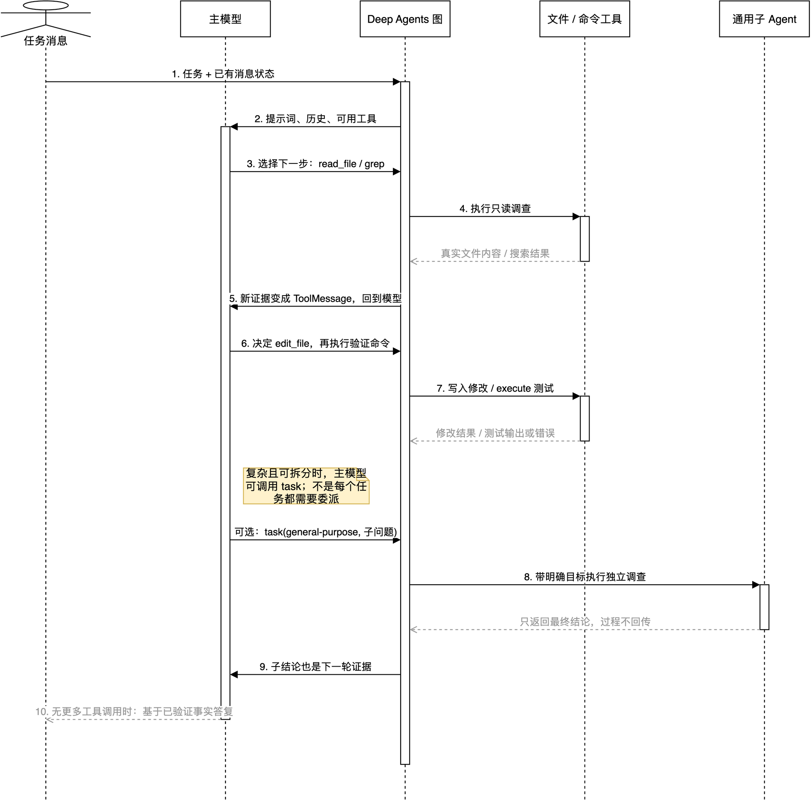

# Deep Agents 如何处理一个用户需求：主 Agent Loop

## 学习目标

这篇只解释一件事：**主 Agent 已经拿到用户任务以后，怎样一步步把任务做完。**

不讲消息怎样从网页、Slack、GitHub 或 FastAPI 进入系统；也不讲 sandbox 如何创建、thread 如何保存。这里从 Agent 手里已经有一条用户消息、一个可用工作目录开始。

读完应该能回答：

- Deep Agent 的“思考”在代码里到底是什么？
- 为什么它不会只调用一次模型就结束？
- 工具结果怎样改变下一步决策？
- 什么情况下主 Agent 会叫子 Agent？
- 它靠什么避免过早结束、无限循环或把错误当成功？

## 先纠正一个容易误会的词：它不是人类式的内心独白

把 Agent 叫作“思考”很方便，但更准确的说法是：

```text
模型根据当前可见信息，选择下一步动作；
动作拿回真实结果；
模型再根据新结果选择下一步。
```

模型内部怎样计算、是否输出推理文本，取决于模型提供商和模型配置，项目代码看不到也不依赖它。Open SWE 真正能控制的是：

- 每次模型能看到哪些任务、提示词、历史消息和工具；
- 模型可以选择哪些行动；
- 行动结果怎样以 `ToolMessage` 回到下一轮；
- 哪些规则、超时、错误和上限会限制这个循环；
- 什么时候没有更多工具调用，从而结束并答复用户。

因此，本文把“思考”理解为**可观察、可验证的行动决策循环**，而不是猜测模型脑中有什么过程。

## 一句话模型

主 Agent 的核心不是：

```text
用户问题 -> 模型 -> 一段答案
```

而是：

```text
用户任务 + 当前证据
       -> 模型选择下一步
       -> 调用工具或子 Agent
       -> 得到真实结果 / 错误
       -> 把结果加入上下文
       -> 模型重新选择下一步
       -> ...
       -> 不再需要工具时，给出最终答复
```

这就是常说的 Agent loop，也可理解为一个很实用的闭环：**判断 -> 行动 -> 观察 -> 再判断**。

## 先看一张只包含 Loop 的图



可编辑源文件：[`16-main-agent-loop.drawio`](open-swe-learning/architecture/premium/16-main-agent-loop.drawio)。离线缩放、搜索版本：[`16-main-agent-loop.html`](open-swe-learning/architecture/premium/html/16-main-agent-loop.html)。

从上到下阅读。第 3 到第 9 步会反复发生；第 10 步才是通常意义上的完成。图里故意没有画入口服务、线程、数据库、GitHub webhook 或 Dashboard，因为它们不属于本篇的 Agent Loop。

| 图中元素 | 当前项目/依赖的真实位置 | 在循环中的作用 |
| --- | --- | --- |
| 主模型 | `agent/server.py:get_agent` 传给 `create_deep_agent()` 的 `main_model` | 根据消息与工具列表选择下一步。 |
| Deep Agents 图 | `deepagents/graph.py:create_deep_agent()` | 自动装配工具节点、子 Agent、摘要与补丁中间件。 |
| 文件/命令工具 | Deep Agents `FilesystemMiddleware` | 提供 `read_file`、`grep`、`edit_file`、`execute` 等行动。 |
| 子 Agent | `agent/server.py:_general_purpose_subagent()` | 通过 `task` 工具接手一个相对独立的子问题。 |
| 循环边 | LangChain `create_agent()` 的 `model -> tools -> model` 条件边 | 有 tool call 就继续；无 tool call 才走向结束。 |

## 案例：修正 README 中过期的启动命令

假设用户已经把任务交给主 Agent：

> “README 里还写着旧启动命令，请改成当前 `make dev` 的说明，并验证文档中的命令和 Makefile 一致。”

下面不是假装记录某次模型的秘密推理，而是一个符合当前项目工具与循环规则的**典型行动轨迹**。

### 第 1 轮：先查证，不急着修改

模型看到任务后，最合理的下一步通常不是直接写文件，而是读取证据：

```text
模型选择：grep("make dev", README.md) + read_file("Makefile")
```

工具返回可能是：

```text
README：make start
Makefile：dev: uv run langgraph dev
```

这两个结果以 `ToolMessage` 追加到消息状态。下一轮模型看到的不再只是“用户说 README 过期”，而是“具体哪一行过期、正确命令是什么”。

### 第 2 轮：判断改动是否足够小

模型会基于上一轮证据决定：只改 README 的那段说明，还是还要找其他文档中的旧命令。一个稳妥但不扩大任务的动作可能是：

```text
模型选择：grep("make start")
```

如果结果只在 README 中出现，范围就清楚了；如果还有安装文档，模型会再根据用户任务决定是否一起改，或者在最终答复里说明发现但未动的范围。

### 第 3 轮：执行最小改动

证据足够后，模型调用：

```text
edit_file("README.md", 把 make start 改为 make dev，并补一句用途说明)
```

工具把修改是否成功、修改后的片段返回给模型。注意，`edit_file` 的成功只表示“文件写进去了”，不等于“内容正确”。所以循环还不能结束。

### 第 4 轮：验证自己的改动

模型会选择验证动作，例如：

```text
read_file("README.md")
execute("rg -n 'make start|make dev' README.md Makefile")
```

若输出显示 README 已包含 `make dev`，且 `Makefile` 的真实规则也是 `uv run langgraph dev`，则证据闭环完成。

若命令报错、README 还残留旧文本，或者发现 `make dev` 的语义并非预期，错误输出不会让整轮 Agent 直接消失。它会作为 `ToolMessage(status="error")` 进入下一轮，模型据此修正动作或解释阻塞原因。

### 第 5 轮：结束，而不是再做无关事情

当模型判断以下条件都成立：

- 已定位旧命令；
- 已做完必要修改；
- 已完成与用户请求相称的验证；
- 没有新的失败或未处理证据；

它就不再发出工具调用，而是输出一段最终答复，例如：

```text
已把 README 的启动命令改为 make dev，并核对它对应 Makefile 中的 uv run langgraph dev。
```

LangChain 的图遇到没有 tool call 的模型消息，就不再走 `tools` 节点，转向结束节点。这个“没有下一步动作”才是正常结束信号。

## 把案例压缩成一张接线图

```text
用户任务
  -> 模型：先读 README / Makefile
  -> 工具：返回旧命令和真实命令
  -> 模型：搜索影响范围
  -> 工具：返回匹配位置
  -> 模型：编辑 README
  -> 工具：返回修改结果
  -> 模型：读取并 grep 验证
  -> 工具：返回验证结果
  -> 模型：确认完成，输出最终答复
```

关键不是固定执行五步，而是每一步都由上一步的**真实结果**决定。简单任务可能两轮结束；复杂任务会更多轮，甚至把独立子问题交给 `task`。

## 这张图怎样在框架里真正形成

### 1. Open SWE 先把“主 Agent 的工作台”交给 Deep Agents

主工厂 [`agent/server.py`](../agent/server.py) 的核心调用是：

```python
create_deep_agent(
    model=main_model,
    tools=static_tools,
    subagents=[...],
    backend=agent_backend,
    middleware=[...],
)
```

这一步并没有手写 `while True`。它把模型、业务工具、沙箱 backend、中间件和子 Agent 规格交给 Deep Agents。

Deep Agents 自动补上编码任务常需的内置能力：

```text
read_file / ls / glob / grep
write_file / edit_file / delete
execute
task
```

其中 `task` 不是普通函数调用，而是一个“请另一个 Agent 完成独立子问题”的工具。

### 2. Deep Agents 内部仍然调用 LangChain 的 `create_agent()`

这里有一个容易混淆但很重要的事实：

```text
Open SWE 的业务代码
  -> 调用 deepagents.create_deep_agent()
  -> Deep Agents 内部调用 langchain.agents.create_agent()
  -> 返回 LangGraph CompiledStateGraph
```

所以此前说“Open SWE 没有直接调用 `create_agent()`”是准确的；但这不等于运行时完全没用它。当前安装的 Deep Agents 在 [`deepagents/graph.py`](../.venv/lib/python3.11/site-packages/deepagents/graph.py) 最后确实调用了 LangChain `create_agent()`。

LangChain 在该工厂里创建了两个关键节点：

```text
model 节点：把系统提示词、消息、工具 schema 发给模型
tools 节点：执行模型请求的工具，生成 ToolMessage
```

并添加条件边：

```text
模型有 tool_calls
  -> tools 节点
  -> 回到下一轮 model

模型没有 tool_calls
  -> 结束
```

这就是图上的闭环在代码中的准确对应。不是模型自己递归调用自己，而是 LangGraph 按图上的条件边反复调度节点。

## 每一轮模型真正看见什么

模型不是只读用户最后一句话。主 Agent 的一次模型请求大致由下列内容组成：

| 输入 | 从哪里来 | 它解决什么问题 |
| --- | --- | --- |
| 系统提示词 | `PrepareAgentRunMiddleware` -> `construct_system_prompt()` | 告诉 Agent 目标、约束、工作原则、当前工作目录和仓库规则。 |
| 用户任务与对话历史 | `state["messages"]` | 保留用户原始意图与此前的问答。 |
| 工具结果 | 同一个 `messages` 中的 `ToolMessage` | 把“我猜文件存在”替换为“工具实际读到的内容”。 |
| 当前可用工具 | Deep Agents 自动加入 + `server.py` 显式传入 | 告诉模型下一步实际可以执行什么行动。 |
| 状态字段 | 中间件 state，例如 `plan_mode`、`rendered_system_prompt` | 让同一轮遵守计划模式与运行准备结果。 |

模型输出也不只是文本，有两种常见形态：

```text
普通文本：说明、追问、最终答复
tool_calls：指定工具名和参数，例如 read_file(path="README.md")
```

有 `tool_calls` 时，模型是在说“请先替我做这些具体动作”；没有 `tool_calls` 时，图通常认为本轮可以结束。

## Deep Agents 自动补上的四个能力

### 文件和命令工具：把语言变成实际行动

`FilesystemMiddleware` 提供读取、搜索、修改文件的工具；当 backend 支持 sandbox 时，`execute` 也可执行命令。主 Agent 正是把 sandbox backend 传给 `create_deep_agent()`，这些工具才会在工作目录里真正操作，而不是只停在文本建议。

### `task`：把可独立的问题交出去

Open SWE 为主 Agent 配置了 `general-purpose` 子 Agent，必要时还会配置浏览器子 Agent。主模型可以像调用工具一样调用：

```text
task(
  subagent_type="general-purpose",
  description="检查认证中间件的调用方，返回兼容性风险；不要修改文件"
)
```

子 Agent 在自己的 Agent loop 里调查。父 Agent 不会收到子 Agent 的逐步工具输出，只会收到它的最终结论，作为一条 `ToolMessage` 进入父 Agent 的下一轮。

这适合“可以独立研究、结论可汇总”的工作，例如追踪多个调用方、查陌生模块、或需要浏览器交互的子问题。小改动自己读两三个文件更快，不该为了显得聪明就委派。

### 摘要：长任务不让上下文无限膨胀

Deep Agents 自动加入 summarization middleware。对话、工具结果和文件内容很长时，它会压缩较早的历史，并保留近期工作所需的信息；相关历史可由 backend 保存为文件。

它解决的是“任务做得越久，模型输入越大、越贵、越容易超上下文”的问题。摘要不是丢掉所有过去，而是把过去浓缩成足以继续工作的信息。

### 工具调用修补：避免断链

如果模型已经发出 tool call，但工具结果尚未写回消息历史，例如中途被取消或参数残缺，`PatchToolCallsMiddleware` 会补一条对应的失败 `ToolMessage`。这样下一轮不会面对“我刚才叫了工具，但系统完全没回应”的断链状态。

## Open SWE 在 Loop 外侧加的护栏

下面这些不是 Deep Agents 的基本循环，但它们直接决定主 Agent 如何做完任务。

| 护栏 | 真实实现 | 在循环中的作用 |
| --- | --- | --- |
| 正确的任务提示词 | `PrepareAgentRunMiddleware` | 每轮模型调用前注入针对当前任务的系统提示词。 |
| 子目录规则 | `SubdirAgentsReadMiddleware` | 读文件时附带适用的祖先 `AGENTS.md` 规则，避免改到受约束目录却不知道。 |
| 工具输入清洗 | `SanitizeToolInputsMiddleware` | 在行动前规范化模型给出的参数。 |
| 工具失败可见 | `ToolErrorMiddleware` | 将异常变成 `status="error"` 的 ToolMessage，让模型可修正。 |
| 子 Agent 短暂失败重试 | `ToolRetryMiddleware` | 对 `task` 的瞬态网络/超时错误最多重试，仍失败则把问题交回主模型处理。 |
| 计划模式 | `PlanModeMiddleware` | 开启计划模式后从模型可见工具中移除会改仓库/外部系统的工具。 |
| 模型调用上限 | `ModelCallLimitMiddleware(run_limit=5000)` | 防止模型-工具循环没有止境。 |
| 单次调用超时 / fallback | `ModelCallTimeoutMiddleware`、`ModelFallbackMiddleware` | 模型卡住或主模型失败时，结束或尝试降级模型。 |
| 过早结束防护（备用模块） | `ensure_no_empty_msg` | 代码库提供的 after-model 防护模块，可对部分空输出或过早文本输出注入确认动作。 |

这里必须区分“存在”与“已接线”：当前 checkout 的 `get_agent()` 默认 middleware 列表**没有**加入 `ensure_no_empty_msg`，所以它不是当前主 Agent Loop 的实际护栏，不能用它解释这次运行为什么继续或结束。该模块和测试仍在代码库中；若将来接入，它会在某些来源和状态下发现“模型没有工具调用、却也没有明确完成动作”时补救。它的目标是减少半途停下，不是阻止正常收尾。

## 一个更贴近代码的伪代码

下面省略框架样板，但保留真实控制方向：

```python
state.messages.append(user_task)
prepare_run_and_render_prompt_once()

while under_model_call_limit:
    request = {
        "system_prompt": rendered_prompt,
        "messages": state.messages,
        "tools": tools_visible_in_current_mode,
    }
    ai_message = model.ainvoke(request)
    state.messages.append(ai_message)

    run_after_model_guards()

    if not ai_message.tool_calls:
        break

    for tool_call in ai_message.tool_calls:
        try:
            result = run_tool_or_subagent(tool_call)
        except Exception as exc:
            result = ToolMessage(status="error", content=normalize(exc))
        state.messages.append(result)

return latest_assistant_answer(state.messages)
```

真实 LangChain 图是 `model -> tools -> model` 的条件边，而不是这段 Python 的 `while`。伪代码只是为了把循环关系看得更直观。

## 它怎样知道“已经完成”

没有单个万能的 `done=True` 开关。通常是几层信号叠加：

1. 模型检查现有证据后，不再发出工具调用。
2. 图据此不再从模型跳到 `tools`，而是走向结束。
3. 系统提示词要求“先理解、行动、验证，再结束”，使模型倾向于在验证后停下。
4. 代码库虽提供 `ensure_no_empty_msg` 作为可选的过早结束防护，但当前默认主 Agent 未接入它。
5. 上限、超时或无法恢复的错误可以强制停止，但这属于“未必完成的终止”，不等于成功完成。

所以要区分两件事：

```text
正常完成：模型基于验证证据，主动不再调用工具并给出结论
被迫终止：到达限制、超时或出现无法恢复的错误
```

用户看到“最终答复”时，最好看其中是否包含已做的修改和验证；不要仅把“模型停止输出”当作任务成功。

### 为什么“没有 tool call”会让框架结束

因为 Agent 图必须有一个明确的“下一步去哪里”信号。一次模型输出从框架角度主要分成两种：

```text
普通文本：模型说“这是我的答复”。
tool_calls：模型说“先替我执行这些动作，拿结果后我再判断”。
```

所以 `tool_calls` 不是普通正文中的一句“我想查文件”，而是结构化协议字段。模型产生：

```text
tool_calls = [read_file(...), grep(...)]
```

LangChain 就知道要把控制权交给 `tools` 节点。模型不产生这个字段时，框架没有可执行的工具名和参数，也没有理由凭空再调用一次模型，于是把该模型消息当成最终答复，走向 `END`。

当前安装版本的条件边就是下面这个逻辑：

```python
last_ai_message = latest_ai_message(state)

if len(last_ai_message.tool_calls) == 0:
    return END

return tools
```

源码注释直接称它为 Agent loop 的经典退出条件。它表示的是：

```text
没有 tool call = 模型没有请求下一步外部行动 = 本轮正常停止
```

它**不**表示：

```text
没有 tool call = 系统已经证明任务一定正确完成
```

可以把它理解成客服流程：

```text
“请查订单状态”     -> 有下一步动作，系统继续查询
“订单已退款完成”     -> 没有下一步动作，系统结束工单
```

客服可能说错，模型也可能过早总结。因此“是否结束”是框架的控制流判断；“是否真的完成”依赖模型此前是否按照提示词调用工具、读取事实并完成验证。

Open SWE 的主提示词因此要求模型持续处理任务、用工具获取真实证据、修改后验证，并明确说：每轮都应调用工具，除非已经百分之百确认任务完成。这是为了减少模型把中途总结误当作最终答复的机会，但它不是形式化证明。

### 两个与常规规则不同的结束出口

常规路径是：

```text
模型有 tool_calls -> tools -> ToolMessage -> 回主模型
模型无 tool_calls -> END
```

但框架还支持两个“工具已经给出可直接交付答案”的特例：

| 特例 | 为什么可直接结束 |
| --- | --- |
| 本轮所有客户端工具都标记 `return_direct=True` | 这些工具的返回值被设计成可以直接作为用户结果，不需要模型再解释。 |
| 结构化输出工具已生成结果 | schema 对应的结果已经写入 `structured_response`，图不必再让模型多跑一轮。 |

当前主 Agent 的普通读写、搜索、命令和 `task` 工具走的仍是常规路径：执行完后先把 `ToolMessage` 还给主模型，让它判断下一步，而不是工具一返回就宣布任务结束。

## 常见误解

### 误解 1：Deep Agent 会先在脑中写完完整计划，再一次性执行

不一定。它可以在复杂任务中使用 `enter_plan_mode`，但很多任务是逐步推进的：先读一个文件，再根据结果决定读哪里、改什么、怎样测。计划是可选工具，行动循环才是基本结构。

### 误解 2：工具只是模型回答里的装饰

不是。工具结果会变成下一轮模型输入；它就是模型从“猜测”转向“基于当前项目事实判断”的证据来源。没有工具结果，模型只能根据训练知识和用户描述作答。

### 误解 3：调用 `task` 就能看到子 Agent 的全部过程

不是。当前 Deep Agents 的同步子 Agent 模式把最终回答作为 `ToolMessage` 返回给父 Agent。父 Agent 看不到每一步中间动作，因此委派说明必须写清楚目标和期望返回内容。

### 误解 4：模型没有 tool call 一定代表任务完成

通常是正常结束信号，但不保证结果正确。它可能误判任务已经完成，也可能被调用上限或异常打断。Open SWE 的提示词和中间件会降低这种风险，但验证仍是 Agent 自己通过工具建立证据的过程。

## 源码与验证证据

| 事实 | 源码或测试 |
| --- | --- |
| 主 Agent 将模型、业务工具、backend、middleware 与子 Agent 传给 Deep Agents | [`agent/server.py`](../agent/server.py) 的 `get_agent()` |
| Deep Agents 自动加入文件、子 Agent、摘要、调用修补能力，并调用 LangChain `create_agent()` | [`.venv/.../deepagents/graph.py`](../.venv/lib/python3.11/site-packages/deepagents/graph.py) |
| LangChain 编译 `model` 与 `tools` 节点，并用条件边形成回环 | [`.venv/.../langchain/agents/factory.py`](../.venv/lib/python3.11/site-packages/langchain/agents/factory.py) |
| 无 `tool_calls` 时走向结束；`return_direct` / 结构化输出的两个例外 | [`.venv/.../langchain/agents/factory.py`](../.venv/lib/python3.11/site-packages/langchain/agents/factory.py) 的 `_make_model_to_tools_edge()` 与 `_make_tools_to_model_edge()` |
| 工具异常变成模型可见错误消息 | [`agent/middleware/tool_error_handler.py`](../agent/middleware/tool_error_handler.py) |
| 可选的过早结束防护模块；当前默认主 Agent 未接线 | [`agent/middleware/ensure_no_empty_msg.py`](../agent/middleware/ensure_no_empty_msg.py)、[`agent/server.py`](../agent/server.py) 的 `get_agent()` middleware 列表、[`tests/middleware/test_ensure_no_empty_msg.py`](../tests/middleware/test_ensure_no_empty_msg.py) |
| 主 Agent 装配 backend、skills、middleware 与子 Agent 的契约 | [`tests/agent/test_agent_assembly_context.py`](../tests/agent/test_agent_assembly_context.py) |

## 验证边界

本篇已完成静态核对：已安装 Deep Agents 的函数签名返回 `CompiledStateGraph`，其源码确实调用 LangChain `create_agent()`；当前 LangChain 源码也明确构建 `model`、`tools` 节点和 `model -> tools -> model` 条件边。

本篇没有发起真实模型调用，也没有让主 Agent 改动真实仓库。因此案例是基于实际工具和控制流的教学轨迹，不是某一次真实运行的完整 trace；模型具体选择哪一个工具、调用多少轮仍是运行时决策。

## 已覆盖与下一步

已覆盖：主 Agent 的模型-工具回环、工具结果如何回流、子 Agent 的位置、摘要与错误护栏、正常完成与被迫终止的区别。

刻意未覆盖：消息如何进入主 Agent、沙箱如何创建、thread/checkpoint/SSE 如何保存与回传、Reviewer/Analyzer/PR Chat 的专用循环。下一步最适合单独学习“工具调用参数如何从模型 JSON 变成 `ToolMessage`”，或者“复杂任务何时进入计划模式”。
