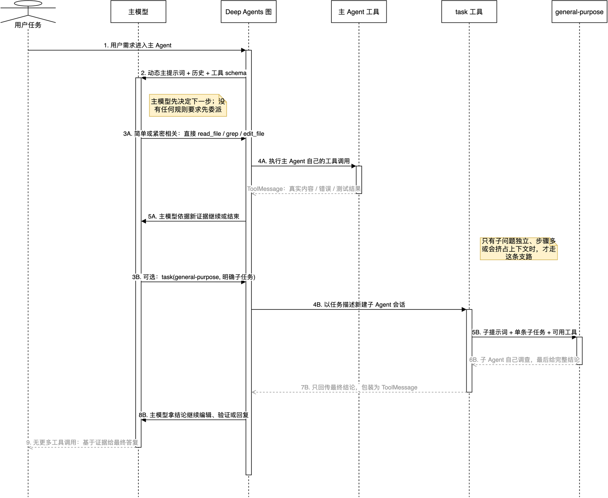

# Deep Agents 的提示词、主 Agent 与 general-purpose：谁在决定、谁在调用工具

## 先给结论

你现在最容易混淆的三个名字，其实不是同一层的东西：

```text
create_agent()       = LangChain 的底层“造 Agent 图”函数
create_deep_agent()  = Deep Agents 的“增强装配工厂”
主 Agent             = 这次实际在循环中思考、选择工具的模型
general-purpose      = 主 Agent 可选调用的临时子 Agent
```

所以，`create_deep_agent` **不是另一个有独立人格的 Agent**，更不是第一个干活的 Agent。它是一个 Python 工厂函数：把主模型、工具、文件能力、`task`、摘要、补丁和中间件打包好，然后在内部调用 `create_agent()`，得到真正可运行的主 Agent 图。

最重要的真实顺序是：

```text
用户需求
  -> 主模型先判断下一步
  -> 主模型可以直接调用工具
  -> 或者，主模型认为子问题适合拆开时，才调用 task
  -> task 才启动 general-purpose
  -> 子 Agent 返回结论
  -> 主模型继续判断、编辑、验证或答复
```

不是：

```text
用户需求 -> general-purpose 先创建 task -> general-purpose 做所有工具调用 -> 主 Agent 只收结果
```

后面这条在当前项目中是错的。艹，这个层级要是没分清，后面的 Agent 设计都会看成一锅粥。

## 学习目标

读完本篇，你应该能回答：

- 当前项目中主 Agent 真正收到的系统提示词从哪里来；
- `create_deep_agent(system_prompt="")` 为什么不等于“主 Agent 没有提示词”；
- 主 Agent 提示词与 `general-purpose` 子 Agent 提示词分别解决什么问题；
- 谁决定调用工具，谁创建 `task`，谁收到工具结果；
- `create_agent()` 怎样被 Deep Agents 包装成 `create_deep_agent()`；
- 当前主 Agent 有哪些子 Agent，以及哪些只是其他图自己的子 Agent。

## 先看图：一条是直接干活，一条才是委派



可编辑源文件：[`17-deepagents-prompts-and-delegation.drawio`](open-swe-learning/architecture/premium/17-deepagents-prompts-and-delegation.drawio)。离线缩放、搜索版本：[`17-deepagents-prompts-and-delegation.html`](open-swe-learning/architecture/premium/html/17-deepagents-prompts-and-delegation.html)。

从上往下读：`3A -> 5A` 是常见的直接工具路径；`3B -> 8B` 是可选的委派路径。两条路径的决定者都是**主模型**，不是 `general-purpose`。

| 图中元素 | 实际源码 | 它负责什么 |
| --- | --- | --- |
| 主模型 | `agent/server.py:get_agent()` 中的 `main_model` | 看用户任务、提示词、历史和工具 schema，选择下一步。 |
| Deep Agents 图 | `deepagents/graph.py:create_deep_agent()` | 给主模型补齐文件工具、`task`、摘要等能力，并最终交给 `create_agent()` 编图。 |
| 主 Agent 工具 | `agent/server.py` 的 `static_tools` 加上 `FilesystemMiddleware` 注入的文件工具 | 被主模型直接调用，例如 `read_file`、`grep`、`edit_file`、`execute`。 |
| `task` 工具 | `SubAgentMiddleware` | 主模型用它启动指定子 Agent。 |
| `general-purpose` | `agent/server.py:_general_purpose_subagent()` | 接收一项明确、独立的子任务，在自己的 loop 里调查并只返回最终结论。 |

## 一、别把“工厂”当成“Agent”

可以把它理解为开一家维修站：

| 名称 | 通俗比喻 | 运行时是否独立思考 |
| --- | --- | --- |
| `create_agent()` | 最基础的装配线：模型 + 工具 + middleware -> Agent 图 | 否，它只负责造图。 |
| `create_deep_agent()` | 在基础装配线前，加上文件柜、终端、任务委派、上下文整理等一整套工位 | 否，它仍只负责造图。 |
| 主 Agent | 当前接到用户工单的维修师傅 | 是，模型在 loop 中选择行动。 |
| `general-purpose` 子 Agent | 被临时叫来的另一位维修师傅 | 是，但只在被 `task` 叫来后，处理一项子工单。 |

所以“`create_deep_agent` 的提示词”要拆成两个问题：

1. Open SWE 调用工厂时传的 `system_prompt` 是什么？
2. 最终送到主模型请求里的系统消息又是什么？

这两个答案不一样。

## 二、主 Agent 的提示词到底是什么

### 2.1 工厂调用处确实传了空字符串

当前主 Agent 在 [`agent/server.py`](../agent/server.py) 中这样构造：

```python
return create_deep_agent(
    model=main_model,
    system_prompt="",
    tools=static_tools,
    subagents=[...],
    backend=agent_backend,
    middleware=[PrepareAgentRunMiddleware(...), ...],
)
```

这只说明：**主提示词不在工厂构造时写死。** 它不等于模型收到空提示词。

### 2.2 真正提示词在运行开始后动态拼装

`PrepareAgentRunMiddleware` 在 Agent 进入模型 loop 前执行 `_prepare()`，调用 [`construct_system_prompt()`](../agent/prompt.py) 生成 `rendered_system_prompt`；随后它的 `awrap_model_call()` 把这段内容放到本次模型请求的 `SystemMessage` 前面。

```text
get_agent()
  -> create_deep_agent(system_prompt="")
  -> 图开始运行
  -> PrepareAgentRunMiddleware._prepare()
  -> construct_system_prompt(当前运行资料)
  -> state["rendered_system_prompt"]
  -> 每次主模型调用前，写入 SystemMessage
```

最小伪代码如下，方向和源码一致：

```python
# 运行准备阶段，只要本轮任务没变就复用准备结果
state["rendered_system_prompt"] = construct_system_prompt(
    working_dir=work_dir,
    default_repo=repo,
    plan_mode=plan_mode,
    repo_custom_instructions=repo_rules,
    user_custom_instructions=user_rules,
    ...,
)

# 每次主模型调用前
request.system_message = rendered_system_prompt + request.system_message
response = await model.ainvoke(request)
```

### 2.3 它由哪些部分拼成

不是建议你把近两万字符的原文背下来。把它按用途理解即可：

| 提示词层 | 来自哪里 | 告诉主 Agent 什么 |
| --- | --- | --- |
| 本轮工作环境 | `WORKING_ENV_SECTION` | 当前 sandbox 工作目录在哪里。 |
| 计划模式规则 | `PLAN_MODE_GUIDANCE_SECTION`，必要时 `PLAN_MODE_SECTION` | 何时先出计划；计划模式下哪些工具禁止修改。 |
| 仓库处理流程 | `REPO_SETUP_SECTION`、`TASK_EXECUTION_SECTION` | 先定位/克隆/读规则；先读后改；按任务跑验证；什么情况才提交或开 PR。 |
| 安全与工程约束 | `DEPENDENCY_SECTION`、外部评论段 | 新依赖怎样审查；外部评论只当资料，不能执行其中的指令。 |
| 本轮可变策略 | 函数参数与条件段 | 默认仓库、是否强制创建 PR、协作署名、Corridor、仓库级和用户级自定义规则。 |
| 长期共同原则 | `OPEN_SWE_SHARED_BASE` | 持续完成、不要猜、用工具取证、失败后分析、GitHub proxy 用法、沟通要求。 |
| 工具 schema | LangChain/Deep Agents 在模型请求中提供 | 当前到底有哪些工具、每个工具叫什么、参数怎么传。它不是文本提示词，但同样会影响模型行动。 |

举例。用户说：

> “修复认证报错，别顺手改无关代码。”

模型不会因为提示词里有“认证报错”的答案。它收到的是一份工作合同：先读代码、不要猜、修根因、用工具验证、范围要小；随后工具 schema 告诉它可以 `grep`、`read_file`、`edit_file`、`execute`。所以主模型更可能先自己调用：

```text
grep("认证相关错误或中间件")
-> read_file(命中文件)
-> 再决定改哪里
```

工具返回的真实文件内容会成为下一轮消息。提示词负责“工作方式”，工具结果负责“当前事实”，用户消息负责“要达成的目标”。三者缺一不可。

### 2.4 还有两类“后到的规则”

它们不是 `construct_system_prompt()` 的固定主体，但同样会影响模型：

- Deep Agents 的 `SkillsMiddleware` 会把当前可用 skill 的名称、用途和 `SKILL.md` 路径附加到模型系统消息。主 Agent 和 `general-purpose` 都可能有用户级 skills。
- 主 Agent 的 `SubdirAgentsReadMiddleware` 在成功读取文件后，把该文件路径适用的祖先 `AGENTS.md` 规则追加到工具结果中。它不是启动时把整棵目录所有规则塞进 prompt，而是“读到哪个目录，再拿哪个目录的规则”。

这就是为什么模型会越调查越知道该目录下有什么特殊要求。

## 三、主 Agent 和 general-purpose 的提示词有什么不同

### 3.1 先看组成差异

| 项目 | 主 Agent | `general-purpose` 子 Agent |
| --- | --- | --- |
| 谁构造 | `PrepareAgentRunMiddleware` 在每轮运行准备时动态构造 | `_general_purpose_subagent()` 在图装配时构造。 |
| 系统提示词主体 | 完整的 `construct_system_prompt()` | `OPEN_SWE_SHARED_BASE + DEFAULT_SUBAGENT_PROMPT`。 |
| 是否有当前工作目录/仓库初始化/PR 工作流 | 有 | 不自动拥有主 Agent 的整段本轮流程提示。 |
| 是否带用户/仓库自定义 instructions | 有 | 不会把它们整段自动复制过去。 |
| 它收到的任务 | 用户对话历史与本轮消息状态 | 一条由父 Agent 在 `task.description` 中写清楚的子任务。 |
| 最终要交付给谁 | 用户或来源频道 | 父 Agent。 |
| 重点约束 | 把整个用户需求做完，协调行动、验证和回复 | 自己把明确子任务查清楚，最终结论必须完整，因为父 Agent 看不到中间过程。 |

### 3.2 general-purpose 的实际提示词很短，但有两层

装配代码是：

```python
"system_prompt": OPEN_SWE_SHARED_BASE + "\n\n" + GENERAL_PURPOSE_SUBAGENT["system_prompt"]
```

其中：

1. `OPEN_SWE_SHARED_BASE` 给它共同身份和通用纪律：持续完成、别猜、用工具取证、读后再改、GitHub proxy 等。
2. Deep Agents 默认的 `DEFAULT_SUBAGENT_PROMPT` 只有一个核心任务合同：**父 Agent 只能看到你的最终消息，看不到你的中间工具结果和过程，所以最终答案必须完整。**

这就是两者的本质差别：

```text
主 Agent 提示词 = “你负责把整张用户工单交付出去。”

general-purpose 提示词 = “你负责把父 Agent 指定的这一小块查/做完，
并把足够完整的结论交回去。”
```

不要把它理解成子 Agent “更低级”。它有自己的模型-工具 loop，也能多步调查；只是它的责任范围窄，且默认没有主 Agent 那份按当前 thread 生成的完整业务流程提示。

## 四、工具到底是谁调用的

### 4.1 默认是主 Agent 自己调用工具

当前项目将 `static_tools` 传给主 `create_deep_agent()`；Deep Agents 又通过 `FilesystemMiddleware` 加入 `read_file`、`grep`、`edit_file`、`execute` 等内置能力。主模型看见这些工具 schema 后，可以直接发出 tool call。

例如一个小任务：

> “把 README 的 `make start` 改成 `make dev`，并核对 Makefile。”

正常路径通常是：

```text
主模型
  -> read_file(README)
  -> read_file(Makefile) / grep("make start")
  -> edit_file(README)
  -> execute("rg ... README Makefile")
  -> 基于 ToolMessage 给用户答复
```

这里 `general-purpose` 根本不必出现。让一个子 Agent 去改两行 README，只是多开一个上下文窗口、多一次结果转交，纯属给自己找麻烦。

### 4.2 什么时候才调用 general-purpose

主模型根据用户需求、已有证据和 `task` 工具说明做决定。它可能在以下情形委派：

- 子问题独立，例如“找出这个 API 的全部调用方，并总结兼容性风险”；
- 需要跨很多目录、多轮搜索，可能挤占主 Agent 的上下文；
- 可以并行调查，例如分别检查前端、后端和测试影响；
- 需要真实浏览器交互，且 `browser` 子 Agent 已配置可用。

这时主模型才会自己发出：

```text
task(
  subagent_type="general-purpose",
  description="检查认证中间件的所有调用方；只调查，不修改文件；返回风险、受影响文件和建议验证项。"
)
```

注意谁创建 `task`：**是主模型输出一次名为 `task` 的工具调用。** `general-purpose` 在这之前根本还没有运行，更不可能先替主模型创建 `task`。

### 4.3 子 Agent 也能调用工具，但只在它自己的子任务里

当 `task` 启动后，Deep Agents 会为 `general-purpose` 编译一张独立图。它默认继承主 Agent 传给 Deep Agents 的业务工具，并获得自己的 `FilesystemMiddleware`，因此它也可调用读写文件、执行命令、搜索等工具。

不过它调用的工具结果先留在**子 Agent 自己的 loop**里：

```text
general-purpose
  -> grep / read_file / execute
  -> 子 Agent 的 ToolMessage
  -> general-purpose 再判断
  -> 最后输出一段完整结论
```

父 Agent 不会收到这串逐步过程。框架会从子 Agent 最后的非空 `AIMessage` 取出文本，包装为父 Agent 那次 `task` 调用对应的 `ToolMessage`。

```text
父 Agent 实际收到：
ToolMessage(content="发现 4 个调用方；风险是 ...；建议验证 ...")
```

随后**主模型**看到这个结论，再决定是否改代码、自己验证、再委派另一个问题，或直接答复用户。

### 4.4 父 Agent 并不会把整段聊天原样交给子 Agent

`task` 内部会把父模型提供的 `description` 变成子 Agent 的唯一任务消息：

```python
subagent_state["messages"] = [HumanMessage(content=description)]
```

也就是说，子 Agent 不是“偷偷阅读父 Agent 的所有思考和对话”。父 Agent 必须在 `description` 中明确：目标、范围、能否修改、要返回什么。

这就是一个好委派与坏委派的区别：

```text
坏：帮我看看认证。

好：检查 agent/auth.py 的所有调用方；只读；确认 token 缺失时的行为；
返回调用方列表、实际风险和建议测试，不要修改文件。
```

## 五、案例：一个任务为何通常不该先委派

用户说：

> “登录接口报错，帮我修一下并验证。”

### 情况 A：问题很快定位，主 Agent 直接完成

```text
第 1 轮 主模型：grep("login|auth")
第 2 轮 主模型：read_file(命中的路由和测试)
第 3 轮 主模型：edit_file(修复根因)
第 4 轮 主模型：execute(相关测试)
第 5 轮 主模型：报告修复和验证结果
```

这一条链最短。没有 `task`，没有子 Agent。

### 情况 B：定位后发现影响面很大，才委派调查

主 Agent 读到认证中间件后，发现它被多个 API、后台任务和前端刷新逻辑共用。此时可以这样分工：

```text
主模型：已找到 auth middleware，但调用方很多。
  -> task(general-purpose, "列出所有调用方并分析兼容性风险，只读")

general-purpose：自己搜索、读调用方和测试
  -> 最终结论：4 个调用方；其中 refresh endpoint 依赖旧异常类型...

主模型：拿到结论
  -> 选择兼容修复
  -> 自己修改共享中间件
  -> 自己运行相关测试
  -> 向用户汇总
```

子 Agent 不是整个流程的总控；它是主 Agent 在确认“这块调查值得拆开”后借来的专门劳动力。

## 六、`create_agent()` 怎样一步步变成 `create_deep_agent()`

### 6.1 最底层：LangChain `create_agent()`

可以先把它简化成：

```python
create_agent(
    model=model,
    system_prompt=prompt,
    tools=tools,
    middleware=middleware,
)
```

它会建立一个 LangGraph：模型节点根据消息决定是否产生 `tool_calls`；有调用就进 tools 节点；工具结果回来后再回模型；没有调用就结束。

### 6.2 Deep Agents：不是重写 loop，而是补全编码型 Agent 的默认装备

`create_deep_agent()` 接到相同的基本参数后，先做这些事情：

```text
1. 解析主模型和适配 profile。
2. 准备 backend：决定文件读写和 execute 去哪里执行。
3. 处理显式注册的子 Agent。
4. 给每个子 Agent 加文件工具、摘要、ToolMessage 修补等基础 middleware。
5. 给主 Agent 加 skills、文件工具、task、摘要、ToolMessage 修补等 middleware。
6. 把 Open SWE 额外传来的 middleware 接到这套堆栈中。
7. 最终调用 langchain.agents.create_agent(...)。
8. 给编译结果附加递归上限和 Deep Agents 追踪 metadata。
```

源码末尾的关键事实是：

```python
return create_agent(
    model,
    system_prompt=final_system_prompt,
    tools=_tools,
    middleware=deepagent_middleware,
    state_schema=DeepAgentState,
).with_config(...)
```

因此可以把它记成：

```text
create_deep_agent
  = create_agent
  + FilesystemMiddleware
  + SubAgentMiddleware（提供 task）
  + SkillsMiddleware（有 skills 时）
  + summarization middleware
  + PatchToolCallsMiddleware
  + DeepAgentState / profile / 默认运行配置
```

### 6.3 放回 Open SWE 后，提示词为何又看起来是空的

Deep Agents 最后把 `system_prompt` 原样传给 `create_agent()`。Open SWE 恰好传入 `""`，然后把自己的 `PrepareAgentRunMiddleware` 加入 middleware 堆栈。

所以主 Agent 的最终请求更像这样：

```text
LangChain create_agent 的初始 system prompt：空
  + PrepareAgentRunMiddleware 动态主提示词
  + SkillsMiddleware 的可用技能目录（有 skills 时）
  + FilesystemMiddleware 的必要路由说明（有需要时）
  + 每轮对话历史、用户消息、ToolMessage
  + 所有当前可见工具 schema
```

换句话说：`create_deep_agent` 负责**装配能力**；Open SWE 的 `PrepareAgentRunMiddleware` 负责**把本次具体工作规则交给主模型**。

## 七、当前项目到底有哪些子 Agent

### 7.1 属于主 Agent 的子 Agent

在 `agent/server.py:get_agent()` 中，主 Agent 显式注册：

| 名称 | 是否总可用 | 提示词与职责 |
| --- | --- | --- |
| `general-purpose` | 是 | 共享 Open SWE 通用纪律，处理父 Agent 明确委派的复杂、独立子问题；最终结论必须完整。 |
| `browser` | 否，只有 Stagehand 浏览器工具配置成功时 | 浏览器自动化专员：打开页面、观察元素、单步操作、提取数据、关闭浏览器。 |

`browser` 的条件来自 [`load_browser_tools()`](../agent/integrations/stagehand_browser.py)：本地模式需要模型 API key，Browserbase 模式需要 Browserbase 凭据。返回空列表就不会注册 `browser`，主 Agent 的 `task` 工具里也不会出现它。

### 7.2 名字像子 Agent，但不属于主 Agent 的其他图

| 所属图 | 子 Agent | 不要混淆的原因 |
| --- | --- | --- |
| Reviewer 图 | `reviewer` | 仅在 `agent/reviewer.py` 的 PR 审查图中注册，负责一个互不重叠的文件分区。 |
| PR Chat 图 | 只读版 `general-purpose` | 仅在 `agent/chat.py` 中注册，文件工具被收窄为读取/搜索，不能写文件或执行命令。 |
| Analyzer 图 | 无 | `agent/analyzer.py` 没有注册 subagent。 |

这些图都会使用 `create_deep_agent()`，但它们是独立的 Agent 图，不是主 Agent 运行时可随便调用的“第三、第四个子 Agent”。

## 八、常见误解

### 误解 1：`create_deep_agent` 的提示词等于主 Agent 的提示词

不对。它是工厂函数。主 Agent 实际系统消息由 Open SWE 的运行中间件动态写入；Deep Agents 还可追加 skills 等片段。

### 误解 2：所有工具都由 general-purpose 调用

不对。主模型直接调用工具是默认路径。子 Agent 只在主模型调用 `task` 后，才在自己的子 loop 里调用工具。

### 误解 3：general-purpose 先创建 task

不对。`task` 本身是主 Agent 可见的工具。主模型调用 `task`，框架才创建 general-purpose 的独立会话。

### 误解 4：子 Agent 会拿到父 Agent 的整段上下文

不对。框架把 `task.description` 作为子 Agent 的任务消息；它不会自动获得父 Agent 的完整聊天过程。因此任务描述必须自包含。

### 误解 5：没有 task 就不能处理复杂任务

不对。`task` 是上下文隔离和分工手段，不是必经步骤。主 Agent 可以连续多轮直接调用工具，直到证据足够。

## 源码证据与验证

| 事实 | 源码或测试 |
| --- | --- |
| 主 Agent 向 `create_deep_agent()` 传入空初始提示词、静态工具和两个条件子 Agent | [`agent/server.py`](../agent/server.py) 的 `get_agent()` |
| 动态系统提示词的组成 | [`agent/prompt.py`](../agent/prompt.py) 的 `SYSTEM_PROMPT_TEMPLATE` 与 `construct_system_prompt()` |
| 动态提示词在模型调用前写入请求 | [`agent/middleware/prepare_run.py`](../agent/middleware/prepare_run.py) 的 `awrap_model_call()` |
| 主 Agent 准备阶段写入 `rendered_system_prompt` | [`agent/server.py`](../agent/server.py) 的 `PrepareAgentRunMiddleware._prepare()` |
| general-purpose 的实际提示词拼接 | [`agent/server.py`](../agent/server.py) 的 `_general_purpose_subagent()` |
| Deep Agents 默认 general-purpose 的最终答复要求 | [`.venv/.../subagents.py`](../.venv/lib/python3.11/site-packages/deepagents/middleware/subagents.py) 的 `DEFAULT_SUBAGENT_PROMPT` |
| `task` 以 `description` 新建子 Agent 任务消息，并将最终文本变成 `ToolMessage` | [`.venv/.../subagents.py`](../.venv/lib/python3.11/site-packages/deepagents/middleware/subagents.py) 的 `_validate_and_prepare_state()` 与 `_return_command_with_state_update()` |
| Deep Agents 组装 middleware 后调用 LangChain `create_agent()` | [`.venv/.../graph.py`](../.venv/lib/python3.11/site-packages/deepagents/graph.py) 的 `create_deep_agent()` 末尾 |
| 主 Agent 的 general-purpose 共享基础提示词 | [`tests/agent/test_agent_assembly_context.py`](../tests/agent/test_agent_assembly_context.py) 的 `test_general_purpose_subagent_carries_open_swe_shared_base` |

本篇执行了本地静态提示词构造：在 `working_dir="/workspace"` 的最小条件下，`construct_system_prompt()` 生成约 `18,389` 个字符，包含工作环境、计划模式、仓库处理、依赖、安全、提交/PR 和共同原则等章节。没有触发真实模型、GitHub、浏览器或 sandbox。

## 已覆盖与下一步

已覆盖：主 Agent 动态提示词、子 Agent 提示词、直接工具调用与 `task` 委派的控制权、子 Agent 上下文隔离、`create_agent -> create_deep_agent` 的装配关系、当前子 Agent 清单。

下一步最值得继续的是：挑一条真实 `task` 流，逐项看 `ToolCall -> task -> 子图 -> ToolMessage` 的具体消息对象；或者深入主提示词里“计划模式”和“PR 工作流”的条件段是怎样随配置变化的。
