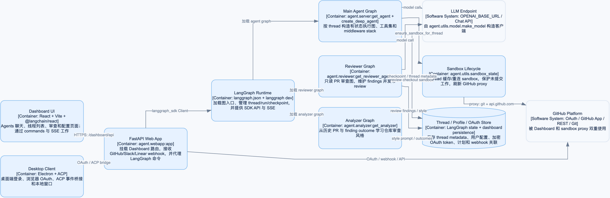
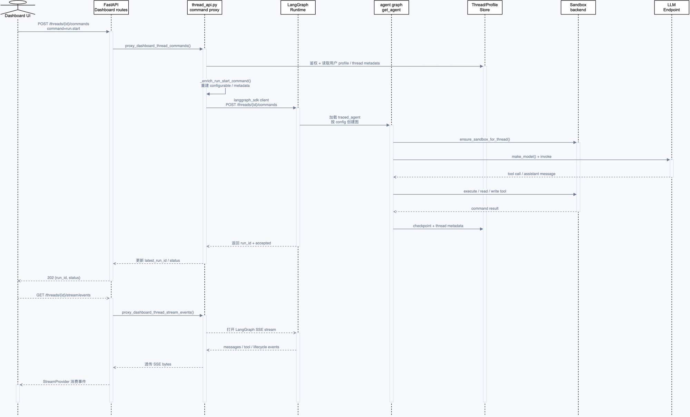
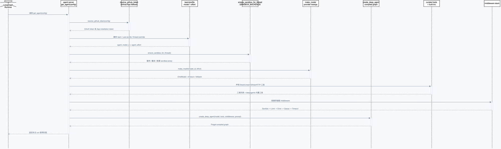
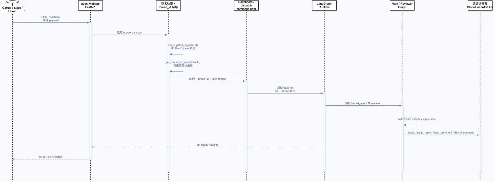
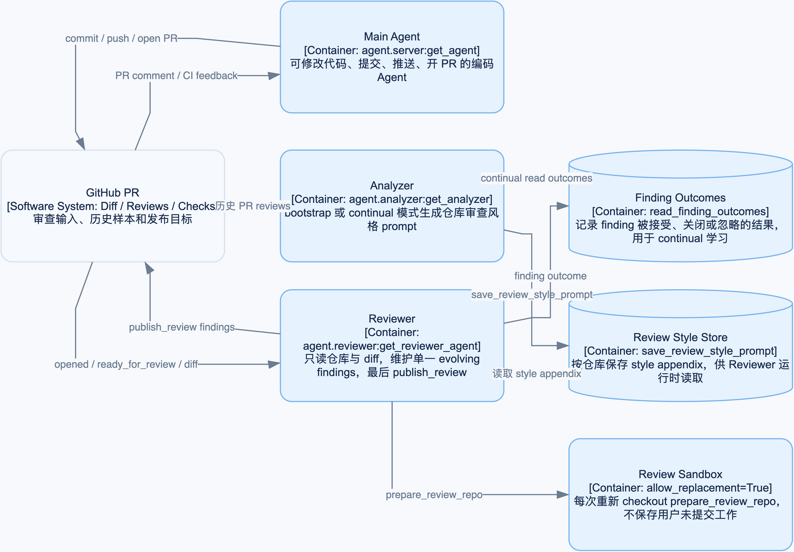

# 第 0 章：架构地图与一次请求的全链路

本章是后续源码学习的总入口。目标不是记住所有文件，而是先建立四个稳定的判断：请求从哪里进入、谁负责调度、状态保存在哪里、凭证在哪一层生效。

## 学习目标

读完本章后，你应能：

1. 从 C4 图中区分 UI、FastAPI、LangGraph Runtime、Agent Graph 和 Sandbox 的职责。
2. 沿着一次 Dashboard `run.start` 请求，解释命令响应和 SSE 事件为什么分开。
3. 根据源码伪代码判断 `get_agent(config)` 何时创建完整 Agent，何时只返回检查图。
4. 区分 LangGraph checkpoint、thread metadata 和 Git turn ref 的用途。
5. 说清楚 GitHub OAuth token、GitHub App installation token 和 sandbox proxy 的边界。

## 1. 先看系统上下文

Open SWE 的核心不是一个网页，也不是一个单独的 Python Agent 函数，而是一个由外部事件驱动的 LangGraph 应用：


图中最重要的箭头是：

- 用户可以从浏览器、Electron、Slack、Linear 或 GitHub 进入。
- Open SWE 把执行交给 LangGraph Runtime，而不是让 UI 直接调用 `get_agent`。
- Agent 需要模型做决策，需要 Sandbox 执行文件和命令，需要 GitHub API/Git 访问仓库。
- Slack、Linear、GitHub 是触发源和回复目标，不是 Agent 的内部状态存储。

打开 [可交互 C4 三页图](architecture/premium/html/01-c4-overview.html)，点击 `Open SWE` 可以从系统上下文下钻到容器视图，再下钻到组件视图；源文件是 [01-c4-overview.drawio](architecture/premium/01-c4-overview.drawio)。

## 2. 四个平面：把“架构图”接成一条线

可以把系统理解成四个平面。它们不是四个进程，而是四种职责：

| 平面 | 关键问题 | 主要源码 |
| --- | --- | --- |
| 命令平面 | 谁允许启动/取消/追加消息？ | `agent/dashboard/routes.py`、`agent/dashboard/thread_api.py` |
| 执行平面 | 哪张图被加载，模型和工具如何循环？ | `langgraph.json`、`agent/server.py` |
| 状态平面 | 如何恢复 thread，如何展示本轮代码 diff？ | LangGraph checkpoint、thread metadata、`agent/utils/sandbox_state.py`、`utils/turn_checkpoint.py` |
| 集成平面 | GitHub、Slack、Linear、模型、sandbox 如何接入？ | `agent/webapp.py`、`agent/tools/`、`agent/integrations/` |

用接线图表示就是：

```text
浏览器 / Desktop / Webhook
          |
          v
  FastAPI Dashboard 命令平面 -----> Thread/Profile/OAuth Store
          |
          v
  LangGraph Runtime --------------> Thread / Run / Checkpoint
          |
          v
  get_agent(config)
      |          |          |
      v          v          v
  Sandbox     Model      Tools + Middleware
      |          |          |
      +----------+----------+
                 |
                 v
        SSE / Slack / Linear / GitHub 回复
```

容器层的完整图在这里：



## 3. 一次 Dashboard 请求的动态链路

浏览器第一次发送消息时，命令代理不会等待 Agent 做完工作。它只负责把命令变成一个可信的 LangGraph 请求，并快速返回 `run_id`；UI 随后另开 SSE 连接观察过程。



对应源码链路：

```text
useSubmitAgentMessage
  -> POST /dashboard/api/threads/{id}/commands
  -> api_thread_commands
  -> proxy_dashboard_thread_commands
  -> _enrich_run_start_command
  -> LangGraph /threads/{id}/commands
  -> traced_agent -> get_agent(config)
  -> sandbox + model + tools + middleware
  -> /dashboard/api/threads/{id}/stream/events
  -> AgentThreadStreamProvider
```

命令代理的教学版伪代码如下，故意省略 HTTP 细节，只保留职责：

```python
async def dashboard_command(thread_id, body, session):
    command = parse_json_object(body)
    require_same_origin(session)

    if command.method == "run.start":
        # 客户端传来的身份、仓库和模型不能直接相信
        await ensure_thread_if_missing(thread_id)
        await assert_thread_readable(thread_id, session)
        command = await enrich_from_server_metadata(
            command,
            github_login=session.github_login,
            email=session.email,
            thread_id=thread_id,
        )
    else:
        await assert_thread_owner(thread_id, session)

    result = await langgraph_client.commands(thread_id, command)
    if result.run_id:
        await save_latest_run_id(thread_id, result.run_id)
    return result  # 这里只返回“已接受”，不是最终答案
```

后续 SSE 事件是另一条路径：

```python
async def stream_events(thread_id, session):
    await assert_thread_readable(thread_id, session)
    async for event in langgraph_client.stream_events(thread_id):
        yield event  # Dashboard 只做边界校验和字节转发
```

所以“Dashboard 把内容改一层再返回 LangGraph”这个理解需要精确化：它改写的是 `run.start` 的可信配置和元数据，不改写 Agent 的模型输出；LangGraph 执行完成后，事件再通过 SSE 到 UI。

源码证据：

- [Dashboard 路由](../../agent/dashboard/routes.py)
- [命令代理](../../agent/dashboard/thread_api.py)
- [UI 提交 hook](../../ui/src/features/agents/lib/provider/useSubmitAgentMessage.ts)
- [UI StreamProvider 包装器](../../ui/src/features/agents/lib/AgentThreadStreamProvider.tsx)

## 4. `get_agent`：执行平面的装配点

LangGraph 注册的是 `agent.graphs.agent:traced_agent`，它最终调用 `agent.server:get_agent`。工厂的装配顺序如下：



可以压缩成下面的伪代码：

```python
async def get_agent(config):
    cfg = config.get("configurable", {})
    if not cfg.get("thread_id") or not graph_loaded_for_execution(config):
        return create_deep_agent(system_prompt="", tools=[])

    github_token = await resolve_github_token(config)
    profile = await load_profile(resolve_github_login(config))
    model_id, effort = resolve_model_and_effort(cfg, profile, team_defaults())

    sandbox = await ensure_sandbox_for_thread(
        cfg["thread_id"], github_token=github_token
    )
    model = make_model(model_id, effort=effort)

    return create_deep_agent(
        model=model,
        tools=curated_tools,
        middleware=ordered_middleware,
        backend= sandbox,
        system_prompt=build_system_prompt(profile, repo_instructions),
    )
```

两个分支必须记住：图加载/检查阶段不应该连接用户 sandbox；真正执行阶段才解析凭证并装配完整工具。这样 `langgraph dev` 能加载图结构，也避免启动检查误触发外部副作用。

更细的工厂拆解见 [第 2-1 章](02-1-main-agent-factory.md)，可编辑图见 [04-agent-factory-sequence.drawio](architecture/premium/04-agent-factory-sequence.drawio)。

## 5. 状态平面：三个“保存”不是一回事


| 状态对象 | 保存什么 | 用来解决什么 | 不能替代什么 |
| --- | --- | --- | --- |
| Thread metadata | `sandbox_id`、所有者、仓库、最新 run 等索引 | 重新进程后找到资源和权限 | 不能恢复完整图状态 |
| LangGraph checkpoint | 消息、节点状态、执行进度 | 中断、恢复、SSE 回放 | 不是代码工作区备份 |
| Git turn ref | 本轮开始时的 worktree 起点 | 计算 changed files / turn diff | 不能恢复模型上下文 |
| Sandbox | 当前文件、未提交修改、命令环境 | 真正执行编码任务 | 不应成为唯一持久化来源 |

主 Agent 对失联 sandbox 默认拒绝“悄悄换一个空沙箱”。因为替换会让用户的未提交代码消失。Reviewer 是例外：它每次通过 `prepare_review_repo` 重新 checkout，只读审查，因此允许 `allow_replacement=True`。

## 6. 安全边界：凭证在哪里生效


学习时按这条规则追踪 token：

```text
用户 OAuth token（优先）
        或
GitHub App installation token（fallback）
        |
        v
FastAPI 进程内解析
        |
        +--> Agent 工具调用 GitHub API
        |
        +--> LangSmith sandbox proxy 配置
                 |
                 +--> sandbox 内 gh/git 出站请求
```

真实 token 不应该写入 sandbox 文件。Sandbox 里可以看到 `GH_TOKEN=dummy gh ...` 这样的调用，认证由 proxy 在出站时注入。

## 7. 外部事件与审查子系统

Webhook 入口先验签，再推导确定性 `thread_id`，最后进入同一条图运行链：



审查不是主 Agent 的一个“模式开关”，而是独立图：



- Main Agent 可以修改代码、提交、推送和创建 PR。
- Reviewer 只读仓库和 diff，维护 findings，最后调用 `publish_review`。
- Analyzer 通过 bootstrap/continual 模式保存仓库审查风格，作为 Reviewer 的上下文附录。

## 8. 最小验证

本章只做本地、无模型、无 GitHub 副作用的验证：

```bash
uv run pytest -vvv tests/agent/test_dispatch.py
uv run pytest -vvv tests/middleware/test_check_message_queue.py
uv run python -c 'from agent.server import get_agent, traced_agent; print(callable(get_agent), callable(traced_agent))'
```

架构图本身使用 Draw.io 31.1.5 导出，并运行 `validate.py --score` 做结构检查。C4 图的少量边交叉是布局工具对长链路的结果，没有节点重叠；时序图和状态图没有结构警告。

## 常见误区

1. 看到 `run_id` 就以为模型已经完成。命令响应只代表运行已接受，最终答案要等 SSE 或源渠道回复。
2. 看到 checkpoint 就以为代码文件能恢复。代码差异来自 sandbox 和 Git ref，checkpoint 保存的是图状态。
3. 看到 GitHub App token 就以为 UI 具备同样权限。UI 通过 Dashboard 权限边界访问，sandbox proxy 还会按安装仓库范围限制出站访问。

## 检查题

1. 画出 `run.start` 命令响应和 SSE 事件流的两条独立箭头，并指出它们分别在哪个函数结束。
2. 如果 `configurable` 没有 `__is_for_execution__`，为什么 `get_agent` 不应该创建 sandbox？
3. 用户在运行中再次发送消息时，为什么要进入 queue，而不是创建第二个同 thread Run？
4. 修改 `agent/utils/model.py` 后，应该从哪张图确认 timeout 和 fallback 位于模型调用的哪一层？

## 本章边界与下一步

本章建立了空间、时间、状态和权限四种视角，但暂不展开 LangGraph SDK command schema、SSE event schema 和 `@langchain/react` `StreamProvider` 的内部消费协议。下一步按课程顺序进入 [第 1 章：入口与本地运行](01-entry-and-runtime.md)，再深入 [第 2 章：线程、Run 与持久化](02-threads-runs-and-checkpoints.md)。
