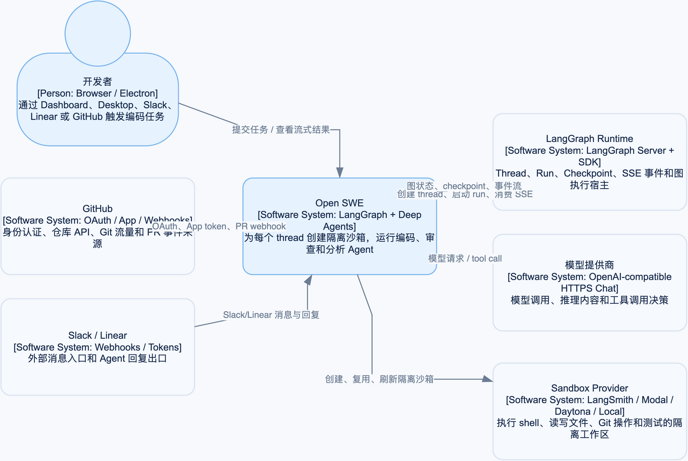

# 第 1 章：入口与本地运行

## 学习目标

读完本章后，你应能回答：Open SWE 启动了哪些图、FastAPI 从哪里挂载，以及本地开发时该运行哪个命令。

## 项目是什么

Open SWE 是一个编码 Agent 框架。LangGraph 负责 Run、线程、状态持久化和事件流；Deep Agents 提供文件、终端、子任务等 Agent 能力；FastAPI 承接 Dashboard 和外部 Webhook。

## 入口地图

`langgraph.json` 是 LangGraph 开发服务器的入口配置：

| 名称 | 入口 | 职责 |
| --- | --- | --- |
| `agent` | `agent.graphs.agent:traced_agent` | 主编码 Agent |
| `reviewer` | `agent.graphs.reviewer:traced_reviewer_agent` | PR 审查 Agent |
| `analyzer` | `agent.graphs.analyzer:traced_analyzer` | 学习仓库审查风格 |
| `chat` | `agent.graphs.chat:traced_chat_agent` | Dashboard 的 PR 对话 |
| `scheduler` | `agent.graphs.scheduler:get_scheduler` | 定时任务 |

同一配置还挂载 `agent.webapp:app`，该 FastAPI 应用再挂载 Dashboard、健康检查和 GitHub/Slack/Linear 路由。

## 配图：入口如何连接到运行时



这张图先回答“谁在调用系统”：浏览器和 Electron 是用户界面，GitHub/Slack/Linear 既可以是事件入口，也可以是回复出口；LangGraph Runtime 才是负责 thread、Run、checkpoint 和 SSE 的执行宿主。完整的文字、伪代码和源码接线见[架构总览](00-architecture-overview.md)。

## 本地命令

```bash
make install
make dev
make test
make lint
make typecheck
```

- `make dev` 运行 `uv run langgraph dev`，适合学习主 Agent、线程和 Dashboard。
- `make run` 只运行 FastAPI 的 `uvicorn`，不替代 LangGraph 图运行时。
- 前端 UI 在另一个终端运行 `pnpm --dir ui run dev`。
- Electron 桌面端在后端已启动后运行 `pnpm --dir desktop run dev`。

## 常见误区

1. 把 `make run` 当作完整系统启动。它只启动 FastAPI，图运行时仍需要 `make dev`。
2. 以为 `agent/server.py` 是唯一入口。它是主 Agent 工厂，真正对外注册点在 `langgraph.json`。

## 练习

1. 打开 `langgraph.json`，找出为什么 Dashboard 与图运行时能使用同一地址。
2. 用 `make help` 列出项目定义的开发命令。
3. 解释 `agent` 和 `reviewer` 为什么要注册成两张不同的图。
