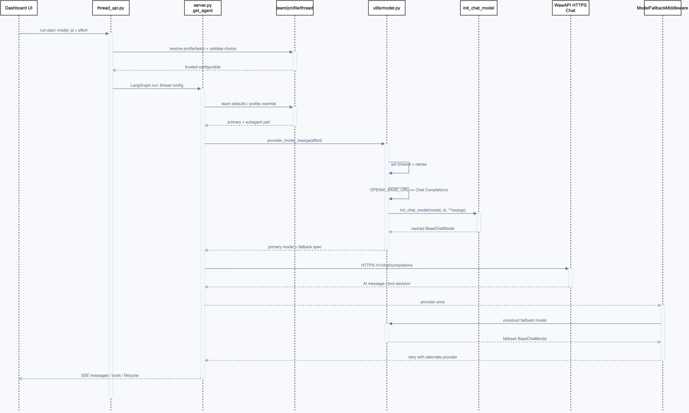

# 第 3 章：模型配置、WawAPI 与故障降级

## 学习目标

读完本章后，你应能回答以下问题：一次 Dashboard 里选中的模型，最终如何变成 WawAPI 的 HTTPS Chat 请求；为什么 `OPENAI_BASE_URL` 会改变协议；以及模型超时、缓存和 fallback 分别在哪一层生效。

本章只讨论模型选择与调用适配，不讨论工具循环、提示词和 middleware 的完整执行语义，它们留给第 4 章。

## 先建立正确的心智模型

“模型配置”在 Open SWE 中分为两件完全不同的事：

1. **选择模型**：决定本次 Run 的 `model_id` 和 `effort`。
2. **构造客户端**：依据 provider 前缀和环境变量，把选择翻译为 `init_chat_model()` 的参数。

前者发生在 Dashboard/Agent factory，后者发生在 `agent/utils/model.py`。不能把 `OPENAI_BASE_URL` 当成模型选择，也不能把 Dashboard 下拉框当成网络客户端配置。

| 层次 | 输入 | 输出 | 真实源码 |
| --- | --- | --- | --- |
| 线程选择 | `agent_model_id`、`agent_effort` | 经过校验的 per-thread override | `agent/dashboard/thread_api.py:_resolve_agent_model_choice` |
| Agent 工厂 | 线程、Profile、团队设置 | 主 Agent 与 subagent 的模型对 | `agent/server.py:get_agent` |
| provider 映射 | `openai:*` + effort | `reasoning`、`max_tokens` 等 kwargs | `agent/utils/model.py:provider_model_kwargs` |
| transport 构造 | 模型 ID、kwargs、环境变量 | LangChain `BaseChatModel` | `agent/utils/model.py:make_model` |
| 网络调用 | `BaseChatModel` + messages | `AIMessage` / tool call | LangChain OpenAI adapter -> WawAPI |

## 架构图：从模型选择到 WawAPI



可打开 [交互查看器](architecture/premium/html/09-model-config-sequence.html) 缩放阅读，也可在 Draw.io 中编辑 [09-model-config-sequence.drawio](architecture/premium/09-model-config-sequence.drawio)。

读图从上到下：先是 Dashboard 产生配置，随后 `get_agent()` 决定最终模型，`model.py` 再决定 provider 参数和协议。实线表示调用，虚线表示返回；最后的 fallback 是异常分支，不是每次请求都会走的正常链路。

```text
UI model_id / effort
  -> thread_api 校验并写入 trusted configurable
  -> get_agent 按优先级选择模型
  -> provider_model_kwargs 翻译 reasoning effort
  -> make_model 设置 base_url / timeout / retry
  -> init_chat_model 构造并缓存客户端
  -> WawAPI Chat Completions
  -> AIMessage 或 tool-call 决策
```

## 1. 模型选择优先级

`get_agent()` 的顺序是：

```text
per-thread config
  > 用户 Profile override
  > 团队默认值
  > 项目硬编码默认值（openai:gpt-5.6-sol / medium）
```

其中前三层是实际 Agent Run 的选择路径。团队默认值由 `get_team_default_model_pair("agent")` 从 LangGraph Store 读取；不存在或失效时，`agent/dashboard/options.py:default_model_pair()` 才返回项目硬编码默认值。

具体过程如下：

1. `thread_api._enrich_run_start_command()` 从前端命令读取候选模型，但用服务端 Profile/团队设置重新构建 `configurable`。
2. `server.get_agent()` 先读取团队的主 Agent/subagent 默认模型对。
3. 若 GitHub 登录用户有合法 Profile override，它覆盖主 Agent；没有单独 subagent override 时，subagent 也继承该选择。
4. 若 `configurable.agent_model_id` 和 `agent_effort` 都位于 `SUPPORTED_MODELS` 允许集合中，per-thread 值最后覆盖主 Agent 与 subagent。
5. `gate_fable_model()` 最后拦截工作区禁用的 Fable 模型，替换为支持的非 Fable Anthropic 模型。

这解释了一个很容易踩坑的现象：同一个 `.env` 放在本地，并不保证 Dashboard 每个新 Run 都会选中那个模型。Dashboard 运行时看的是线程/Profile/团队设置；环境变量主要决定**凭据与 transport**。

### 当前项目变量的实际地位

| 变量 | 当前项目是否读取 | 实际作用 |
| --- | --- | --- |
| `OPENAI_API_KEY` | 是 | OpenAI provider 的认证密钥；WawAPI 复用这个变量名 |
| `OPENAI_BASE_URL` | 是 | 直接 OpenAI provider 的 endpoint；存在时强制使用 Chat Completions |
| `LLM_MODEL_ID` | 是，但只在本地 FastAPI 启动校验中 | `validate_local_dev_llm_config()` 用它确认对应 provider key 已配置；它不是 `get_agent()` 的最高优先级 |
| `LLM_FALLBACK_MODEL_ID` | 是 | 显式覆盖默认 fallback model ID |

`agent/api/app.py` 的 lifespan 在本地 `DASHBOARD_BASE_URL` 是 `http://localhost...` 时调用 `validate_local_dev_llm_config()`。因此 `LLM_MODEL_ID` 对“启动时尽早发现少了 API key”有价值，但它不替代 Dashboard 里的模型设置。

## 2. 为什么 WawAPI 走 Chat Completions

`make_model()` 对 `openai:` 前缀有两个分支：

```python
if os.environ.get("OPENAI_BASE_URL"):
    model_kwargs["base_url"] = base_url.rstrip("/")
    model_kwargs["use_responses_api"] = False
else:
    model_kwargs["base_url"] = "wss://api.openai.com/v1"
    model_kwargs["use_responses_api"] = True
```

所以自定义 OpenAI-compatible endpoint 的配置应该保持为：

```dotenv
OPENAI_API_KEY="<你的 WawAPI key>"
OPENAI_BASE_URL="https://wawapii.com/v1"
```

`/v1` 很重要。LangChain/OpenAI client 会在这个 base URL 后使用 Chat Completions 路径；项目测试也明确断言：自定义 `https://wawapii.com/v1/` 会被规范为没有尾部斜杠的 `https://wawapii.com/v1`，同时 `use_responses_api=False`。

这不是“把官方 OpenAI 请求换了个域名”那么简单：官方直连分支使用 Responses API，并额外设置 `store=False`、`output_version="responses/v1"` 和 reasoning encrypted content；WawAPI 分支刻意不设置这些 Responses-only 字段。

### effort 在两种协议里的变化

`provider_model_kwargs("openai:...", "medium", ...)` 先产生：

```python
{
    "max_tokens": ...,
    "reasoning": {"effort": "medium", "summary": "auto"},
}
```

当 `make_model()` 发现 `use_responses_api=False` 时，`_coerce_openai_chat_completions_kwargs()` 会移除 `reasoning`，并改写为：

```python
{"reasoning_effort": "medium"}
```

这样做是为了让 OpenAI-compatible Chat Completions endpoint 接收它能理解的字段。WawAPI 是否支持某个具体模型和 effort，仍属于网关能力，不应由本地代码臆测；本章的真实验证覆盖了当前 `medium` 设置。

## 3. `make_model()` 还做了哪些事

| 机制 | 代码行为 | 为什么需要 |
| --- | --- | --- |
| Provider timeout | OpenAI/Anthropic/Google/Fireworks 默认 `600s` | 让 HTTP client 不会无限挂住 |
| Provider retries | 默认 `max_retries=6` | 瞬时 5xx/网络波动先由 provider client 重试 |
| 模型缓存 | key 包含 model ID、gateway 开关、kwargs、event loop | 同一运行循环复用 client，避免反复建连接；不同 loop 不误复用异步资源 |
| 应用关闭 | FastAPI lifespan 调 `close_cached_models()` | 释放 client/连接池 |
| Gateway 覆盖 | gateway 启用且有 LangSmith key 时覆盖 `base_url`/`api_key` | 路由流量进入 LangSmith Gateway，而不是 WawAPI |

这里有一个实用边界：若团队开启了 `gateway_enabled`，且 Gateway 可用，`gateway_overrides()` 会覆盖 WawAPI 的 `base_url`。因此要让请求直达 WawAPI，团队 Gateway 必须关闭，或调用 `make_model(..., use_gateway=False)` 进行本地验证。

## 4. timeout、fallback 与错误的层次

这三者并不重复：

```text
Provider client: 600s HTTP timeout + max_retries=6
      |
      v
ModelCallTimeoutMiddleware: 900s wall-clock deadline
      |
      v
ModelFallbackMiddleware: transient error 时主/备模型交替重试
```

- `600s` timeout 是请求级限制。
- `900s` 的 `ModelCallTimeoutMiddleware` 是运行级兜底，专门处理 SDK/socket 没有抛出请求超时但调用已经卡死的情况；可由 `OPEN_SWE_MODEL_CALL_TIMEOUT_SECONDS` 改写。
- `ModelFallbackMiddleware` 只处理暂态 provider 错误，例如连接错误、超时、429 和 5xx。非暂态参数错误会直接抛出，避免拿错误请求反复重试。

默认跨 provider 逻辑是 OpenAI 主模型回退到 Anthropic，Anthropic 主模型回退到 OpenAI。你的 WawAPI 配置验证了 OpenAI 主路径，**没有验证 Anthropic fallback**；若要让 fallback 真正可用，还需要独立的 Anthropic 凭据与可访问模型。只配置 WawAPI 时，把 fallback 当成已可用是错误的。

## 源码证据表

| 图元素 | 源码位置 | 关键符号 | 图中行为 |
| --- | --- | --- | --- |
| Dashboard 模型选择 | `agent/dashboard/thread_api.py` | `_resolve_agent_model_choice`、`_enrich_run_start_command` | 校验可选模型，生成可信 `configurable` |
| 运行时优先级 | `agent/server.py` | `get_agent` | 团队 -> Profile -> thread 覆盖，随后构造主/子模型 |
| Provider 参数 | `agent/utils/model.py` | `provider_model_kwargs` | 翻译 OpenAI reasoning effort |
| WawAPI 适配 | `agent/utils/model.py` | `make_model` | 有 `OPENAI_BASE_URL` 时切换 Chat Completions |
| Gateway | `agent/utils/gateway.py` | `gateway_overrides` | 有效 Gateway 覆盖 direct provider transport |
| Fallback | `agent/middleware/model_fallback.py` | `ModelFallbackMiddleware` | 只对暂态错误交替重试 |
| 静态协议证据 | `tests/sandbox/test_gateway.py` | `test_make_model_direct_openai_uses_custom_chat_base_url` | 断言自定义 base URL 与 `use_responses_api=False` |

## 完整调用链伪代码

```python
async def build_agent_model(config):
    model_id, effort = await get_team_default_model_pair("agent")

    if profile_has_valid_override(config.github_login):
        model_id, effort = profile_override
    if valid_pair(config.configurable.agent_model_id, config.configurable.agent_effort):
        model_id, effort = config.configurable.agent_model_id, config.configurable.agent_effort

    model_id, effort = gate_fable_model(model_id, effort)
    kwargs = provider_model_kwargs(model_id, effort, max_tokens=DEFAULT_LLM_MAX_TOKENS)
    model = make_model(model_id, use_gateway=team_gateway_enabled, **kwargs)

    if model_id.startswith("openai:") and OPENAI_BASE_URL:
        # make_model 内部：base_url=OPENAI_BASE_URL, use_responses_api=False
        # reasoning -> reasoning_effort
        pass
    return model
```

## 最小验证

### 静态验证

```bash
uv run pytest -q tests/sandbox/test_gateway.py tests/models/test_model_request_timeout.py tests/models/test_model_fallback_resolution.py
```

它验证 custom base URL、Responses/Chat 分支、timeout、模型迁移和 fallback 选择，不发送网络请求。

### 真实 WawAPI 验证记录

本章已在当前配置下执行了两次短请求，均使用 `openai:gpt-5.6-terra`、`OPENAI_BASE_URL`、`use_gateway=False`、`max_tokens=16`、`timeout=30s`：

1. 直接 `make_model(...).invoke("只回复 OK")` 返回 `OK`。
2. 使用真实 Agent 风格参数 `provider_model_kwargs(..., "medium")` 后再调用，返回 `OK`。

第二次尤其重要：它证明当前 WawAPI 不仅能接收普通 Chat Completions 请求，也接受本项目从 `medium` effort 转换出的 Chat Completions 参数。两次请求都有极小模型费用；未打印 API key、请求头或完整环境变量。

可复用的最小命令如下。它会产生一次外部模型调用和可能的费用：

```bash
uv run --env-file .env python - <<'PY'
from agent.utils.model import make_model, provider_model_kwargs

kwargs = provider_model_kwargs("openai:gpt-5.6-terra", "medium", max_tokens=16)
model = make_model("openai:gpt-5.6-terra", use_gateway=False, timeout=30.0, **kwargs)
print(model.invoke("只回复 OK").content)
PY
```

## 常见误区

1. **把 `LLM_MODEL_ID` 当成强制运行时默认。** 它当前主要服务本地启动校验，真实 Agent 的优先级仍由 thread/Profile/team 决定。
2. **WawAPI base URL 漏掉 `/v1`。** SDK 的路径拼接会落到错误地址；保持 `https://.../v1`，不要手工加 `/chat/completions`。
3. **开启 Gateway 后仍认为在调用 WawAPI。** 有效 Gateway 会覆盖 direct provider 的 base URL；应先确认团队 `gateway_enabled`。
4. **把 fallback 当成本地重试。** fallback 是模型 middleware 的跨模型尝试；没有备用 provider 凭据时，它不能提供真实容灾。

## 扩展边界与下一步

本章已覆盖 OpenAI-compatible/WawAPI 的 direct path、选择优先级、kwargs 翻译、超时和 fallback 装配；未真实验证 LangSmith Gateway、Anthropic fallback 和工具调用 payload，这些需要额外 provider 凭据或付费授权。

下一章进入 **Deep Agent 装配：工具、提示词、middleware 和 subagent**。届时会把本章构造出的 `BaseChatModel` 放回 `create_deep_agent(...)`，解释它如何在每一次模型调用前后与工具循环协作。

## 检查题与改造练习

1. 在 `agent/server.py:get_agent` 中，为什么 per-thread override 必须同时携带合法的模型 ID 和 effort？
2. 假设 `OPENAI_BASE_URL` 存在但 `LANGSMITH_GATEWAY_ENABLED=true` 且团队 Gateway 也启用，最终请求会去哪里？请沿 `make_model()` 和 `gateway_overrides()` 验证。
3. 将 `provider_model_kwargs("openai:gpt-5.6-terra", "medium", max_tokens=16)` 的返回值，分别代入 Responses API 与 Chat Completions 分支，写出最终 kwargs 的差异。
4. 在不添加新依赖的前提下，为不在 `SUPPORTED_MODELS` 中的 `model_id` 写一个测试，证明它不能绕过 thread/Profile/team 的模型选择优先级。
