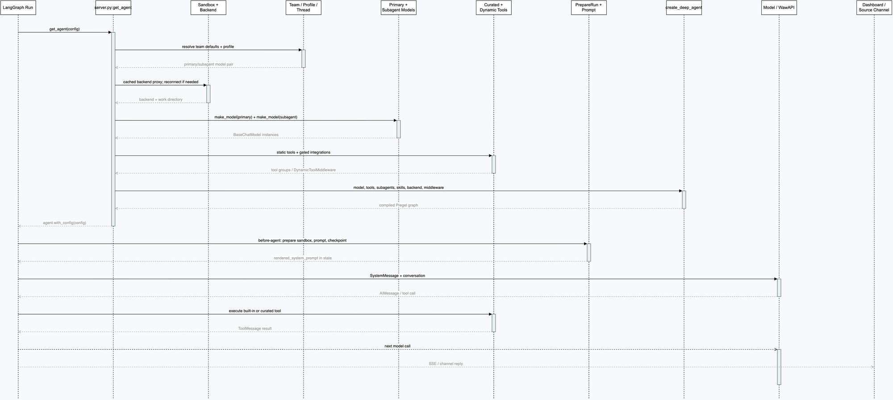

# 第 4 章：Deep Agent 装配：工具、提示词、middleware 和 subagent

## 学习目标

本章把第 3 章得到的 `BaseChatModel` 放回真正的 Agent 工厂。读完后，你应该能回答：`get_agent(config)` 为什么不是简单的 `create_deep_agent()` 包装；一个工具从哪里进入模型可见的工具列表；系统提示词为什么在 middleware 中注入；以及 `task` 委派给 subagent 时，模型、工具和超时边界如何变化。

本章只解释主 Agent 的装配与一次模型/工具循环。Dashboard 的 SSE event schema 和 `@langchain/react` 消费协议仍按课程 README 的待深入主题保留，暂不展开。

## 先看总图



图中上半段是“构造期”：LangGraph 调用 `get_agent()`，工厂解析设置、取得 sandbox backend、构造两个模型、加载工具并编译 Deep Agent。下半段是“运行期”：`PrepareAgentRunMiddleware` 准备本轮状态和提示词，模型返回 `AIMessage` 或 tool call，工具结果再回到下一次模型调用，最终由 Dashboard 或 Slack/GitHub/Linear 通道收到输出。

可打开 [交互查看器](architecture/premium/html/10-deep-agent-assembly-sequence.html) 缩放，也可以在 Draw.io 中编辑 [源文件](architecture/premium/10-deep-agent-assembly-sequence.drawio)。嵌入 XML 的 PNG 预览位于 [10-deep-agent-assembly-sequence.drawio.png](architecture/premium/png/10-deep-agent-assembly-sequence.drawio.png)。

## 1. `get_agent()` 是装配根，而不是执行循环

入口是 `agent/server.py:get_agent`。它先把 `configurable.thread_id` 取出来，并把递归预算设为 `DEFAULT_RECURSION_LIMIT`（`agent/server.py:951-956`）。没有 thread，或当前调用不是执行阶段时，函数返回一个没有 sandbox、工具为空的轻量 graph（`agent/server.py:958-963`）。这条分支用于加载/检查 graph，不能误认为生产 Run 已经具备文件操作能力。

执行期的装配可以压缩成下面的伪代码：

```python
async def get_agent(config):
    thread_id = config["configurable"].get("thread_id")
    if not thread_id or not graph_loaded_for_execution(config):
        return create_deep_agent(system_prompt="", tools=[])

    team, gateway, profile, fable = await load_cached_settings(...)
    backend = get_cached_sandbox_backend(thread_id, reconnect=...)
    primary, subagent = resolve_model_pairs(team, profile, config["configurable"])
    primary = gate_fable_model(primary, fable_enabled=fable)
    subagent = gate_fable_model(subagent, fable_enabled=fable)

    tools = static_tools + load_authorized_integrations(...)
    models = make_primary_and_subagent_models(primary, subagent, gateway)
    return create_deep_agent(
        model=models.primary,
        tools=tools,
        subagents=[general_purpose(models.subagent), browser_if_available(...)],
        skills=user_skill_route_if_logged_in,
        backend=backend,
        middleware=ordered_middleware,
    ).with_config(config)
```

这里有两个重要边界：工厂本身只负责**拼装图**，不在 `get_agent()` 中调用 LLM；真正的 LLM 调用发生在图运行后，由 Deep Agents 生成的 model/tool loop 驱动。

## 2. 一次真实配置如何穿过工厂

假设 Dashboard 启动一个 Run，可信的 `configurable` 大致如下（值仅用于说明，不对应任何真实密钥）：

```python
config = {
    "configurable": {
        "__is_for_execution__": True,
        "thread_id": "thread-demo",
        "github_login": "octocat",
        "repo": {"owner": "acme", "name": "sample"},
        "agent_model_id": "openai:gpt-5.6-terra",
        "agent_effort": "medium",
        "source": "dashboard",
    },
    "metadata": {},
}
```

`get_agent()` 的解析顺序是：团队默认主/子模型对 -> 用户 Profile 主模型覆盖 -> Profile 的独立 subagent 覆盖 -> 合法的 per-thread `agent_model_id + agent_effort` 覆盖（`agent/server.py:988-1036`）。线程覆盖必须同时通过 `SUPPORTED_MODEL_IDS` 和 `model_supports_effort` 校验；随便塞一个字符串不会绕过服务端策略。随后 `gate_fable_model()` 对被工作区禁用的 Fable 模型做最后替换（`agent/server.py:1042-1047`）。

模型参数由 `provider_model_kwargs()` 翻译后分别构造主模型和 subagent 模型（`agent/server.py:1049-1058`）。WawAPI 的 `OPENAI_BASE_URL`、Chat Completions 协议和 `reasoning_effort` 转换已经在第 3 章说明；本章只关心它们最终成为两个 `BaseChatModel` 对象。

### 2.1 sandbox backend 不是可选装饰

工厂通过 `_get_cached_sandbox_backend(thread_id, reconnect=...)` 取得线程绑定的 backend（`agent/server.py:979-986`）。它既承载工作区文件，又作为 Deep Agents 的 backend 传入 `create_deep_agent()`。如果当前用户已登录，工厂还把用户 skill 的只读 Store 挂到 `CompositeBackend` 的 `/skills/` 路由（`agent/server.py:1160-1174`）。

因此这里不是“给 Agent 一个工作目录字符串”这么简单：

```text
thread_id
  -> SandboxBackendProxy
       -> sandbox filesystem / execute
  -> CompositeBackend
       /skills/ -> ReadOnlyBackend(StoreBackend(namespace=(skills, login)))
```

`tests/agent/test_agent_assembly_context.py:81-90` 明确锁定了这一契约：传给 Deep Agents 的必须是初始化好的 `CompositeBackend` 实例，而不是一个工厂函数。这样 Deep Agents 才能自动启用文件工具结果驱逐和历史摘要卸载。

## 3. 工具如何进入模型上下文

### 3.1 静态工具：稳定的产品能力

`static_tools` 在 `agent/server.py:1119-1146` 枚举。它包含 Web 请求和搜索、计划模式、用户指令/skill、Linear、PR、sandbox 重建、平台问题报告、唤醒调度，以及 Slack 线程操作。列表中的对象本身是工具函数；`agent/tools/__init__.py` 只做懒加载导出，把公共名字映射到实际模块，避免启动时一次性导入全部工具。

文件读写类工具不在这个列表里，因为 `create_deep_agent()` 根据 backend 自动加入 Deep Agents 内置工具：`read_file`、`write_file`、`edit_file`、`execute`、`grep`、`glob`、`ls`、`delete`、`task` 等。重复把这些工具塞进 `static_tools` 会造成同名冲突和错误的工具边界。

### 3.2 动态工具：按权限和环境出现

工厂并行加载 Corridor、Observability、Currents、Notion、Browser 等集成。Observability 先做管理员/组织成员授权检查；Corridor、Currents、Notion 等 loader 失败或超时会降级为空列表，确保核心 Agent 仍然可以启动（`agent/server.py:1091-1117`）。

如果至少有一个集成组非空，才创建 `DynamicToolMiddleware`（`agent/server.py:1147-1158`）。它以组为单位向模型暴露工具，并把 Deep Agents 内置名字和静态工具名字放入 `reserved_names`，防止外部 MCP 工具覆盖 `execute` 或 `open_pull_request` 之类的核心能力。

可以把工具集合画成三层：

| 工具来源 | 什么时候加入 | 典型例子 | 保护边界 |
| --- | --- | --- | --- |
| Deep Agents 内置 | `create_deep_agent` 自动加入 | `read_file`、`execute`、`task` | backend/Deep Agents 负责注册 |
| Open SWE 静态 | 每个执行期主 Agent 都注册 | `web_search`、`open_pull_request`、`slack_thread_reply` | `PLAN_MODE_EXCLUDED_TOOLS` 等 middleware 限制 |
| 集成动态组 | 凭据、权限和 loader 都满足时 | Corridor、LangSmith、Currents、Notion | `DynamicToolMiddleware.reserved_names` 防同名覆盖 |

## 4. 系统提示词为什么在 middleware 中注入

`create_deep_agent()` 接收的 `system_prompt` 故意是空字符串（`agent/server.py:1181-1184`）。这不是没有系统提示词，而是把提示词延迟到**每次新 Run**：

1. `PrepareAgentRunMiddleware` 的 `abefore_agent()` 根据最近一条消息和配置计算 fingerprint；同一 invocation 恢复时若 fingerprint 没变，就跳过重复准备（`agent/middleware/prepare_run.py:41-67`）。
2. 子类 `PrepareAgentRunMiddleware._prepare()` 会准备 work directory、sandbox 状态、回合 checkpoint，并调用 `construct_system_prompt(...)`；返回值放进 `rendered_system_prompt` state（`agent/server.py:874-948`）。
3. 在模型调用边界，`BasePrepareRunMiddleware.awrap_model_call()` 读取这个 state，把渲染结果与 Deep Agents 已有的 system message 拼成一个 `SystemMessage`（`agent/middleware/prepare_run.py:84-94`）。

因此 repo 指令、用户指令、计划模式、提交身份和来源通道信息都能随线程/回合刷新，而不是在进程启动时冻结。这个设计同时解释了为什么“工厂创建 graph”和“本轮模型看到的完整提示词”是两个时刻。

## 5. middleware 顺序：一条有方向的保护链

`agent/server.py:1191-1233` 给出了精确顺序。可按职责分成四段：

| 阶段 | 代表 middleware | 主要作用 |
| --- | --- | --- |
| 运行准备 | `PrepareAgentRunMiddleware`、`DynamicToolMiddleware` | 准备 sandbox、提示词、checkpoint，并让集成工具动态可见 |
| 工具输入与预算 | `SanitizeToolInputsMiddleware`、`ModelCallLimitMiddleware`、`ToolErrorMiddleware`、`SubdirAgentsReadMiddleware` | 规范参数、限制模型调用次数、把异常变成 ToolMessage、补充作用域内 `AGENTS.md` |
| 协作与外部副作用 | `ToolRetryMiddleware(task)`、PR guard、GitHub proxy refresh、消息队列、Slack 状态、超时收尾、step-limit 通知 | 只重试 subagent `task`，阻止不合规 PR 操作，刷新代理凭据，接收中途消息并报告边界 |
| 模型调用内圈 | fallback、plan mode、Fireworks/thinking 清洗、`ModelCallTimeoutMiddleware` | 跨 provider 降级、计划模式工具限制、清洗 provider payload，给单次模型调用设墙钟 deadline |

顺序不是装饰。以 `ToolErrorMiddleware` 和 `ToolRetryMiddleware` 为例，测试要求前者在列表中位于后者之前（`tests/agent/test_agent_assembly_context.py:150-157`），这样 retry 失败最终能被统一转换成工具错误，而不是绕过错误处理直接中止。

`ModelCallTimeoutMiddleware` 放在最内层（`agent/server.py:1231-1233`），其 `asyncio.wait_for()` 只包住实际 provider handler；超时异常向外冒泡后，`ModelFallbackMiddleware` 才有机会切换模型。fallback 本身只对连接错误、429、5xx 等暂态错误重试，参数错误直接抛出（`agent/middleware/model_fallback.py:164-187`）。

## 6. subagent：同一图里的独立小图

### 6.1 general-purpose subagent

`_general_purpose_subagent()` 返回一个 `SubAgent` 描述（`agent/server.py:602-624`）：

```python
{
    "name": "general-purpose",
    "description": GENERAL_PURPOSE_SUBAGENT["description"],
    "system_prompt": OPEN_SWE_SHARED_BASE + "\n\n" + deepagents_task_prompt,
    "model": subagent_model,
    "middleware": [dynamic_tool_middleware?, ModelCallTimeoutMiddleware()],
    "skills": ["/skills/"]?,
}
```

这意味着 `task` 委派并不是把父 Agent 的当前模型调用“递归调用一次”。Deep Agents 会把这个 spec 编译成自己的 graph；父 middleware 不会包住子图里的模型调用，所以工厂显式给 subagent 放入独立的 `ModelCallTimeoutMiddleware`。`tests/models/test_agent_subagent_models.py:15-85` 验证了 Profile 可以让主 Agent 和 subagent 使用不同模型/effort，`89-152` 验证没有独立 subagent 配置时它继承主模型。

### 6.2 browser subagent

当 `load_browser_tools()` 返回工具时，工厂额外加入 `_browser_subagent(...)`（`agent/server.py:1185-1188`）。它使用同一个 subagent model，但拥有 Stagehand 浏览器工具和专门的浏览器操作提示词；没有 browser tools 时不会创建空的 browser agent。

### 6.3 subagent 的返回边界

父 Agent 调用 `task` 后只得到 subagent 的最终消息/摘要，不直接共享子图内部的每个中间模型消息。这个边界是为什么 general-purpose prompt 强调“调用 agent 只能看到你的最终结果”；相关断言位于 `tests/agent/test_agent_assembly_context.py:161-170`。

## 7. 一次具体任务的完整链路

假设用户在 Dashboard 输入：“检查 `sample` 仓库的测试失败原因并修复”。实际运行可以抽象为：

```text
1. get_agent(config)
   - 取 thread_id=thread-demo
   - 解析模型：thread override -> profile -> team
   - 取得 SandboxBackendProxy(/workspace)
   - 构造主模型与 subagent 模型
   - 注册 static_tools + 动态集成组 + Deep Agents 内置工具
   - 编译 create_deep_agent(...)

2. PrepareAgentRunMiddleware.abefore_agent()
   - 确认 sandbox 可用、刷新本轮上下文
   - 快照 worktree
   - 渲染含 AGENTS.md、repo/user 指令和工作目录的系统提示词

3. 主模型调用
   SystemMessage + 用户问题
   -> AIMessage(tool_calls=[execute("pytest ...")])

4. 工具循环
   execute -> ToolMessage(测试输出)
   -> 主模型再次判断
   -> 需要并行研究时 task -> general-purpose subagent
   -> subagent 最终摘要回到父 Agent

5. 完成
   主模型发出最终 AIMessage
   -> LangGraph 持久化 state/checkpoint
   -> Dashboard/Slack/GitHub/Linear 收到流或回复
```

注意第 5 步没有“after-agent 自动开 PR”的隐藏钩子。主 Agent 是否 commit、push、创建/更新 PR，取决于模型是否调用对应工具以及提示词中的策略；工厂只负责把这些能力和保护 middleware 装进去。

## 8. 源码证据表

| 图元素 | 源码位置 | 关键符号 | 证据含义 |
| --- | --- | --- | --- |
| 工厂入口 | `agent/server.py:951-963` | `get_agent` | 非执行调用返回空工具 graph；执行调用进入完整装配 |
| 模型优先级 | `agent/server.py:988-1047` | profile/thread/fable gates | 解析主模型与 subagent 模型对，并做能力校验 |
| sandbox/backend | `agent/server.py:979-986,1160-1174` | `_get_cached_sandbox_backend`, `CompositeBackend` | 工作区和 `/skills/` 只读路由进入 Deep Agents |
| 工具集合 | `agent/server.py:1119-1158` | `static_tools`, `DynamicToolMiddleware` | 静态工具稳定注册，集成工具按权限动态出现 |
| Deep Agent 编译 | `agent/server.py:1181-1190` | `create_deep_agent` | 主模型、subagents、skills、backend 组成 compiled graph |
| middleware 顺序 | `agent/server.py:1191-1233` | `middleware=[...]` | 顺序定义保护、重试、fallback 和 timeout 的嵌套关系 |
| 提示词注入 | `agent/middleware/prepare_run.py:41-94` | `BasePrepareRunMiddleware` | 运行前准备并把 state 中的 prompt 注入 `SystemMessage` |
| subagent 模型 | `agent/server.py:602-624` | `_general_purpose_subagent` | 共享 Open SWE 基础提示词，拥有独立 timeout |
| backend 上下文能力 | `tests/agent/test_agent_assembly_context.py:81-90` | backend assertion | `CompositeBackend` 触发 Deep Agents 的 eviction/summarization |
| subagent override | `tests/models/test_agent_subagent_models.py:15-85` | profile model test | 主模型与 subagent 可独立选择 provider/effort |

## 9. 最小验证

本章的装配测试不触发真实 sandbox 或模型，而是 patch 掉外部依赖、捕获传给 `create_deep_agent` 的 kwargs。建议先运行：

```bash
uv run pytest -q \
  tests/agent/test_agent_assembly_context.py \
  tests/models/test_agent_subagent_models.py
```

重点看四类断言：backend 是实例而不是 callable；用户 skill 路由是只读的；`RepairOrphanedToolCallsMiddleware` 没有重复注入；以及 `task` retry、消息队列和 step-limit middleware 都仍在正确位置。

## 常见误区

1. **把 `create_deep_agent` 当成纯模型包装器。** 它还会根据 backend 加入文件工具，并自动接入上下文管理 middleware。
2. **把所有工具都放进静态列表。** 内置工具由 Deep Agents 提供，集成工具还需要权限和 loader；重复注册会破坏保留名规则。
3. **以为 system prompt 在工厂创建时就固定。** 本项目延迟到 `PrepareAgentRunMiddleware`，因此每个新回合可以得到最新的 repo/user 指令和 worktree 信息。
4. **认为父 Agent 的 middleware 会自动保护 subagent。** 子图独立编译，subagent 必须显式带自己的 timeout；动态工具是否可见也由 subagent spec 决定。
5. **把 middleware 列表当成无序配置。** `ToolErrorMiddleware` 与 `ToolRetryMiddleware`、fallback 与 innermost timeout 的相对位置都会改变行为。

## 检查题与改造练习

1. 为什么 `get_agent()` 在没有 `thread_id` 时不能直接创建带 `execute` 的主 Agent？请从 sandbox/backend 缺失的角度回答。
2. 假设 `profile` 只覆盖主模型，不提供 subagent 模型；根据测试推断两个 `make_model()` 调用会收到什么 model ID 和 effort。
3. 把 `DynamicToolMiddleware` 的 `reserved_names` 中的 `"execute"` 删除，会产生什么工具治理风险？请指出一个可能的同名覆盖场景。
4. 设计一个测试：让 primary model 第一次抛出 `TimeoutError`，验证最内层 timeout 如何把异常交给 fallback middleware。
5. 在不修改 `agent/server.py` 工厂顺序的情况下，为一个新的只读工具增加权限门控，并说明它应该属于 static 还是 dynamic 组。

## 下一章

下一章进入 **Sandbox 生命周期：线程工作区、GitHub 凭据代理与故障恢复**，重点解释 `SANDBOX_BACKENDS`、metadata 中的 `sandbox_id`、不可达 sandbox 为什么默认不能被静默替换，以及 reviewer 为什么拥有 `allow_replacement=True` 的例外。
