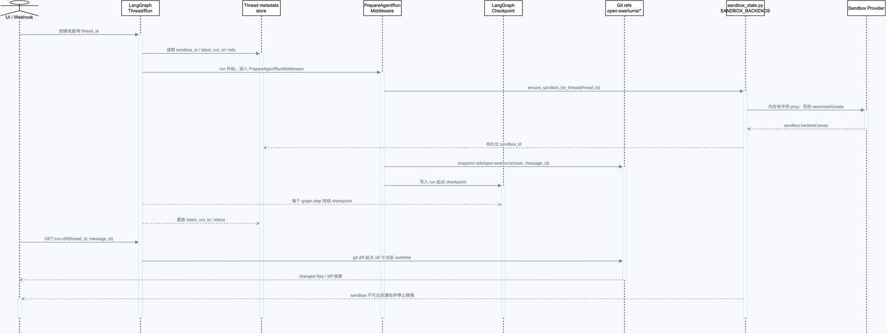
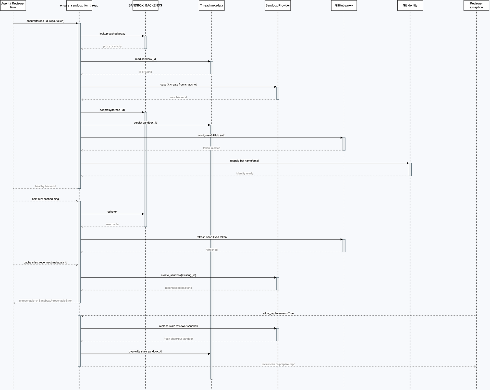

# 第 5 章：Sandbox 生命周期：线程工作区、凭据代理与故障恢复

## 学习目标

本章解释 Open SWE 如何把一个 `thread_id` 绑定到可复用的 sandbox，以及为什么这个绑定同时存在于进程内缓存、LangGraph thread metadata 和外部 sandbox provider 三个层面。读完后，你应该能追踪新 sandbox 的创建、缓存命中、metadata 重连、GitHub proxy 刷新、不可达错误和 reviewer 替换例外，并能判断一次“重建 sandbox”是否会破坏未提交工作。

本章不讨论 LangSmith 沙箱产品的计费细节，也不执行真实创建/删除操作；外部 sandbox 会产生资源和费用，验证以本地 fake provider、状态单元测试和源码构图为主。

## 1. 先建立三个对象的边界

“sandbox”在代码里不是一个单独对象，而是三层组合：

| 层 | 代表对象 | 生命周期 | 解决的问题 |
| --- | --- | --- | --- |
| Provider backend | `SandboxBackendProtocol` 实例 | 由 LangSmith/Daytona/Modal 等 provider 管理 | 真正执行 `read/write/execute`、保存工作树 |
| 线程代理 | `SandboxBackendProxy` | 进程内按 `thread_id` 缓存 | 让已构造的 Deep Agents 工具持有稳定句柄，底层 backend 可重连/替换 |
| Thread metadata | `metadata["sandbox_id"]` | 随 LangGraph thread 持久化 | worker 重启后知道应该连接哪个外部 sandbox |

短接线图如下：

```text
thread_id
  -> SANDBOX_BACKENDS[thread_id] : SandboxBackendProxy
       -> current : SandboxBackendProtocol
  -> LangGraph thread metadata.sandbox_id
       -> create_sandbox(existing_id) 重新连接 provider
```

代理不是多余的包装。`SandboxBackendProxy` 继承 `BaseSandbox`，使 Deep Agents 的 `FilesystemMiddleware` 仍能识别 capture-at-source 能力；否则 `execute` 的大段 stdout 会被拉回 worker，绕过 sandbox 内的大小限制（`agent/utils/sandbox_state.py:30-45`，`tests/sandbox/test_sandbox_state.py:77-82`）。

## 2. 两张图：全生命周期与确保函数细节

先看已有的全局生命周期图，它把 Thread、Run、Checkpoint、Git ref 和 sandbox 放在同一条时间线上：



可编辑 [05-state-lifecycle.drawio](architecture/premium/05-state-lifecycle.drawio)，也可打开 [HTML 查看器](architecture/premium/html/05-state-lifecycle.html)。

本章重点再下钻一层，专门跟踪 `ensure_sandbox_for_thread()` 的三种进入路径和 reviewer 例外：



可编辑 [11-sandbox-lifecycle-sequence.drawio](architecture/premium/11-sandbox-lifecycle-sequence.drawio)，或打开 [交互查看器](architecture/premium/html/11-sandbox-lifecycle-sequence.html)。

读第二张图时从左到右看参与者，从上到下看时间。实线是调用，灰色虚线是返回；`SandboxUnreachableError` 是故障结果，不是创建成功。底部 reviewer 分支特意使用 `allow_replacement=True`，表示它与主 Agent 的数据保留假设不同。

## 3. `ensure_sandbox_for_thread()` 的三种情况

源码在 `agent/server.py:429-527`，函数开头同时读取内存缓存和 thread metadata：

```python
sandbox_backend = SANDBOX_BACKENDS.get(thread_id)
if sandbox_backend is not None and not sandbox_backend.has_backend:
    sandbox_backend = None
sandbox_id = await get_sandbox_id_from_metadata(thread_id)
```

接下来只有三条合法路径。

### 3.1 情况一：内存里已有 backend

如果 `SANDBOX_BACKENDS[thread_id]` 有实际 backend，`_connect_existing_sandbox()` 先调用 `check_sandbox_reachable()` 执行 `echo ok`（`agent/server.py:391-401`）。ping 成功后，LangSmith provider 会刷新 GitHub proxy；随后重新写入 bot 的 Git name/email。

这是最短路径：不创建新 sandbox，不改变工作树，只恢复本轮需要的短期 GitHub token。

### 3.2 情况二：进程缓存丢失，但 metadata 有 `sandbox_id`

worker 重启后，内存字典为空，但 thread metadata 仍保留外部 ID。此时 `_connect_existing_sandbox()` 调用 `create_sandbox(str(sandbox_id))` 重连 provider，再执行可达性检查和 proxy 刷新（`agent/server.py:404-426`）。

`SandboxBackendProxy._aget_backend()` 还提供了并发保护：多个异步工具第一次访问空代理时，共用同一把 `asyncio.Lock`，只会进行一次 reconnect；`tests/sandbox/test_sandbox_state.py:118-152` 用五个并发 `aexecute()` 断言 provider 只被调用一次。

### 3.3 情况三：缓存和 metadata 都没有

这是唯一的正常创建路径。`_create_sandbox_with_proxy()` 先按 repo 查找 ready snapshot，调用 `create_sandbox(snapshot_id=...)`，如果 `SANDBOX_TYPE=langsmith`，再配置 GitHub proxy（`agent/server.py:298-328`）。创建完成后：

1. `set_sandbox_backend(thread_id, backend)` 把 provider backend 放入稳定 proxy。
2. 若 ID 与 metadata 不同，调用 `client.threads.update(..., metadata={"sandbox_id": ...})` 持久化绑定（`agent/server.py:518-523`）。
3. `_configure_git_identity()` 每次运行重新写入 bot 身份（`agent/server.py:383-388,525`）。

因此“创建 sandbox”不是只得到一个 ID，而是完成 provider、proxy、metadata、Git 身份四个同步动作。

## 4. 为什么主 Agent 默认绝不静默替换

假设 thread metadata 指向 `sandbox-old`，里面有模型刚刚修改但还没有 commit 的文件。下一次 Run 连接失败时，如果程序直接创建 `sandbox-new` 并继续，模型看到的是一个空工作树，却会误以为之前的修改还在。这个错误比直接失败危险得多，因为它会产生看似正常但缺少上下文的 commit/PR。

所以 `ensure_sandbox_for_thread(..., allow_replacement=False)` 在 `_connect_existing_sandbox()` 抛出 `SandboxUnreachableError` 时直接重新抛出（`agent/server.py:489-491`）。`SandboxUnreachableError` 明确携带 `thread_id`、旧 `sandbox_id` 和原因（`agent/utils/sandbox_state.py:18-29`）。主 Agent 的 `PrepareAgentRunMiddleware` 捕获它后，清除进程缓存，并调用 `post_sandbox_unreachable_notification()` 告诉用户（`agent/server.py:891-898`）。

这里的产品语义是：**保留失败现场，等待旧 sandbox 恢复或让用户显式重建**，而不是偷偷换一块空磁盘。

## 5. reviewer 为什么可以替换

Reviewer 是有意设计的例外。`agent/reviewer.py:_ensure_reviewer_sandbox_for_thread()` 在 `agent/reviewer.py:955-965` 传入 `allow_replacement=True`，原因有两个：

- reviewer sandbox 只保存 `prepare_review_repo` 重新 checkout 出来的工作树，不保存 Agent 的未提交创作；
- 一个 PR 对应一个长期 reviewer thread，而 provider 可能因 retention TTL 删除旧 sandbox；拒绝替换会让这个 PR 的后续 review 永久卡死。

替换路径仍然是有边界的：先捕获旧 ID，再创建新 sandbox；创建失败仍包装成 `SandboxUnreachableError`（`agent/server.py:497-515`）。Reviewer middleware 捕获二次失败后，会在 PR 上发布“无法准备 review sandbox”的通知（`agent/reviewer.py:1015-1024`）。测试覆盖了允许替换、替换失败和默认主 Agent 不替换三种情况（`tests/sandbox/test_reviewer_sandbox_recovery.py:56-152`）。

另外，用户主动调用 `recreate_sandbox_for_thread()` 时是明确的重建动作，而不是故障自动恢复。它要求已有旧 ID、创建一个不同的新 ID、更新 metadata 并把 proxy 绑定到新 backend（`agent/server.py:530-560`）。这条路径应当由显式工具/操作触发，不能混入默认的不可达处理。

## 6. GitHub proxy：凭据不进 sandbox 文件系统

LangSmith provider 的 sandbox 不直接保存 GitHub token。创建或重连时，server 通过 `_resolve_proxy_token()` 优先使用调用方传入的 token，否则取得 GitHub App installation token（`agent/server.py:273-279`），再调用 `_configure_github_proxy(sandbox_id, token)`。

`agent/integrations/langsmith.py:334-385` 将 token 交给 LangSmith proxy-config API，规则负责：

```text
git traffic to github.com
  -> proxy injects Basic auth for git operations
api.github.com requests
  -> proxy injects Bearer auth
sandbox command
  -> uses GH_TOKEN=dummy gh ... without storing the real token
```

复用 sandbox 时，`_refresh_github_proxy()` 会再次配置短期 token；刷新失败被转换成 `SandboxUnreachableError`（`agent/server.py:330-380`）。这保证了 token 轮换和 sandbox 复用不会互相冲突。

## 7. Provider 工厂和配置边界

`agent/utils/sandbox.py:11-21` 用 `SANDBOX_FACTORIES` 把 `SANDBOX_TYPE` 映射到 provider 模块：`langsmith`、`daytona`、`modal`、`runloop`、`e2b`、`local`。`create_sandbox()` 负责统一异步接口；LangSmith 原生 async，其余 provider 用 `asyncio.to_thread()` 桥接同步 SDK（`agent/utils/sandbox.py:24-59`）。

当 `SANDBOX_TYPE=langsmith` 时，启动阶段会检查 `DEFAULT_SANDBOX_SNAPSHOT_ID` 和资源参数（`agent/utils/sandbox.py:61-88`）。本地学习只需要理解这个配置契约；如果没有 LangSmith sandbox 凭据，不能把 provider 创建测试冒充成真实外部验证。

## 8. 一个实际调用例子

假设 thread `thread-demo` 第一次运行，metadata 没有 `sandbox_id`，团队配置 `SANDBOX_TYPE=langsmith`：

```text
1. get_agent() 取得 SandboxBackendProxy(thread-demo)
2. PrepareAgentRunMiddleware._prepare() 调 ensure_sandbox_for_thread()
3. SANDBOX_BACKENDS 有空 proxy，metadata 也没有 sandbox_id
4. create_sandbox(snapshot_id=repo_snapshot_or_default)
5. _configure_github_proxy(new_id, installation_token)
6. SANDBOX_BACKENDS[thread-demo] = proxy(current=new_backend)
7. threads.update(metadata.sandbox_id = new_id)
8. git config --global user.name/email
9. Agent 在同一 backend 上执行 clone/read/edit/execute
```

第二次运行时，通常只发生 `echo ok`、proxy refresh 和 Git identity refresh；不会重新创建。若 worker 重启，缓存步骤消失，但 metadata 重连会把它恢复到同一个 ID。

### 对应伪代码

```python
async def ensure(thread_id, allow_replacement=False):
    cached = SANDBOX_BACKENDS.get(thread_id)
    sandbox_id = await get_sandbox_id_from_metadata(thread_id)

    if cached is None and sandbox_id is None:
        backend = await _create_sandbox_with_proxy()
    else:
        try:
            backend = await _connect_existing_sandbox(
                thread_id, cached=cached, sandbox_id=sandbox_id
            )
        except SandboxUnreachableError:
            if not allow_replacement:
                raise
            backend = await _create_sandbox_with_proxy()

    proxy = set_sandbox_backend(thread_id, backend)
    if sandbox_id != proxy.id:
        await client.threads.update(
            thread_id=thread_id, metadata={"sandbox_id": proxy.id}
        )
    await _configure_git_identity(proxy)
    return proxy
```

伪代码省略了 token、repo snapshot 和日志细节，但保留了源码真正的分支：默认不替换，只有显式 `allow_replacement` 才创建替代品。

## 9. 源码证据表

| 图元素 | 源码位置 | 关键符号 | 图中行为 |
| --- | --- | --- | --- |
| 稳定线程句柄 | `agent/utils/sandbox_state.py:30-123` | `SandboxBackendProxy` | 代理文件/命令操作，并在首次异步访问时单次重连 |
| 进程缓存 | `agent/utils/sandbox_state.py:226-281` | `SANDBOX_BACKENDS`, `set_sandbox_backend` | `thread_id -> proxy`，替换 backend 时保留 proxy 身份 |
| metadata 读取 | `agent/utils/sandbox_state.py:283-322` | `get_sandbox_id_from_metadata` | 先读运行时 config，再回退 LangGraph client |
| 三路决策 | `agent/server.py:429-527` | `ensure_sandbox_for_thread` | 缓存 ping、metadata 重连、无状态创建；默认不替换 |
| 新建与 proxy | `agent/server.py:298-328` | `_create_sandbox_with_proxy` | provider 创建、GitHub proxy 配置、token expiry 记录 |
| 不可达错误 | `agent/utils/sandbox_state.py:18-29` | `SandboxUnreachableError` | 携带 thread/旧 ID/原因，阻止静默丢工作 |
| 主 Agent 通知 | `agent/server.py:874-898` | `PrepareAgentRunMiddleware._prepare` | sandbox 不可达时清缓存并通知用户 |
| reviewer 例外 | `agent/reviewer.py:955-965` | `allow_replacement=True` | checkout 可重建，因此允许替换过期 sandbox |
| provider 选择 | `agent/utils/sandbox.py:11-59` | `SANDBOX_FACTORIES`, `create_sandbox` | `SANDBOX_TYPE` 映射到 provider，统一 async 接口 |
| GitHub 凭据边界 | `agent/integrations/langsmith.py:334-385` | `_configure_github_proxy` | token 注入 proxy，不写入 sandbox 文件系统 |

## 10. 最小验证

本章不执行真实 LangSmith sandbox 创建，避免产生外部资源和费用。运行以下本地测试即可验证生命周期契约：

```bash
uv run pytest -q \
  tests/sandbox/test_sandbox_state.py \
  tests/sandbox/test_sandbox_recovery.py \
  tests/sandbox/test_reviewer_sandbox_recovery.py \
  tests/sandbox/test_sandbox_recreation.py \
  tests/sandbox/test_stale_sandbox_creating.py
```

这些测试覆盖代理并发重连、capture offload、默认不替换、reviewer 替换、替换失败的类型保持、显式重建和 stale creating 状态。`tests/sandbox/test_proxy_auth.py` 还可以单独验证 GitHub proxy payload 和失败重试，不会把真实 token 打到输出中。

## 常见误区与反例

1. **sandbox 不可达就自动创建一个新的。** 这会让模型在空工作树上继续，静默丢掉未提交修改；主 Agent 默认必须抛 `SandboxUnreachableError`。
2. **只在内存中保存 sandbox ID。** worker 重启后无法重连；必须把 ID 写入 thread metadata。
3. **把 `SandboxBackendProxy` 当成一次性适配器。** Deep Agents 已经持有这个代理，reviewer 替换时应保留 proxy 身份并替换其 `current backend`。
4. **把 GitHub token 写入 sandbox 的环境变量或 git remote。** 本项目使用 LangSmith proxy 注入，sandbox 内只使用 `GH_TOKEN=dummy`，真实 token 留在服务端/代理层。
5. **把 reviewer 的 `allow_replacement=True` 复制给主 Agent。** reviewer checkout 可重新推导，主 Agent 的工作树包含用户未提交成果，两者数据保留假设完全不同。

## 检查题与改造练习

1. 沿 `ensure_sandbox_for_thread()` 说明缓存存在但 `metadata.sandbox_id` 不同的情况下，最终 metadata 是否会被覆盖？为什么？
2. 为 `SandboxBackendProxy._aget_backend()` 设计一个并发测试，证明五个并发工具调用只触发一次 provider reconnect。
3. 如果 `_refresh_github_proxy_or_fail()` 改成记录 warning 后继续，可能出现什么凭据和权限问题？
4. 设计一个显式“重建 sandbox”按钮：它应该调用哪个函数，如何向用户说明旧工作树是否仍可恢复？
5. 新增 `local` provider 时，为什么 `create_sandbox()` 要把同步 SDK 放进 `asyncio.to_thread()`？

## 已覆盖与下一步

本章已覆盖 sandbox 的对象边界、三路生命周期、metadata 持久化、proxy token、Git identity、不可达保护和 reviewer 替换。真实 provider 创建、LangSmith API 状态轮询和费用行为未验证，原因是它们会产生外部资源；本地状态与 proxy 契约已通过测试验证。

下一章进入 **Dashboard：认证、线程列表、流式交互和消息队列**，届时再追踪 README 中保留的 LangGraph command schema、SSE event schema 和 `@langchain/react` `StreamProvider` 消费链路。
