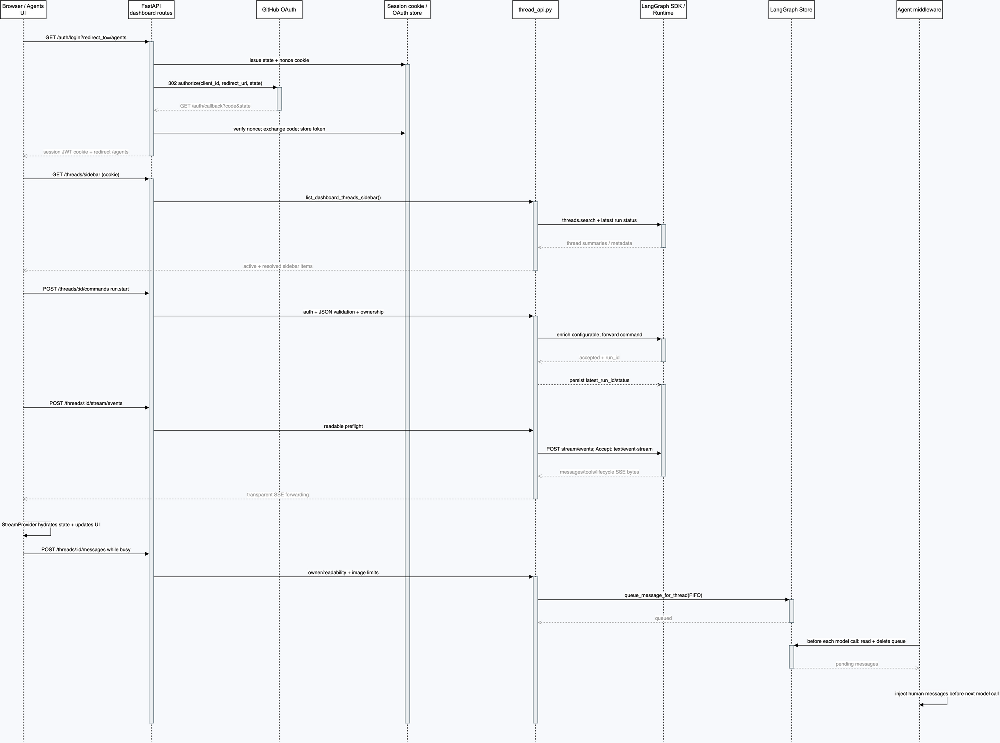

# 第 6 章：Dashboard：认证、线程列表、流式交互和消息队列

## 学习目标

本章沿着 Dashboard 的真实请求链路，解释浏览器如何登录、发现线程、启动 Run、消费 SSE，以及在 Agent 已经运行时把追加消息放进当前 Run 的上下文。读完后，你应该能够：

- 从 `/auth/login` 和 `/auth/callback` 追踪 GitHub OAuth 的 state、nonce、cookie 和 session JWT。
- 说明 `/threads`、`/threads/sidebar`、`/threads/page` 的用途，以及 readable/owner/admin 三种权限边界。
- 解释 `run.start` 为什么必须经过 Dashboard 代理重建可信配置，再交给 LangGraph。
- 区分命令请求、SSE 事件和队列消息三种数据方向。
- 追踪 `StreamProvider` 如何复用 transport、带上 session cookie、切换 thread 并恢复状态。
- 解释 busy thread 的 `/messages` 如何写入 LangGraph Store，并在下一次模型调用前被 middleware 注入。

本章只做本地源码和单元测试验证，不调用真实 GitHub OAuth、模型、LangGraph 远端或外部付费服务。

## 1. 先把 Dashboard 看成三个平面

Dashboard 不是“UI 直接调用 `get_agent()`”。它在 Agent Runtime 前面增加了一个面向浏览器的控制层：

| 平面 | 方向 | 主要职责 | 代表实现 |
| --- | --- | --- | --- |
| 命令面 | UI -> API -> LangGraph | 登录后的用户发起 `run.start`、取消或响应命令 | `routes.py`、`thread_api.py` |
| 观察面 | LangGraph -> API -> UI | 传输消息、工具、生命周期和 checkpoint 事件 | `/stream/events`、`StreamProvider` |
| 协作面 | UI/Slack/Linear/GitHub -> Store -> 当前 Run | Run 运行中追加反馈，不打断当前模型循环 | `/messages`、`queue_message_for_thread()`、`check_message_queue_before_model()` |

关键结论是：**Dashboard 会重建并鉴权命令，但不会把 Agent 的最终结果改写成另一套业务结果；SSE 主要负责观察，Store 队列负责协作。**

## 2. 架构图：一次登录到流式协作的完整时序



[打开可编辑 Draw.io 源文件](architecture/premium/12-dashboard-auth-stream-queue-sequence.drawio) · [打开自包含 HTML 查看器](architecture/premium/html/12-dashboard-auth-stream-queue-sequence.html)

这张图从左向右看参与者，从上向下看时间。蓝色是浏览器/UI，青绿色是 Dashboard 控制层，紫色是 LangGraph 执行层，绿色是 Store/线程状态。实线命令箭头表示“触发或控制”，虚线 SSE 箭头表示“观察”，队列箭头表示“把后续反馈留给下一次模型调用”。图中模块和 endpoint 都来自当前源码；事件的具体 SDK 字段在本章只解释到项目实际消费的边界，完整 event schema 留到后续 UI 章节。

### 图元素到源码的映射

| 图元素 | 源码位置 | 关键符号 | 图中行为 |
| --- | --- | --- | --- |
| OAuth 登录入口 | `agent/dashboard/routes.py:373-401` | `auth_login` | 生成 nonce/state，写 state cookie，构造 GitHub redirect URI |
| OAuth 回调 | `agent/dashboard/routes.py:404-437` | `auth_callback` | 比对 cookie nonce hash，交换 token，签发 session JWT |
| 线程列表 | `agent/dashboard/routes.py:1608-1663` | `api_list_threads*` | 读取 sidebar/page/list，并执行 admin gate |
| 命令代理 | `agent/dashboard/thread_api.py:2038-2131` | `proxy_dashboard_thread_commands` | 检查 thread、权限，补全 `run.start`，转发并记录 run ID |
| Run 配置重建 | `agent/dashboard/thread_api.py:1269-1394` | `_enrich_run_start_command` | 解析模型、effort、图片能力、assistant、stream modes 和可信 configurable |
| SSE 代理 | `agent/dashboard/routes.py:1798-1816`、`thread_api.py:1998-2035` | `api_thread_stream_events`、`_stream_thread_events` | preflight 后透传 `text/event-stream` bytes |
| StreamProvider | `ui/.../AgentThreadStreamProvider.tsx:17-149` | `AgentThreadStreamProvider` | 强制 cookie、绝对 API URL、复用 transport、hydrate thread |
| Busy 消息入口 | `agent/dashboard/thread_api.py:1436-1493` | `send_dashboard_message` | 要求 thread active，把消息写进队列 Store |
| FIFO 队列 | `agent/utils/thread_ops.py:45-84` | `queue_message_for_thread` | namespace `("queue", thread_id)`，最多保留 100 条 |
| 模型调用前注入 | `agent/middleware/check_message_queue.py:148-248` | `check_message_queue_before_model` | 读取并删除队列，按 FIFO 追加 human content blocks |

### 短接线图

```text
GitHub OAuth
  -> state cookie + session JWT
  -> UI /threads/sidebar
  -> run.start command proxy
  -> LangGraph thread/run
  -> stream/events SSE
  -> StreamProvider -> streamMessagesToUi

busy prompt
  -> POST /messages
  -> Store[("queue", thread_id), "pending_messages"]
  -> before_model hook
  -> new human message(s)
  -> next LLM call
```

## 3. OAuth：state cookie 解决的不是“登录”，而是“回调属于哪个浏览器会话”

### 3.1 登录入口

`auth_login()` 从环境变量读取 `GITHUB_APP_CLIENT_ID`。它先把用户要回去的地址经过 `sanitize_redirect_to()`，然后生成一次性 nonce。服务端不会把 nonce 明文放进 state，而是把 `hash_state_nonce(nonce)` 放入签名 state，同时把 nonce 写入 HttpOnly state cookie。

浏览器随后被重定向到 GitHub：

```text
GET /dashboard/api/auth/login?redirect_to=/agents
  -> issue_state({ redirect_to, nonce_hash })
  -> Set-Cookie: dashboard_oauth_state=<nonce>
  -> 302 https://github.com/login/oauth/authorize?...&state=<signed-state>
```

`desktop=true` 时，callback base URL 使用当前请求的 `request.base_url`；浏览器模式则使用 `_api_base_url()`。这就是桌面端和浏览器端 callback URL 可能不同的源码原因。

### 3.2 回调校验与 session

`auth_callback()` 同时拿到 GitHub 回传的 `state` 和浏览器发送的 cookie。只有下列关系成立才继续：

```text
hash(cookie_nonce) == state_payload["nonce_hash"]
```

校验失败统一返回 `400 oauth state mismatch — please retry login`。校验成功后，服务端用 code 换 GitHub access token，读取 GitHub login，执行组织登录门禁，把 access token 加密保存，再签发 session JWT cookie。后续 Dashboard 请求通过 `_SESSION_DEP` 解析这个 JWT。

这里有两个不同凭证：GitHub access token 用来代表用户访问 GitHub；session JWT 只用来代表浏览器已完成 Dashboard 登录。不要把它们混为一个 cookie，也不要把 GitHub token交给前端 JavaScript。

## 4. 线程列表与权限：readable 不等于 owner

### 4.1 三个列表 API

`/threads` 返回完整列表，`/threads/sidebar` 针对左侧导航提供 active/resolved 分段和当前 thread，`/threads/page` 提供分页、搜索、source、status、viewed/resolved 筛选。三者都依赖登录 session；`all=true` 只允许管理员。

线程摘要不是原始 LangGraph thread 的简单透传。`thread_api.py:_thread_summary()` 会从 metadata/run 状态整理出 UI 需要的 `sandboxId`、模型、effort、PR、viewed、resolved、queuedMessages 等字段。因此 UI 不必知道所有 runtime metadata 的内部键名。

### 4.2 权限边界

| 操作 | 条件 | 原因 |
| --- | --- | --- |
| 查看 surfaced-source thread | 已登录且 thread 可读 | 组织成员可以看到被展示给组织的任务 |
| 首次或后续 `run.start` | 可读成员 | 这是一次带归属前缀的用户追加消息 |
| 非 `run.start` 写命令 | thread owner | `input.respond` 等命令可能改变原运行控制状态 |
| `/messages` 追加消息 | 可读且 thread active | 追加反馈不是直接控制别人的 Run |
| `all=true` 列表 | admin | 避免普通成员读取全组织线程 |

代理在转发前先读取 thread metadata，再调用 `_assert_thread_readable()` 或 `_assert_thread_owner()`。这意味着“LangGraph endpoint 本身可调用”不等于“Dashboard 用户可以调用”。

## 5. `run.start` 命令代理：服务端重建可信配置

### 5.1 新 thread 的首个命令

UI 可以先生成一个 client-minted `thread_id`，然后直接发送首个 `run.start`。LangGraph 线程还不存在时，代理只接受 `run.start`，调用 `_enrich_run_start_command(..., creating=True)` 创建并盖章 Dashboard thread metadata；其它命令直接 404。

### 5.2 已有 thread 的命令

已有 thread 先判断 active 状态。`run.start` 遇到 busy thread 会返回 409，前端随后走 `/messages` 队列；其它命令先要求 owner。这样可以避免两个 run 同时修改同一个 sandbox。

### 5.3 `_enrich_run_start_command()` 做了什么

该函数不是简单 `dict.update()`，而是把客户端输入降级为“请求意图”，再从服务端可信来源构建真正的 run config：

1. 校验消息是可接受的 JSON content，必要时验证图片和模型视觉能力。
2. 解析 `agent_model_id`、`agent_effort`、`plan_mode`，并经过项目支持列表归一化。
3. 新 thread 写入 owner、repo、标题、模型和来源 metadata；已有 thread 按权限更新模型/effort/plan 状态。
4. 调用 `_build_dashboard_configurable()` 合并 thread、用户 profile、团队默认值和本次 override。
5. 注入 `_ASSISTANT_ID`、`_DASHBOARD_STREAM_MODES` 和 `stream_resumable=True`。
6. 转发到 LangGraph `/threads/{thread_id}/commands`。
7. 如果响应包含 `run_id`，写回 `latest_run_id`、`latest_run_status="pending"`。

默认 stream modes 是 `values`、`updates`、`messages`、`messages-tuple`、`tools`、`checkpoints`、`events`。这套配置解释了 UI 为什么能同时看到聊天文本、工具卡片和恢复所需的状态。

### 5.4 命令代理是不是“修改后再返回给 LangGraph”

是，但要准确理解“修改”的边界：

- 修改的是**可信执行参数**：权限、模型、effort、来源、assistant、stream modes、metadata。
- 不负责执行模型，也不把模型输出翻译成 Dashboard 私有结果协议。
- LangGraph 接受命令后，Runtime 才加载图、调用 `get_agent(config)`、运行模型/工具循环。
- UI 通过另一个 SSE endpoint 观察结果。

所以完整方向是：

```text
UI command --(鉴权/重建)--> LangGraph Runtime --(执行)--> SSE event --(映射)--> UI
```

## 6. SSE：观察面和命令面必须分开

`POST /threads/{thread_id}/stream/events` 首先在生成器外完成 JSON content-type 和 readable metadata preflight。这样认证失败会作为普通 HTTP 401/403 返回，而不是 SSE 已经开始后才变成一段模糊错误文本。

通过 preflight 后，`_stream_thread_events()` 向 LangGraph 发送 `Accept: text/event-stream`，使用 `httpx.AsyncClient.stream()` 逐块读取上游 bytes 并原样 yield。上游状态码 >= 400 时，代理把错误包装成：

```text
event: error
data: {"status": ..., "detail": ...}
```

正常情况下，Dashboard 不重排事件、不等待 Run 完成、不把消息落成另一种业务记录；它只是把 LangGraph event stream 送给已认证的浏览器。旧的 `/stream` endpoint 仍使用 `join_stream` 包装事件，新 UI 主要走 v2 `/stream/events`。

## 7. `StreamProvider`：一个 `/agents` 子树共用一个 transport

### 7.1 Cookie 与 URL

`dashboardFetch()` 给每个请求强制 `credentials: "include"`。同时调用 `overrideFetchImplementation()`，因为 SDK 的 `getState/history` 读取并不总是经过 transport 的 fetch；如果不覆盖，全局 Client 可能使用裸 `fetch`，导致 session cookie 丢失并得到 401。

`toAbsoluteApiUrl()` 把相对 `/dashboard/api` 提升为带当前 origin 的绝对 URL，避免 SDK 把相对地址错误回退到 `http://localhost:8123`。

### 7.2 生命周期与 thread 切换

`AgentThreadStreamProvider` 被挂在 `/agents` layout，而不是单个 thread 页面。因此 home -> thread 导航不会销毁 transport。`threadId=null` 时，SDK 处于 lazy-create 模式，首次 `stream.submit` 创建 thread；切换到具体 ID 时复用同一个 controller 并 hydrate 状态。

浏览器从后台恢复可见时，`ActiveThreadRecovery` 先 `hydrate(null)`，再 hydrate 当前 thread，避免旧连接残留。`onCreated` 刷新列表，`onCompleted` 刷新当前 thread 和列表。

### 7.3 事件如何变成聊天 UI

`streamMessagesToUi()` 不让 Dashboard 服务端复制一份“UI transcript”。它直接消费 SDK 投影：

- `messages` 决定 human/AI 顺序、文本和 reasoning。
- `toolCalls` 决定工具调用的进行中、完成、错误和 output。
- `subagents` 把 `task` 调用关联到子 Agent namespace 和生命周期。
- 工具名被映射为 `read/edit/execute/search/fetch/task` 等 UI 类型。

这样 checkpoint/history hydrate 后与实时 SSE 的 UI 映射使用同一套函数，减少“实时看起来正常、刷新后顺序不同”的风险。

## 8. busy thread 的消息队列：不启动第二个 Run

### 8.1 前端的两条提交路径

`useSubmitAgentMessage()` 先尝试 `agentsApi.queueMessage()`：

- 如果 thread 正在运行，`stream.isLoading` 为真，直接把消息排队。
- 如果 thread 看起来 idle，但服务端返回 409（典型是状态竞态），也回退到 `stream.submit()`。
- idle 的真正启动路径调用 `stream.submit()`，而且不 `await`；因为 Promise 会等整个 Run 结束，await 会把输入框锁死，用户无法继续排队。

### 8.2 服务端队列写入

`send_dashboard_message()` 读取 thread，要求可读，并调用 `get_thread_active_status()`。若不是 active，返回 409，提示用户从命令 endpoint 启动新 Run。active 时，它更新 source/plan/model metadata，然后调用：

```text
namespace = ("queue", thread_id)
key = "pending_messages"
value = {"messages": [oldest, ..., newest]}
```

`queue_message_for_thread()` 以 FIFO 顺序追加，最多保留 `MAX_QUEUED_MESSAGES = 100` 条，超出时丢弃最旧消息。这是有意的边界：队列是短期协作缓冲，不是无限历史数据库。

### 8.3 模型调用前消费

`check_message_queue_before_model()` 每次模型调用前读取 `configurable.thread_id`，从同一 namespace 获取 `pending_messages`。它**先删除再注入**，避免 middleware 重入时重复消费，然后把文本、图片、Dashboard handoff、plan approval 状态按 FIFO 合并成新的 human content blocks。

因此追加消息不是“开一个并行 Run”，而是改变当前 Run 下一次 LLM call 看到的 state：

```text
当前 state
  -> before_model 读取并删除队列
  -> state.messages += [queued human message 1, queued human message 2]
  -> 下一次 model.invoke(state)
```

如果消费过程中发生异常，middleware 记录日志并返回 `None`，不会把一个无法读取的队列伪装成已经成功注入。

## 9. 一个实际调用例子：从“修复登录页”到运行中追加约束

假设用户已经通过 GitHub 登录，在 `/agents` 输入“修复登录页的 OAuth 回调”，随后又在 Agent 执行期间追加“不要改桌面端协议”。完整链路如下：

1. `StreamProvider` 的 `stream.submit()` 组装 human message，通过 transport POST `/threads/<id>/commands`。
2. Dashboard 读取 session JWT，发现 thread 不存在，于是接受首个 `run.start`。
3. `_enrich_run_start_command()` 创建 thread metadata，解析模型/effort，注入 assistant、stream modes 和可信 configurable。
4. LangGraph 返回 `run_id`；Dashboard 写入 `latest_run_id` 和 `latest_run_status=pending`。
5. Runtime 为 thread 装配 Agent 和 sandbox，模型开始调用 `read_file`、`grep`、`edit_file` 等工具。
6. `StreamProvider` 从 `/stream/events` 收到消息和 tool lifecycle，`streamMessagesToUi()` 生成聊天文本和工具卡片。
7. 用户再次提交时，`stream.isLoading` 为真，前端调用 `/messages`，服务端把约束写入 `("queue", <id>)/pending_messages`。
8. Agent 下一次模型调用前，`check_message_queue_before_model()` 取出并删除队列，把“不要改桌面端协议”追加成新的 human message。
9. 模型继续使用原 Run、原 thread、原 sandbox 工作树，只是多了一个新的上下文约束；SSE 继续把后续事件流给 UI。

## 10. 与源码一致的伪代码

### 10.1 UI 提交：idle/busy 两条路径

```python
async def submit_message(vars, thread_id, stream):
    if stream.isLoading:
        optimistic_add_queued(vars)
        await POST("/messages", vars)
        return

    try:
        # 先尝试队列，处理服务端看到的 active 状态
        optimistic_add_queued(vars)
        await POST("/messages", vars)
        return
    except HTTPError(status=409):
        remove_optimistic_queue_item()

    # 真正启动新 Run；不要 await 到整个 Run 完成
    void stream.submit(
        {"messages": [{"type": "human", "content": message_content(vars)}]},
        {"config": {"configurable": model_effort_plan(vars)}}
    )
```

### 10.2 Dashboard 命令代理

```python
async def proxy_commands(thread_id, login, raw_body):
    command = parse_json_object(raw_body)
    thread = await try_get_thread(thread_id)

    if thread is None:
        if command["method"] != "run.start":
            raise HTTPException(404)
        metadata = {}
        creating = True
    else:
        metadata = thread_metadata(thread)
        if command["method"] == "run.start":
            assert_readable(metadata)
        else:
            assert_owner(metadata, login)

    command = await enrich_run_start_command(
        thread_id, login, command, metadata=metadata, creating=creating
    )
    response = await langgraph_post(f"/threads/{thread_id}/commands", command)
    if is_successful_run_start(response):
        await persist_latest_run_id(thread_id, response)
    return response
```

### 10.3 busy 消息到下一次模型调用

```python
async def queue_message_for_thread(thread_id, content):
    namespace = ("queue", thread_id)
    messages = await store.get(namespace, "pending_messages") or []
    messages.append({"content": content})
    await store.put(namespace, "pending_messages", {"messages": messages[-100:]})


@before_model
async def check_message_queue_before_model(state, runtime):
    thread_id = get_config()["configurable"].get("thread_id")
    item = await store.get(("queue", thread_id), "pending_messages")
    if not item:
        return None
    await store.delete(("queue", thread_id), "pending_messages")
    blocks = flatten_fifo_content(item["messages"])
    return {"messages": [HumanMessage(content=blocks)]}
```

## 11. 最小验证

以下验证全部使用 fake LangGraph client、fake Store 或 OAuth mock，不需要外部网络和真实密钥：

```bash
uv run pytest -q tests/dashboard/test_dashboard_oauth_redirect.py
uv run pytest -q tests/dashboard/test_dashboard_thread_api.py
uv run pytest -q tests/dashboard/test_dashboard_csrf.py
uv run pytest -q tests/dashboard/test_dashboard_web_handoff.py
uv run pytest -q tests/middleware/test_check_message_queue.py
```

重点观察：OAuth 测试应覆盖 callback redirect 和 state mismatch；thread API 测试应覆盖首个 `run.start`、owner/readable 和 SSE/command proxy；queue 测试应覆盖 FIFO、先删除再注入、图片/plan handoff。图资产使用 `validate.py --score` 检查，当前图为 `0 error / 0 warning / 0 crossings`。

## 12. 常见误区与反例

1. **把 OAuth state 当作 access token。** state 只绑定回调浏览器会话，access token 才代表 GitHub 用户；混用会导致安全边界和过期策略错误。
2. **前端直接把完整 configurable 当作可信配置。** 客户端只能提出模型/effort 意图，服务端必须重新合并 profile、team 和 thread metadata。
3. **把 SSE 当成启动命令。** `run.start` 是命令面；`stream/events` 是观察面。没有先启动 Run，单独连 SSE 不会产生执行。
4. **busy thread 再调用一次 `stream.submit()`。** 这会制造并发 Run 或触发 SDK multitask 策略，正确路径是 `/messages` Store 队列。
5. **队列读取后不删除。** middleware 每次模型调用都会再次看到同一条消息，Agent 会重复执行用户约束。
6. **把 `stream.submit()` await 到结束。** UI mutation 会一直 pending，用户无法在流式执行中继续追加反馈。
7. **只给 transport 设置 cookie。** SDK 的 history/getState 可能走全局 Client；必须使用 `overrideFetchImplementation()` 统一注入 `credentials: include`。
8. **认为线程可读就能执行所有命令。** `run.start` 是可读成员的发帖路径，其它控制命令通常 owner-only。

## 13. 检查题与改造练习

1. 沿 `auth_login()` 和 `auth_callback()` 说明：如果浏览器禁用了 state cookie，为什么即使 GitHub code 正确也会得到 `oauth state mismatch`？
2. 阅读 `proxy_dashboard_thread_commands()`，解释一个不存在的 thread 为什么只接受首个 `run.start`。
3. 给 `queue_message_for_thread()` 增加一个本地测试，证明写入 101 条消息后只保留最新 100 条，并说明为什么不能无限增长。
4. 修改 `useSubmitAgentMessage()` 的伪代码，使 `stream.submit()` 失败时把 thread 状态从 optimistic `running` 改回 `error`。
5. 设计一个调试日志：只记录 thread_id、run_id、command method 和 queue length，不记录 session JWT、GitHub token 或图片 base64。

## 14. 扩展边界与下一步

本章已经覆盖 Dashboard 自己实现的认证、线程目录、命令代理、SSE 代理、StreamProvider 生命周期和 busy queue。以下内容刻意留到后续 UI/协议章节：

- LangGraph SDK `run.start`、取消、`input.respond` 的完整 command schema。
- `stream/events` 中 `messages`、`tools`、`lifecycle`、`checkpoints` 等事件的完整编码和重连语义。
- `@langchain/react` 如何维护 `stream.messages`、`stream.toolCalls`、`stream.subagents` 的内部投影。
- GitHub/Slack/Linear webhook 如何复用同一 Store queue，及其确定性 `thread_id` 推导。

## 已覆盖与下一步

本章已完成源码驱动讲解，并通过图、调用链和伪代码把三条数据方向连起来：命令触发 Run，SSE 观察 Run，Store 队列向当前 Run 注入追加上下文。未执行真实 OAuth、LangGraph 远端 SSE 或真实模型调用；这些外部链路受账号、网络和费用边界约束。

下一章进入 **GitHub/Slack/Linear 入口：Webhook、确定性 thread_id 与同一执行链**，重点追踪外部事件如何进入 Dashboard 之外的 dispatch 路径，以及为什么 webhook 的 busy 策略与 Dashboard 队列不同。
