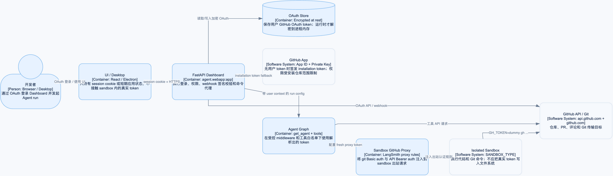

# 第 9 章：测试、类型检查、部署与安全边界

## 学习目标

本章把前面各章的源码证据收束成一套可复现的工程检查流程，覆盖测试、格式/lint、类型检查、LangGraph/FastAPI 启动方式和凭据安全边界。读完后，你应该能够：

- 选择正确的 `make`/`uv` 命令验证代码、图入口和运行服务。
- 理解 `langgraph.json`、`Makefile`、`pyproject.toml` 之间的职责分工。
- 检查 Dashboard OAuth、CSRF、redirect、GitHub App token 和 sandbox proxy 的安全边界。
- 区分本地静态验证、fake client 单测和真实外部服务验证。
- 使用综合调用链判断一次任务从 UI/webhook 到 sandbox 和回源回复是否可审计、可恢复。

本章不执行生产部署、真实 GitHub OAuth、真实 LangSmith sandbox 或真实 webhook；这些操作可能产生外部资源、权限变化和费用。

## 1. 工程入口：三个文件各管什么

| 文件 | 管理内容 | 当前源码事实 |
| --- | --- | --- |
| `Makefile` | 人类可读的安装、启动、测试、lint、format、typecheck 命令 | `make install/dev/run/test/lint/typecheck` |
| `pyproject.toml` | Python 依赖、ruff、pytest、basedpyright、Python 版本 | `>=3.11`，ruff line length 100，pytest asyncio auto |
| `langgraph.json` | LangGraph graph entrypoint、FastAPI app、checkpointer TTL、`.env` | agent/reviewer/analyzer/chat/scheduler + `agent.webapp:app` |

运行职责分离如下：

```text
make dev
  -> uv run langgraph dev
  -> LangGraph Runtime + FastAPI routes + 多张 graph

make run
  -> uv run uvicorn agent.webapp:app --reload --port 8000
  -> 只有 FastAPI app，不自动提供 LangGraph graph runtime

make desktop
  -> cd desktop && pnpm run dev
  -> Electron UI，后端仍需单独运行
```

因此，浏览器 Dashboard 要完整执行 Agent，通常需要 `make dev`；只运行 `make run` 只能验证 FastAPI 路由和 webhook 层，不能假设 `/threads/.../commands` 后面有可用 graph runtime。

## 2. 安全边界图



[打开可编辑 Draw.io 源文件](architecture/premium/06-security-boundary.drawio) · [打开自包含 HTML 查看器](architecture/premium/html/06-security-boundary.html)

读图时从左向右追踪凭据流，从上向下追踪一次请求。用户 session JWT 只进入 Dashboard API；GitHub OAuth token 在服务端加密/缓存后用于代表用户；GitHub App installation token 用于 bot/reviewer 或 sandbox proxy；真实 token 不写进 sandbox 工作树，sandbox 内通过 proxy 看到注入后的认证头。

### 图元素到源码映射

| 图元素 | 源码位置 | 关键符号 | 安全行为 |
| --- | --- | --- | --- |
| Session JWT | `agent/dashboard/oauth.py:25-40,150-223` | `issue_session`、`decode_session`、`require_session` | HS256 session，HttpOnly cookie，7 天 TTL |
| OAuth state | `agent/dashboard/routes.py:373-437` | `auth_login`、`auth_callback` | nonce hash 与 state cookie 双向校验，10 分钟 TTL |
| Redirect allowlist | `agent/dashboard/oauth.py:43-115` | `sanitize_redirect_to` | 只允许相对路径或允许 origin，拒绝开放重定向 |
| CSRF | `agent/dashboard/routes.py:241-268` | `require_same_origin_for_mutations` | cookie-authenticated mutation 检查 Origin/Referer |
| GitHub App token | `agent/utils/github_app.py:90-195` | `get_github_app_installation_token_with_expiry` | 私钥签 JWT，短期 installation token，进程内缓存 |
| Sandbox proxy | `agent/integrations/langsmith.py:206-216,334-385` | `_github_proxy_rules`、`_configure_github_proxy` | Git/API 流量注入 Basic/Bearer auth，不把 token 落盘 |

### 短接线图

```text
Browser
  -- session cookie --> Dashboard API -- trusted config --> LangGraph Runtime
  -- OAuth code ----> GitHub OAuth -- access token --> server-side encrypted store
GitHub App private key --> short-lived installation token --> sandbox proxy
Sandbox command -- GH_TOKEN=dummy --> proxy injects real GitHub auth
```

## 3. Dashboard 安全机制

### 3.1 Session 与 state 是两个不同 cookie

`osw_oauth_state` 只在 OAuth 往返期间存在，服务端保存 nonce 的 hash 到签名 state，并把 nonce 放进 HttpOnly cookie。回调时：

```text
hash(cookie_nonce) == state_payload.nonce_hash
```

通过后才交换 GitHub code，并签发 `osw_session`。session cookie 的生产配置是 `Secure; SameSite=None`，本地 HTTP 配置是非 Secure、`SameSite=Lax`，避免 localhost 浏览器拒收 cookie。

### 3.2 Redirect 与 CSRF

`sanitize_redirect_to()` 只允许安全相对路径或 `DASHBOARD_BASE_URL`/`DASHBOARD_ALLOWED_ORIGINS` 中的 origin，并拒绝 `/dashboard/api`、`/_serverFn` 等敏感路径。`require_same_origin_for_mutations()` 对 POST/PATCH/DELETE 等 mutation 检查 Origin/Referer；桌面端的 `open-swe://app` 是显式允许的特殊 origin。

这两个机制解决不同问题：redirect allowlist 防开放重定向，same-origin 检查防跨站携带 session cookie 发起写操作。

### 3.3 权限不是只有“登录/未登录”

Dashboard 还区分 session、admin、thread readable、thread owner、repo access。`all=true` 列表要求 admin；thread command proxy 对 `run.start` 和其它写命令使用不同边界；webhook 创建的 thread 通过 metadata owner/source 进入 Dashboard 可见范围。安全审查时必须同时检查认证、授权和对象归属。

## 4. 凭据生命周期

| 凭据 | 生成/来源 | 保存位置 | 用途 | 不应出现的位置 |
| --- | --- | --- | --- | --- |
| Dashboard JWT secret | `DASHBOARD_JWT_SECRET` | 服务端环境 | 签 session/state JWT | 浏览器、日志、sandbox |
| GitHub OAuth token | GitHub code exchange/refresh | 加密 OAuth store + 进程短缓存 | 以用户身份操作 GitHub | 前端、源码、sandbox 文件 |
| GitHub App private key | `GITHUB_APP_PRIVATE_KEY`/文件 | 服务端环境或受控文件 | 签 App JWT | webhook payload、UI、sandbox |
| Installation token | GitHub App API | 进程短期缓存 | Reviewer/bot、proxy | 长期 metadata、仓库文件 |
| LangSmith API key | `LANGSMITH_API_KEY_PROD` | 服务端环境 | sandbox/proxy API | Agent prompt、工具输出 |
| Webhook secret | GitHub/Slack/Linear env | 服务端环境 | 验签原始 body | 事件内容、客户端 |

`github_app.py` 的缓存 key 包含安装、仓库和权限范围，且在过期窗口前刷新；`langsmith.py` 只把 token转成 proxy rules。任何新增 provider 都必须重新审查“凭据是否进入 sandbox 文件系统”。

## 5. 测试金字塔：从便宜检查到真实外部验证

### 5.1 静态与格式

```bash
uv run ruff check agent tests
uv run ruff format agent tests --check
npx --yes basedpyright agent tests
```

`make lint` 会执行 ruff check 和 format diff；`make format` 会修改代码并自动修复 ruff 问题，属于写操作，学习时先用 check 版本。类型检查使用 `basedpyright`，配置在 `pyproject.toml`，排除 UI 和 node_modules。

### 5.2 单元测试

```bash
uv run pytest -q
uv run pytest -q tests/dashboard/test_dashboard_thread_api.py
uv run pytest -q tests/reviewer/test_reviewer.py
```

项目测试默认是 unit-only，`asyncio_mode="auto"` 让 async test 不需要手写 event loop fixture。fake LangGraph client、fake Store 和 monkeypatch 是验证代理/状态边界的正确方式，不应把普通函数调用冒充真实 LangGraph Run。

### 5.3 集成与真实外部服务

`make integration_tests` 只在 `tests/integration_tests/` 存在时执行；当前目录为空或不存在时 no-op。真实模型、GitHub、Slack、Linear、LangSmith sandbox 需要单独配置和授权，不能因为 unit tests 通过就声称外部链路已验证。

## 6. 部署与运行检查清单

### 本地学习

```bash
make install
make dev
```

浏览器 UI 通过 Dashboard API + LangGraph runtime 使用；只想检查 FastAPI 路由时：

```bash
make run
```

桌面端：

```bash
make desktop
```

桌面端不会替代后端；它需要已经运行的 backend，并且 OAuth callback 必须使用当前桌面协议配置。

### 部署前必须确认

1. `LANGGRAPH_URL`/生产 runtime 地址不是 loopback。
2. `DASHBOARD_API_BASE_URL`、`DASHBOARD_BASE_URL` 使用正确 HTTPS origin。
3. `DASHBOARD_JWT_SECRET` 足够长且不是开发默认值。
4. GitHub App callback、webhook URL、permissions/repositories 已配置。
5. `GITHUB_WEBHOOK_SECRET`、`SLACK_SIGNING_SECRET`、`LINEAR_WEBHOOK_SECRET` 已设置。
6. sandbox provider、snapshot、LangSmith proxy 权限和 token scope 与部署环境一致。
7. CORS/allowed origins 只包含实际 Dashboard origin，不要写 `*` 配合 cookie。
8. checkpointer TTL、日志脱敏和外部 webhook 重试策略已明确。

## 7. 综合案例：一次 Dashboard 任务的工程验收

以用户在 Dashboard 发送“修复登录回调并开 PR”为例，把前面图谱串起来：

1. 浏览器携带 `osw_session` 调用 `/threads/{id}/commands`。
2. Dashboard 校验 session、thread 权限和 mutation origin，并由 `_enrich_run_start_command()` 重建可信 configurable。
3. LangGraph 创建 Run；`get_agent(config)` 解析用户 GitHub token、模型、sandbox 和 middleware。
4. `ensure_sandbox_for_thread()` 复用或创建 thread sandbox，并通过 proxy 注入 GitHub auth。
5. Agent 在 sandbox 中 read/edit/execute，`PrepareAgentRunMiddleware` 为本轮创建 git turn ref。
6. UI 通过 `/stream/events` 收到消息、工具和生命周期事件；`StreamProvider` 复用 session cookie 并 hydrate。
7. Agent 通过 `GH_TOKEN=dummy gh` 提交/推送/开 PR；真实 token 仍留在服务端 proxy。
8. 如果 PR 触发 Reviewer，canonical reviewer thread 启动只读 graph，创建 GitHub review check，并发布 findings。
9. Dashboard/外部平台只看到授权后的 thread metadata、事件和回源回复，不会拿到服务端 secret。

这条验收链同时引用了前面章节的图：02 Dashboard run sequence、05 sandbox lifecycle、06 security boundary、07 reviewer/analyzer。它保留了真实项目的权限、checkpoint、sandbox 和多 graph 边界，省略了生产负载、真实 webhook 和供应商 SLA。

## 8. 常见误区与反例

1. **只运行 `make run` 就测试完整 Agent。** 该命令只启动 FastAPI；没有 LangGraph runtime 时，命令代理无法完成真实 Run。
2. **把 `make format` 当成只读检查。** 它会修改代码；CI/学习验收应优先用 `ruff format --check`。
3. **把 CORS 配成 `*` 再使用 cookie。** 浏览器不会允许带 credentials 的通配 origin，且会扩大跨站风险。
4. **把 session JWT、GitHub token 或 App private key 写入 thread metadata。** metadata 会被 UI/日志/调试工具读取，长期凭据绝不能进入。
5. **把 sandbox proxy 当作凭据存储。** proxy 只做请求头注入，token 生命周期仍由服务端 token resolver/cache 管理。
6. **只测成功路径。** OAuth state mismatch、CSRF、过期 token、sandbox unreachable、上游 SSE 断开和 webhook 签名错误都是必须测试的边界。

## 9. 检查题与改造练习

1. 根据 `Makefile` 判断：要验证完整 graph 应运行哪个命令？要只验证 FastAPI 路由又应运行哪个命令？
2. 为 `sanitize_redirect_to()` 增加一个测试：外部 origin 被拒绝、允许 origin 被保留、敏感内部路径回退到 Dashboard base URL。
3. 检查一次新 Dashboard mutation 是否经过 `require_same_origin_for_mutations()` 和 thread owner/readable 校验。
4. 设计日志脱敏规则：允许记录 thread_id/run_id/source/status，但禁止记录 cookie、OAuth token、private key、图片 base64。
5. 新增 sandbox provider 时，列出 provider factory、proxy auth、token expiry、reconnect 和测试必须覆盖的五个点。

## 10. 当前验证记录与差距

本章的验证层级如下：

| 层级 | 当前状态 | 说明 |
| --- | --- | --- |
| 图结构 | 已完成 | security boundary 图 `0 error / 0 warning / 0 crossings` |
| 单元测试 | 已完成 | 前面章节已覆盖 Dashboard、dispatch、sandbox、Reviewer、Analyzer、webhook 边界 |
| Ruff | 待本轮执行 | 只读 check，不修改文件 |
| basedpyright | 待本轮执行 | 可能暴露当前工作树既有类型问题 |
| 完整 pytest | 待本轮执行 | 可能受外部/缺失模块影响，失败需区分根因 |
| 真实 OAuth/GitHub/Slack/Linear | 未执行 | 需要外部账号、网络和 webhook 配置 |
| 真实 LangSmith sandbox | 未执行 | 会产生外部资源和潜在费用 |
| 当前 CI auto-fix 调度器 | 缺失 | `agent/ci_autofix.py` 不在当前 checkout |

## 11. 课程总收束

已完成的课程路径是：入口与运行 -> thread/run/checkpoint -> Dashboard command proxy -> model/WawAPI -> Deep Agent 装配 -> sandbox lifecycle -> Dashboard stream/queue -> webhook/thread routing -> Reviewer/Analyzer -> 测试部署安全。

最值得继续深入的项目外协议仍有三项：LangGraph command schema、SSE event schema、`@langchain/react` StreamProvider 内部消费机制。它们已经在 README 的待深入主题中保留，当前课程只解释了 Open SWE 自己实现的代理边界。
