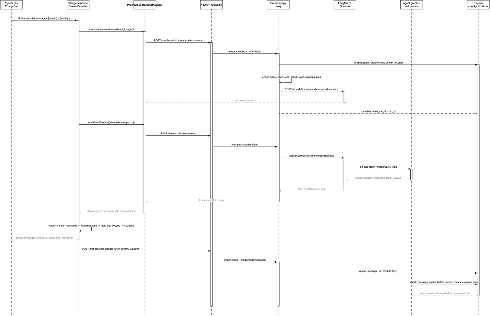

# 10. LangGraph SDK 命令协议与 SSE 事件模型

## 学习目标

读完这一章，你应该能回答：

1. `stream.submit()` 如何变成 `run.start` 命令。
2. Dashboard 代理到底修改了请求的哪一层，哪些字段不会原样透传。
3. `commands` 和 `stream/events` 为什么必须是两条 HTTP 通道。
4. `values`、`messages`、`tools`、`lifecycle` 事件如何进入 `@langchain/react`，再变成聊天消息、工具卡片和运行中状态。
5. 为什么忙碌线程的后续消息走 `/messages` 队列，而不是再次发送 `run.start`。

## 1. 先建立协议边界

本章最容易混淆的词有三个：**命令（command）**、**事件（event）**、**状态（state）**。

| 名称 | 方向 | 作用 | 当前项目入口 |
| --- | --- | --- | --- |
| Command | UI → Dashboard → LangGraph | 触发、恢复、取消或更新一次运行 | `run.start`、`input.respond`、cancel 路由 |
| SSE event | LangGraph → Dashboard → UI | 观察运行过程，不负责触发运行 | `POST /threads/{id}/stream/events` |
| State | LangGraph → Dashboard/UI | 某个 checkpoint 的完整快照，用于首次加载和恢复 | `GET /threads/{id}/state` |

因此，Dashboard 不是把“转发内容改一遍再返回给 LangGraph”这么简单。更准确的描述是：

```text
UI command
  └─> FastAPI 鉴权、线程归属判断、模型/仓库/用户上下文补全
        └─> LangGraph commands endpoint 触发 run

LangGraph event stream
  └─> FastAPI 只做可读性预检和字节转发
        └─> StreamProvider 解码、聚合、投影给 UI
```

命令是控制面，SSE 是观察面；两者可以独立建立、关闭和重连。

## 2. 架构图



可编辑源文件：[13-sdk-command-event-protocol-sequence.drawio](architecture/premium/13-sdk-command-event-protocol-sequence.drawio)；交互查看器：[13-sdk-command-event-protocol-sequence.html](architecture/html/13-sdk-command-event-protocol-sequence.html)。

读图从左到右、从上到下：上半段是一次 `run.start`，中段是独立的 SSE 订阅和事件回流，下半段是运行中追加消息的队列路径。

图中箭头含义：实线是控制请求，虚线是响应或事件；`Thread / checkpoint store` 是持久身份和队列存储，不是浏览器本地状态；`Agent graph + middleware` 是真正执行模型和工具的地方。

## 3. `stream.submit()` 的真实命令

### 3.1 前端调用点

Agents 首页把用户输入包装为 LangChain 消息：

```ts
await stream.submit(
  {
    messages: [{
      type: "human",
      content: [
        { type: "image", base64, mime_type },
        { type: "text", text: "修复 flaky test" },
      ],
    }],
  },
  { config: { configurable: {
    agent_model_id: "选中的模型",
    agent_effort: "medium",
    plan_mode: true,
  } } },
)
```

这里的 `stream.submit` 不是直接调用 Python 图。`@langchain/react` 的 controller 会把它转换为协议命令，并将 `assistant_id` 绑定为 `agent`。从已安装的 `@langchain/langgraph-sdk` 实现看，核心形状等价于：

```json
{
  "method": "run.start",
  "params": {
    "assistant_id": "agent",
    "input": {
      "messages": [
        {"type": "human", "content": "修复 flaky test"}
      ]
    },
    "config": {
      "configurable": {
        "agent_model_id": "...",
        "agent_effort": "medium",
        "plan_mode": true
      }
    },
    "metadata": {}
  }
}
```

`run.start` 的语义是统一的：线程空闲时启动新 run；线程被 interrupt 时把输入作为恢复值；运行中是否允许注入输入由服务端策略决定。本项目对运行中的 Dashboard 输入采用自己的 FIFO 队列，所以代理会拒绝再次启动并返回 `409`。

### 3.2 Dashboard 代理的三层处理

`agent/dashboard/routes.py` 的两个路由只是 HTTP 外壳：

| 路由 | 调用 | 行为 |
| --- | --- | --- |
| `POST /dashboard/api/threads/{thread_id}/commands` | `proxy_dashboard_thread_commands` | 读取 session、校验 JSON、鉴权、补全后转发命令 |
| `POST /dashboard/api/threads/{thread_id}/stream/events` | `proxy_dashboard_thread_stream_events` | 先检查可读权限，再把 LangGraph SSE 字节流转回浏览器 |

`proxy_dashboard_thread_commands` 在 `thread_api.py:2038` 开始，顺序不能倒：

1. `_require_json_content_type` 拒绝错误的请求类型。
2. `json.loads` 要求顶层是对象，而不是数组或任意文本。
3. 读取线程。如果线程不存在，只有第一次 `run.start` 可以懒创建；`run.cancel` 等其他命令直接 `404`。
4. 已存在的线程：`run.start` 只需可读；其他写命令要求 owner。
5. 线程状态或 metadata 显示 `pending/running` 时，`_enrich_run_start_command` 返回 `409`，提示调用 `/messages` 队列。
6. 调用 `_enrich_run_start_command`，重建可信的 `configurable`，写入 `assistant_id="agent"`、stream 配置和版本 metadata。
7. 向 LangGraph 的 `/threads/{id}/commands` 发出新的 JSON。
8. 如果响应包含 `run_id`，写回 `metadata.latest_run_id` 与 `latest_run_status="pending"`。

关键事实是“重建”而不是“合并所有客户端字段”。例如客户端传来的 `repo_explicitly_none` 是 Dashboard 创建线程的提示，不会泄漏到最终运行配置；用户身份、来源、仓库和模型选择由服务端根据 session、线程 metadata 和团队默认值决定。

## 4. SSE 事件不是第二个命令接口

### 4.1 订阅请求

`ProtocolSseTransportAdapter` 的默认路径是：

```text
POST /threads/{thread_id}/stream/events
Content-Type: application/json
Accept: text/event-stream
```

请求体是订阅过滤器，不是 `run.start`：

```json
{
  "channels": [
    "values",
    "checkpoints",
    "lifecycle",
    "input",
    "messages",
    "tools"
  ],
  "namespaces": [[]],
  "since": 42
}
```

`since` 是重连游标。SDK 解析每个 SSE 数据对象中的单调 `seq`，断线后带上最后序号重新订阅；因此“页面切后台再回来”不等于丢失整个 run。

### 4.2 FastAPI 只做门禁和透明转发

`proxy_dashboard_thread_stream_events` 在生成器外完成 JSON content-type 和 `_readable_thread_metadata` 预检，避免 SSE 已经开始后才抛出 `401/403`。随后 `_stream_thread_events`：

```python
async with client.stream(
    "POST",
    f"{langgraph_url()}/threads/{thread_id}/stream/events",
    content=body,
    headers={"Accept": "text/event-stream"},
) as response:
    async for chunk in response.aiter_bytes():
        yield chunk
```

成功响应的 bytes 不被 Dashboard 重新序列化；上游错误则被包装为一条 SSE `event: error`，这样浏览器仍能用同一条事件管道收敛错误状态。

### 4.3 事件频道的语义

项目在 `thread_api.py:57-65` 设置了 Dashboard run 的兼容 stream modes：`values`、`updates`、`messages`、`messages-tuple`、`tools`、`checkpoints`、`events`。这组值影响 LangGraph run 产生哪些运行输出；而 v2 SSE 订阅的 `channels` 决定客户端实际接收哪些事件。不要把两个字段混为一谈。

| 频道 | UI/SDK 用途 | 典型数据 |
| --- | --- | --- |
| `values` | 完整状态快照，适合 checkpoint 后的状态 | `{ messages, ... }` |
| `updates` | 节点级增量 | `{ "node_name": { ... } }` |
| `messages` | 内容块级消息流 | `message-start`、`content-block-delta`、`message-finish` |
| `messages-tuple` | 旧式 `(message, metadata)` 兼容流 | token chunk + 调用 metadata |
| `tools` | 工具生命周期 | started、output delta、finished、error |
| `lifecycle` | run/namespace 生命周期 | running、completed、failed、interrupted |
| `checkpoints` | 可恢复快照和 tasks | values、next、checkpoint、interrupts |
| `events` | 更细的 LangChain 回调事件 | `on_chat_model_*`、`on_tool_*` 等 |

项目注释明确指出：只发 `messages-tuple` 的旧 run 对 `@langchain/react` 的 `messages/tools/lifecycle` 投影几乎没有可消费内容。因此 Dashboard 同时保留兼容模式和 v2 频道。

### 4.4 React SDK 和 Python SDK 是什么关系？

当前项目同时使用两套客户端包，但它们访问的是同一个 LangGraph Server 协议，不是两套不同的图运行时：

| 客户端 | 使用位置 | 主要职责 |
| --- | --- | --- |
| `langgraph_sdk` | Python 后端 | `threads`、`runs`、`store`、状态和后台 Run 管理 |
| `@langchain/langgraph-sdk` | React 前端 | HTTP 客户端、命令发送、线程状态和事件流 transport |
| `@langchain/react` | React 前端 | `StreamProvider`、`useStreamContext`、事件聚合和 React 状态 |

可以把它们理解成两个语言环境的客户端：

```text
Python SDK ─┐
            ├── LangGraph Server 的 HTTP/命令/SSE 协议
React SDK ──┘
```

Python SDK 适合 Slack、Linear、GitHub Webhook 和定时任务，它们只需要创建或查询 Run。React SDK 还要处理浏览器交互：增量消息、工具卡片、停止、恢复、重连和 `isLoading`。因此 Dashboard 不能只把浏览器文本翻译成 `create_durable_run()`，否则还要重新实现 React SDK 依赖的命令响应和事件协议。

当前前端在 `ui/src/features/agents/lib/AgentThreadStreamProvider.tsx` 创建 `Client` 和 `StreamProvider`；后端的 `create_durable_run()` 则位于 `agent/dispatch.py`，主要供非浏览器触发方使用。

### 4.5 SSE 到底由谁实现？

SSE 是三层协作，不是 Dashboard 自己实现了一套 Agent 流式协议：

| 层 | 责任 |
| --- | --- |
| LangGraph Server | 执行 graph，生成 lifecycle、messages、tools、values 等事件 |
| FastAPI + `httpx` | 鉴权、线程可读性检查，并把上游 SSE bytes 透明转发 |
| `@langchain/react` | 解析 SSE、维护 stream 状态，并投影为 React 消息和工具状态 |

真实请求链是：

```text
Browser StreamProvider
  -> POST /dashboard/api/threads/{id}/stream/events
  -> FastAPI StreamingResponse
  -> httpx POST {LANGGRAPH_URL}/threads/{id}/stream/events
  -> LangGraph Server 产生 text/event-stream
  -> httpx.aiter_bytes() 原样转发
  -> React SDK 解码和聚合
```

当前项目的代理代码在 `agent/dashboard/thread_api.py:_stream_thread_events`：它设置 `Accept: text/event-stream`，通过 `response.aiter_bytes()` 逐块 `yield`；成功事件不重新解析、不重新组装。路由在 `agent/dashboard/routes.py:api_thread_stream_events` 使用 `StreamingResponse` 返回 `text/event-stream`。

因此，答案可以精确表述为：**事件协议和事件生产由 LangGraph Server 提供，SSE transport 和 React 状态处理由 LangGraph SDK 实现，Open SWE 的 FastAPI 只负责安全代理和透明转发。**

`commands` 和 `stream/events` 是两条不同通道：前者触发或控制 Run，后者只观察 Run。Dashboard 使用 `httpx` 代理这两条协议，是为了保留 React SDK 的原生行为，而不是因为 Python SDK 做不到创建 Run。

### 4.6 `stream/events` 会执行 Run 吗？

不会。在当前项目中：

```text
POST /threads/{thread_id}/commands
    + method = run.start
    -> 创建并执行 Run

POST /threads/{thread_id}/stream/events
    -> 订阅这个 thread 的运行事件
    -> 不创建 Run，不启动 Agent
```

可以把 `commands` 理解成“启动或控制按钮”，把 `stream/events` 理解成“监控摄像头”。前端通常先建立事件订阅，再发送 `run.start`；Run 开始后，LangGraph Server 产生的模型、工具和生命周期事件会通过已经建立的 SSE 连接返回。由于项目启用了 `stream_resumable=True`，如果订阅稍晚建立，客户端还可以回放已保留的事件。

一次 Dashboard 交互可以简化为：

```text
浏览器 --普通 JSON--> /commands
浏览器 <--202/204 普通响应-- /commands

浏览器 --POST 建立流--> /stream/events
浏览器 <--SSE 增量事件-- /stream/events
```

这里的 `POST` 方法本身不代表“执行任务”；是否执行由命令体中的 `method` 决定，是否流式则由响应的 `Content-Type: text/event-stream` 和持续输出行为决定。

### 4.7 当前项目哪些接口是流式的？

前后端并不是所有接口都使用流式输出：

| 接口/调用 | 是否流式 | 用途 |
| --- | ---: | --- |
| `POST /threads/{id}/commands` | 否 | 启动、停止或控制 Run |
| `POST /threads/{id}/stream/events` | 是 | 接收模型、工具和生命周期事件 |
| `GET /threads/{id}/state` | 否 | 获取当前完整状态 |
| `GET /threads/{id}/history` | 否 | 获取历史 checkpoint |
| `POST /messages` | 否 | Agent 工作期间追加消息到队列 |
| `client.runs.create()` | 否 | 后端创建 Run |
| Run 完成 webhook | 否 | Run 结束后通知后端 |

后端到 LangGraph Server 也分成两种：

```text
commands:
FastAPI --普通 httpx POST--> LangGraph Server

stream/events:
FastAPI --httpx 流式请求--> LangGraph Server
FastAPI <--逐块转发 SSE-- LangGraph Server
```

因此，SSE 只负责持续观察 Agent 的执行过程；创建、查询、停止、追加消息和读取状态仍然使用普通 HTTP。`stream/events` 不是第二个 Run 创建接口。

## 5. `@langchain/react` 如何消费事件

### 5.1 Provider 的组装

`ui/src/features/agents/lib/AgentThreadStreamProvider.tsx:17-35` 先定义带 `credentials: "include"` 的 `dashboardFetch`，再调用 `overrideFetchImplementation`。这是必要的：transport 的 fetch 和 SDK 内部 `Client` 的 `getState/history` 读取必须携带同一个 session cookie，否则 hydration 会收到 `401`。

`AgentThreadStreamProvider.tsx:109-147` 创建一个长期存在的 `ProtocolSseTransportAdapter`，交给 `StreamProvider`。它位于 `/agents` 布局层，因此首页 → 线程详情的导航不会销毁 SSE controller；线程 ID 改变时只重新 hydrate 同一个 controller。

### 5.2 SDK 的投影层

安装的 `@langchain/react`/`@langchain/langgraph-sdk` 版本中，controller 维护几类投影：

```text
SSE event
  ├─ values/checkpoints -> stream.values / hydrate 快照
  ├─ lifecycle          -> stream.isLoading / subagents / subgraphs
  ├─ messages           -> stream.messages (BaseMessage[])
  └─ tools              -> stream.toolCalls (AssembledToolCall[])
```

源码中的 `ui/src/features/agents/components/AgentThreadView.tsx:125-153` 读取 `stream.messages`、`stream.toolCalls`、`stream.subagents`，再交给 `streamMessagesToUi`。这个函数不是简单 `JSON.stringify`：

- `HumanMessage` 变成用户气泡，并保留图片块。
- `AIMessage` 的 reasoning、text、tool calls 变成 Agent turn 的 chunks。
- `AssembledToolCall` 与 `ToolMessage` 按 `tool_call_id` 配对，得到工具状态和输出。
- `task` 工具如果发现 `SubagentDiscoverySnapshot`，会附加 namespace 和子 Agent 状态。
- 真正的文件变更仍从 git turn-diff 得到，不能从工具参数臆测最终差异。

因此 UI 展示的工具卡片是“协议事件 → SDK 聚合 → 本地纯映射”的三段结果，Dashboard 后端没有镜像一份 pending-tools 状态。

## 6. 一次请求的完整接线

下面按源码事实串起“发送、执行、展示、追加”四条线：

```text
ChatComposer
  -> useSubmitAgentMessage
     ├─ idle/409 后 -> stream.submit
     │  -> StreamController -> run.start
     │     -> ProtocolSseTransportAdapter
     │        -> routes.api_thread_commands
     │           -> thread_api.proxy_dashboard_thread_commands
     │              -> _enrich_run_start_command
     │                 -> LangGraph /threads/:id/commands
     │
     ├─ stream.isLoading -> agentsApi.queueMessage
     │  -> routes /messages -> queue_message_for_thread
     │  -> check_message_queue_before_model
     │
     └─ 同时由 StreamProvider 建立
        -> /threads/:id/stream/events
           -> values/messages/tools/lifecycle
              -> streamMessagesToUi
                 -> Messages / Tool cards / stop button
```

对应的伪代码如下，故意保留项目中的分支：

```python
# dashboard proxy
command = parse_json(request.body)
thread = await client.threads.get(thread_id)
if thread is missing and command.method != "run.start":
    raise HTTPException(404)
if thread is busy and command.method == "run.start":
    raise HTTPException(409, "queue message instead")

command = await _enrich_run_start_command(
    thread_id, session.login, command, metadata, creating=thread is missing
)
response = await http.post(langgraph_url + "/threads/.../commands", json=command)
persist_latest_run_id(response)
```

```ts
// UI submitter
if (stream.isLoading) {
  await agentsApi.queueMessage(threadId, body)
} else {
  void stream.submit(
    { messages: [{ type: "human", content: messageContent(body) }] },
    { config: { configurable: modelAndPlanOverrides } },
  )
}

const uiMessages = streamMessagesToUi(
  stream.messages,
  stream.toolCalls,
  stream.subagents,
)
```

## 7. 最小本地验证

本章不需要真实模型或外部 OAuth。最小验证使用仓库现有单元测试，验证代理的边界行为：

```bash
uv run pytest -q \
  tests/dashboard/test_dashboard_thread_api.py \
  tests/dashboard/test_dashboard_csrf.py \
  tests/agent/test_dispatch.py
```

重点观察：

- 新 thread 只允许 `run.start` 懒创建，并写入 owner、repo、title、model。
- 非 JSON body 被拒绝。
- 忙碌线程不会重复创建 run，而是要求调用消息队列。
- `run_id` 被写回 `latest_run_id`。
- dispatch 默认使用 `stream_resumable=True`，保证稍后接入的 UI 可以回放事件。

已安装 SDK 的静态协议证据来自 `ui/node_modules/@langchain/protocol/protocol.ts`、`@langchain/langgraph-sdk/dist/client/stream/transport/http.js` 和 `@langchain/react/dist/use-stream.d.ts`；本章没有发起真实远程 SSE，也没有产生外部费用。

## 8. 常见误区

### 误区一：把 `run.start` 当成普通 REST “提交消息”

错。它是线程状态机入口，可能启动、恢复或向运行中的图注入输入。Open SWE 额外规定忙碌 Dashboard 线程走 `/messages`，从而让 `check_message_queue_before_model` 在当前 run 的下一个模型调用前消费消息。

### 误区二：只订阅 `messages-tuple` 就能驱动新版 UI

错。项目注释已经说明旧式 tuple 流对 `@langchain/react` 的 `messages/tools/lifecycle` 投影不够。缺少 `lifecycle` 时，UI 可能没有 `isLoading`；缺少 `tools` 时，工具卡片无法正确结束；缺少 `messages` 时，文本只会在完整 `values` 快照时突然出现。

### 误区三：SSE 代理应该解析每个事件再组装给前端

这会重复实现 SDK 的协议解析，并破坏 `seq`、namespace 和未知事件的前向兼容。当前代码只做权限预检、上游错误包装和 bytes 透传，把协议演进留给 LangGraph SDK。

### 误区四：`stream.submit` 必须一直 await

错。`submit` 的 Promise 通常在 run 结束时才 resolve。`useSubmitAgentMessage` 使用 `void stream.submit(...)`，否则输入框会被锁到整个 Agent run 结束，用户无法追加消息。

## 9. 扩展边界

当前项目已经使用的能力：

- SSE 连接、`since` 重连、线程 hydration。
- `values/messages/tools/lifecycle/checkpoints` 的根投影。
- `input.respond` 等协议能力由 SDK 暴露，Dashboard 代理保留 owner-only 写命令边界。

当前项目没有深入或没有启用的能力：

- WebSocket 双工 transport：适合高频双向控制，但需要新的部署和代理配置。
- 自定义 `custom:*` channel：适合业务事件，必须先约定版本化 payload。
- 多 namespace 的深层 subgraph 订阅：当前 UI 主要通过 `subagents` discovery 再按需订阅。
- 直接使用 legacy `client.runs.stream`：SDK 文档标为兼容路径，新 UI 应继续使用 thread-centric v2。

学习顺序建议是先读本章协议边界，再读 `ui/src/features/agents/lib/streamMessagesToUi.ts` 的纯映射，最后再追踪子 Agent namespace 和 interrupt UI；不要先从组件样式入手。

## 10. 检查题与改造练习

1. 追踪 `stream.submit` 首次创建线程时，为什么 `GET /state` 不应先发出？指出 `AgentThreadStreamProvider` 和 `AgentsHome` 中处理 lazy thread 的两处代码。
2. 给 `proxy_dashboard_thread_commands` 增加一个测试：已有线程收到非 owner 的 `input.respond` 必须返回 `403`，但同一用户的 `run.start` 可以继续走 attribution 分支。
3. 临时删除 `_DASHBOARD_STREAM_MODES` 中的 `tools`，预测 UI 哪个字段先失真，再用 `streamMessagesToUi` 的 `toolStatus` 验证你的判断。
4. 设计一个 `custom:approval` 频道，只传 `{request_id, action, expires_at}`；说明为什么不能把 GitHub token 放进事件 payload。

## 本章小结

这条链路可以压缩成一句话：**命令让 run 发生，SSE 让 UI 看见发生了什么，state 让 UI 在断线或刷新后恢复上下文。** Dashboard 代理只在命令侧重建可信运行上下文，在事件侧保持透明；真正把事件变成聊天和工具体验的是 `@langchain/react` controller 与 `streamMessagesToUi`。

下一章继续深入 UI 的事件投影和子 Agent namespace；本章暂不展开具体 SSE frame 的全部兼容分支。
