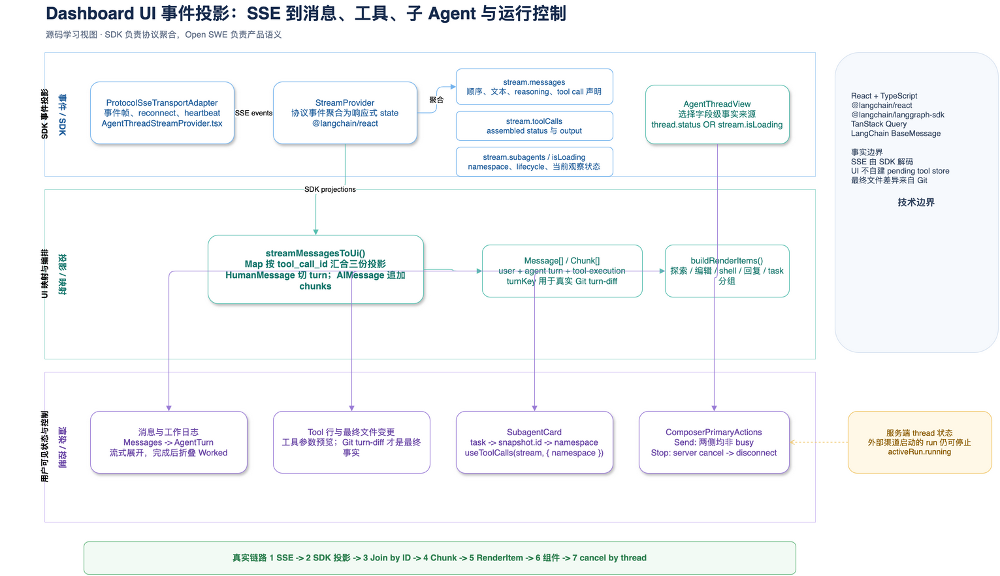

# 第 11 章：Dashboard UI 如何投影流事件

## 学习目标

本章只研究浏览器内的最后一段链路：LangGraph 的 SSE 事件已经被 SDK 解码后，Dashboard 如何把它们变成聊天消息、工具工作日志、子 Agent 卡片，以及发送/停止按钮。读完后，你应该能回答：

- `stream.messages`、`stream.toolCalls`、`stream.subagents` 各自是什么，为什么不能只读其中一个。
- `streamMessagesToUi()` 如何用稳定的 `tool_call_id` 把三份投影汇合为一条 UI transcript。
- 为什么 `task` 不等于一个普通工具行，以及 namespace 如何避免两个子 Agent 的工具记录串台。
- 为什么停止按钮既检查 `stream.isLoading`，也检查后端 `thread.status`。
- 一条 Agent turn 为什么能把多个 `AIMessage` 合并成一个工作区块，并在完成后折叠。

本章不连接远端 SSE、不触发模型，也不修改 UI；验证使用项目已有的纯映射单测和 Draw.io 结构校验。

## 1. 先建立正确心智模型：这里有两次投影

第 10 章已经讲过 SSE 协议。它到达浏览器后并不会直接成为 React 节点，而是先由 `@langchain/react` 的 `StreamProvider` 聚合成运行时投影，再被项目映射成自己的 UI 模型：

```text
SSE frame
  -> StreamProvider 的协议聚合
     -> stream.messages / stream.toolCalls / stream.subagents / stream.isLoading
        -> streamMessagesToUi()
           -> Message[] + Chunk[]
              -> buildRenderItems()
                 -> Messages / AgentTurn / Tool 行 / SubagentCard / 运行按钮
```

第一层属于 SDK，负责协议细节、断线恢复、事件顺序和工具生命周期组装。第二层属于 Open SWE，负责产品语义：哪种工具算“探索”、何时折叠工作日志、如何显示编辑、一个 `task` 要不要变成子 Agent 卡片。这个边界很关键：项目没有重写 SSE parser，也没有维护另一份 pending-tools store。

## 2. 架构图：从 SDK 投影到可交互 UI



[打开可编辑 Draw.io 源文件](architecture/premium/14-dashboard-ui-event-projection.drawio) · [打开自包含 HTML 查看器](architecture/premium/html/14-dashboard-ui-event-projection.html)

从上到下读图：顶部是协议事件被 SDK 聚合后的四份投影；中部是 `AgentThreadView` 和纯函数映射；底部是消息、工作日志、子 Agent、发送/停止控制这四种不同的产品表现。实线箭头表示本地数据变换，虚线箭头表示服务端状态或控制请求。图刻意把“最终 git diff”放在独立支线，因为工具入参只能描述打算修改什么，不能证明最终工作树发生了什么。

### 图元素到源码映射

| 图元素 | 源码位置 | 关键符号 | 图中行为 |
| --- | --- | --- | --- |
| SSE transport | `ui/src/features/agents/lib/AgentThreadStreamProvider.tsx:17-35` | `dashboardFetch`、`overrideFetchImplementation` | transport 和 SDK 内部 hydration 都携带 session cookie |
| 长生命周期 provider | `AgentThreadStreamProvider.tsx:86-147` | `ProtocolSseTransportAdapter`、`StreamProvider` | `/agents` 子树共享 controller；切线程时 hydrate 而非销毁连接 |
| 四份 SDK 投影 | `AgentThreadView.tsx:140-174` | `stream.messages`、`toolCalls`、`subagents`、`isLoading` | 读取实时投影，计算 transcript、加载态、sandbox 设置态 |
| 本地 transcript 映射 | `streamMessagesToUi.ts:261-397` | `streamMessagesToUi` | 建索引、合并 Agent turn、生成 `Chunk` |
| 工具分类/分组 | `renderItems.ts:38-165` | `buildRenderItems` | 探索、编辑、shell、回复、子 Agent 分开渲染 |
| 子 Agent 活动 | `SubagentActivity.tsx:22-50` | `useToolCalls(stream, { namespace })` | 只订阅一个子 Agent namespace 内的嵌套工具 |
| 停止控制 | `ComposerPrimaryActions.tsx:87-128` | `handleStop` | 先按 thread 取消，再断开本地 stream，最后乐观更新缓存 |

## 3. Provider：把连接做成整个 Agents 区域的基础设施

`AgentThreadStreamProvider` 不挂在单个聊天页面，而是挂在 `/agents` 的共同布局。首页首次调用 `stream.submit()` 后，SDK 可以创建 thread；页面跳到新 thread 时，原来的 controller 仍在，流不会因为路由切换而消失。

有两个容易忽略的认证细节：

1. `dashboardFetch` 强制 `credentials: "include"`。
2. `overrideFetchImplementation(dashboardFetch)` 不只是为了 SSE transport。SDK 内部的 `getState` 与 `history` 读取也要走同一 fetch；否则跨 origin 时少 cookie，Dashboard proxy 会返回 `401`。

浏览器重新获得焦点时，`ActiveThreadRecovery` 会先 `hydrate(null)` 再 `hydrate(threadId)`。前一步清掉旧的 controller 状态，后一步从 checkpoint/history 重建当前 thread；`recoveringRef` 与 `threadIdRef` 防止失焦/切线程竞争时重复 hydration。

```ts
const transport = new ProtocolSseTransportAdapter({
  apiUrl: absoluteDashboardApiUrl,
  fetchFactory: () => dashboardFetch,
})

<StreamProvider transport={transport} threadId={threadId ?? undefined}>
  <ActiveThreadRecovery threadId={threadId} />
  {children}
</StreamProvider>
```

`fetchFactory` 不是多余的包装。源码注释指出，直接传 `fetch` 会关掉 SDK 默认的 reconnect 与 idle heartbeat 行为，因此这里把 fetch 包成 factory。

## 4. `AgentThreadView`：四份事实来源各管一件事

这段组件不是把后端 `thread.messages` 当作唯一真相。正常情况下它使用 SDK 的 live/hydrated 投影；仅在新 thread 的短暂空窗，才使用 `AgentsHome` 乐观写入的 `thread.messages` 作为 fallback。

| 输入 | 它负责的事实 | 不能替代它的原因 |
| --- | --- | --- |
| `stream.messages` | 人类文本、AI 文本、reasoning、工具调用的出现顺序 | 没有工具运行状态和子图 namespace |
| `stream.toolCalls` | 已组装工具的 status/output | 单靠 `ToolMessage` 不能实时得到所有 in-progress 状态 |
| `stream.subagents` | `task` 对应子 Agent 的 lifecycle、namespace | `task` 入参不知道子图真正是否已发现或结束 |
| `thread.status` | 后端认为 thread 是否正在运行 | 本浏览器可能刚刷新，尚未看见 lifecycle event |
| `stream.isLoading` | 当前 controller 是否观察到 active lifecycle | 外部渠道发起的 run 可能暂时没有本地 run id |

源码的实际组装是：

```ts
const baseMessages = streamMessagesToUi(
  stream.messages,
  stream.toolCalls,
  stream.subagents,
  messageArrivalTimestamp,
)

const isStreaming = thread.status === "running" || stream.isLoading
const activeRun = { threadId: thread.id, running: thread.status === "running" }
```

因此 UI 采用的是“字段级权威来源”，而不是“选一个总状态对象”。`isStreaming` 采用 OR 不是为了掩盖错误，而是处理观察延迟：SDK event 到达前依旧要让外部渠道的 run 显示为忙碌。

## 5. 核心纯函数：如何把三份投影汇成 `Message[]`

`streamMessagesToUi()` 的输入是不可变投影，输出是普通 UI 数据，因此它最值得作为阅读断点。它的主流程分成五步：

```text
1. toolCallsById     = { call.id/callId -> AssembledToolCall }
2. subagentsByCallId = { snapshot.id    -> SubagentDiscoverySnapshot }
3. toolMessagesById  = { ToolMessage.tool_call_id -> ToolMessage }
4. 顺序扫描 BaseMessage[]：HumanMessage 切 turn；AIMessage 追加 chunks
5. flushAgentTurn()：合并连续 Agent 消息，删除本 turn 中较早的 text chunk
```

### 5.1 人类消息定义 turn 边界

遇到 `HumanMessage` 时先 `flushAgentTurn()`，再把其 `id` 保存到 `turnKey`。后面的一个或多个 `AIMessage` 都归入这个 turn。`turnKey` 不是展示用 ID，它与 Agent 开始执行时保存的 Git ref 对应，完成后 `TurnChangedFilesCard` 用它读取服务端的 `turn-diff`。

例如消息序列：

```text
Human(u-1, "修复登录")
AI(a-1, tool=read_file)
Tool(t-1, "...")
AI(a-2, text="已经定位...")
Human(u-2, "顺便加测试")
AI(a-3, tool=write_file)
```

映射结果不是六张聊天卡，而是：

```text
UserMessage(u-1)
AgentTurn(turnKey=u-1, chunks=[read_file, "已经定位..."])
UserMessage(u-2)
AgentTurn(turnKey=u-2, chunks=[write_file])
```

`ToolMessage` 本身不产生 chunk。它只作为回退数据源：如果 SDK 还没把输出放进 `AssembledToolCall.output`，函数才读取同 `tool_call_id` 的 `ToolMessage.text`。

### 5.2 工具状态优先信任 SDK 的 assembled lifecycle

状态映射极小，但语义明确：

```ts
if (assembled?.status === "finished") return "completed"
if (assembled?.status === "error") return "error"
if (assembled) return "in_progress"
if (toolMessage) return toolMessage.status === "error" ? "error" : "completed"
return "in_progress"
```

也就是说，工具调用刚出现、还没有结果时 UI 立即显示进行中；工具流结束后显示完成/失败；hydration 只有消息历史时仍可用 `ToolMessage` 补全完成态。这里没有全局 `pendingTools` 数组，避免了“历史重放、断线重连、同 ID 更新”三套状态同步问题。

### 5.3 工具入参能预览，不等于最终 diff

对编辑工具，`maybeDiffFromArgs()` 会从 `path`、`old_string`、`new_string` 等参数构建即时 `diffData`，让审批或进行中的卡片有内容。但它不能替代最终变更：同一文件可能被后续工具继续修改、撤销，或者 shell 直接改文件。`AgentTurn` 完成后显示的 changed-files 卡片改读 Git ref 之间的真实差异。

这是一个很好的工程边界：**事件告诉 UI 工具打算做什么，Git 告诉 UI 最后实际发生了什么。**

## 6. 子 Agent：`task` 卡片如何得到自己的活动流

父 Agent 的 `task` 是普通 `AIMessage.tool_calls` 里的一个调用，但其显示不应当与 `grep`、`execute` 混在一起。`streamMessagesToUi()` 先以 `snapshot.id === toolCallId` 关联 `stream.subagents`：

```ts
if (subagent) {
  chunk.subagentNamespace = [...subagent.namespace]
  chunk.status = subagentStatus(subagent)
}
```

注意 `stream.subagents` 的 Map 是按子 Agent 名称取值，而关联键在 snapshot 内部。代码先重建 `subagentsByCallId`，因此两个同名子 Agent 或多个连续 `task` 不会因 Map 的外层 key 而误配。

后续链路是：

```text
toolKind("task")
  -> buildRenderItems(): 连续 task 合成 subagent-group
  -> SubagentGroup / SubagentCard
  -> 仅在 live StreamProvider 内且 namespace 非空时
  -> useToolCalls(stream, { namespace })
  -> 当前嵌套工具名 + step count
```

`SubagentActivity` 不把所有嵌套工具全文渲染出来。它只取最后一项，显示当前工具、完成/错误/转圈图标和步数。这是刻意的密度控制：父 turn 已有主工作日志，子卡需要回答“它还在做什么”，而不是复制一份完整 transcript。历史回放时没有 live subscription，卡片仍保留从 snapshot 得到的完成/失败状态。

## 7. 渲染：同一个 `Chunk` 为什么会得到不同 UI

`buildRenderItems()` 是纯粹的视觉编排层，不改变工具状态。它的规则如下：

| Chunk | RenderItem | 最终表现 |
| --- | --- | --- |
| 连续 `read/search` | `explored-group` | 默认只显示最近一条，可展开 |
| `task` | `subagent-group` | 多张子 Agent 卡片网格 |
| 有 `diffData/diffs` 的工具 | `edit-item` | 文件编辑工作行；最终 diff 另读 Git |
| `execute` | `shell-item` | 可展开 shell body |
| Slack/Linear 回复 | `reply-item` | 渠道回复卡片 |
| reasoning | `reasoning-item` | reasoning block |
| text/code/error/image | `text-chunk` | 交给 `ChunkRenderer` 分派 |

`AgentTurn` 在流式期间完整展开；流结束后，把结尾连续的 text/reply 识别为“回复”，其余工作区块默认折叠成 `Worked`。这让用户优先看到最终回答，但仍能展开审查 Agent 做过的读、写、shell 和子任务。

`Messages` 只给最后一条 Agent turn 设置 `isStreaming`，并用“靠近底部才自动滚动”的锁定策略保护正在读历史内容的用户。队列消息则是 React Query 中的 optimistic 记录，在还未被当前 Agent run 消费前显示为虚线用户气泡。

## 8. 运行按钮：为什么停止要先请求服务端

`ComposerPrimaryActions` 有两条实现路径：桌面 ACP 使用传入的 `onStop`；Dashboard 线程使用 `StreamPrimaryActions`。Dashboard 的显示条件是：

```text
Send: !stream.isLoading && !activeRun.running
Stop:  stream.isLoading || activeRun.running
```

点击 Stop 的顺序不能改成单纯 `stream.stop()`：当前浏览器可能只是旁观一个 Slack、Linear、GitHub webhook 发起的 run，或刷新后刚重新 hydrate，本地并没有可取消的 SDK run id。因此源码先调用 `useCancelAgentThread(threadId)` 的后端取消端点；**只有取消成功**才 `stream.disconnect()`，然后把缓存状态设为 `interrupted`。取消失败时故意保持连接和 poll 状态，避免假装已停止而把仍在运行的任务藏起来。

发送消息也有对应的双路径。`useSubmitAgentMessage()` 在 `stream.isLoading` 为真时直接写 `/messages` 队列；非 busy 时也先尝试 queue，只有服务端以 `409` 表示 idle/可启动时才 `stream.submit()`。而 `submit()` 使用 `void`，因为 Promise 会在整次 run 结束才 resolve；等待它会把输入框锁到无法追加消息。

## 9. 一个完整例子：主 Agent 调子 Agent 并编辑文件

假设用户发送“检查认证模块，必要时修复并加测试”。不依赖特定模型，浏览器侧会按以下因果链更新：

```text
1. HumanMessage(u-17) 到达 stream.messages
   -> 用户气泡；turnKey=u-17

2. AIMessage(a-18) 含 task(call-21) 与 read_file(call-22)
   -> AgentTurn 建立；task/read 的 status 都先为 in_progress

3. tools 事件更新 stream.toolCalls
   -> call-22 的 output/status 变为 completed
   -> read_file 被归入 explored-group

4. lifecycle/subgraph discovery 更新 stream.subagents
   -> snapshot.id=call-21，namespace=["task:call-21"]
   -> task 变为 SubagentCard，卡片订阅 scoped useToolCalls

5. 子 Agent 的 namespace 内出现 grep/read 工具
   -> 卡片只显示最新动作和 steps，不污染主 Agent 工具列表

6. AIMessage(a-19) 含 write_file(call-23)
   -> 即时编辑行；完成后 AgentTurn 的 git turn-diff 显示最终文件集

7. lifecycle completed + thread.status=finished
   -> Stop 变 Send；工作日志折叠；最终文字回复保持展开
```

与源码一致的伪代码：

```ts
function projectForScreen(stream, thread) {
  const transcript = streamMessagesToUi(
    stream.messages,
    stream.toolCalls,
    stream.subagents,
  )

  const streaming = stream.isLoading || thread.status === "running"
  const items = transcript.map((turn) => buildRenderItems(turn.chunks))

  return {
    transcript,
    items,
    primaryAction: streaming ? "stop-by-thread" : "send-or-queue",
  }
}
```

## 10. 最小验证记录

本章选择可离线执行的单元测试：

```bash
pnpm --dir "ui" exec vitest run \
  "src/features/agents/lib/streamMessagesToUi.test.ts"
```

该测试断言两轮用户消息与 Agent 消息的合并关系：每个 Agent turn 的 `turnKey` 必须等于开启它的 `HumanMessage.id`。它验证第 5.1 节的 turn 边界，但**未覆盖**真实 SSE、SDK subagent discovery、OAuth cookie 和服务端取消；这些属于需运行 LangGraph/外部身份系统的集成验证，不能由这个纯函数测试冒充。

图文件使用 Draw.io CLI 导出普通 PNG、嵌入 XML 的 PNG 与自包含 HTML，并运行 `validate.py --score`。图验证结构与可读性，不验证远端协议。

## 11. 常见误区

### 误区一：`ToolMessage` 就是工具卡片

不对。它只可能提供历史完成结果。实时 status/output 的首选来源是 `stream.toolCalls` 的 `AssembledToolCall`；少了它，进行中卡片与错误状态会退化。

### 误区二：`task` 里的 `description` 足以显示子 Agent 进度

不对。description 只是启动参数。真实进度来自与 `task` call ID 对应的 `SubagentDiscoverySnapshot.namespace`，再以该 namespace 订阅 `useToolCalls`。

### 误区三：只用 `stream.isLoading` 控制停止按钮

不对。外部渠道启动、刷新页面或 SSE 尚未建立时，该字段可暂时为 false；后端 `thread.status === "running"` 是必要的补充事实。

### 误区四：工具参数里的 diff 就是最终文件变更

不对。参数只是一时意图。最终用户可见的 changed files 必须读 Git turn ref，才能覆盖 shell 修改、重复编辑与回退。

## 12. 检查题与下一步

1. 追踪 `streamMessagesToUi()`：删除 `toolCallsById` 后，工具开始、完成和 hydration 三个阶段各会失去什么信息？
2. 给 `streamMessagesToUi.test.ts` 设计一个新增测试：构造 `task` 的 `tool_call_id` 与 `SubagentDiscoverySnapshot.id`，断言输出 chunk 持有正确 namespace 和 completed 状态。
3. 假设两个子 Agent 同时运行，说明为什么不能调用不带 `{ namespace }` 的 `useToolCalls(stream)` 后直接取最后一条。
4. 将 Stop 的顺序改为先 `disconnect()` 再取消 thread，会造成什么用户可见错误？请对照 `ComposerPrimaryActions.tsx:94-120` 推导。

下一章建议回到输入侧，阅读 `ChatComposer` 的 slash command、图片限制、`@` 文件引用与 model/effort 选择如何进入 `configurable`。至此 UI 流事件已经覆盖“协议层”和“投影/渲染层”，但尚未逐项讲解输入编辑器。
