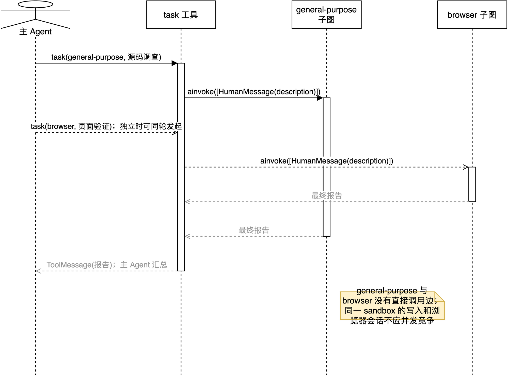

# 06：`task` 机制与多个子智能体如何协作

本篇回答两个容易混淆的问题：

1. `create_deep_agent` 的子智能体能不能互相调用？
2. 多个子智能体实际上怎样协作完成一件事？

先给当前 Open SWE 的准确结论：**不能直接互相调用。** `general-purpose` 与 `browser` 都是主 Agent 的叶子子图；只有主 Agent 持有可选择它们的 `task` 工具。它们的协作模式是“主 Agent 分派 -> 子 Agent 各自完成 -> `task` 返回摘要 -> 主 Agent 汇总并继续”，不是 A 子 Agent 把任务直接转发给 B 子 Agent。

配套时序图：[18-subagent-task-coordination.drawio](../architecture/premium/18-subagent-task-coordination.drawio)。



## 1. 先建立正确的调用拓扑

当前 `get_agent()` 注册的子 Agent 是：

```python
subagents=[
    _general_purpose_subagent(...),
    *([_browser_subagent(...)] if browser_tools else []),
]
```

Deep Agents 只在**主图**装入 `SubAgentMiddleware`，该 middleware 向主 Agent 的工具集添加一个名为 `task` 的 StructuredTool。源码见 [deepagents/graph.py:827](../../../.venv/lib/python3.11/site-packages/deepagents/graph.py:827) 和 [subagents.py:608](../../../.venv/lib/python3.11/site-packages/deepagents/middleware/subagents.py:608)。

```text
                  task(subagent_type="general-purpose", ...)
主 Agent  --------------------------------------------------> general-purpose 子图
    |
    |             task(subagent_type="browser", ...)
    +-----------------------------------------------------> browser 子图

general-purpose 子图  -X->  browser 子图
browser 子图          -X->  general-purpose 子图
```

`-X->` 代表当前代码没有这条调用边。构造 raw 子 Agent 时，Deep Agents 给子图添加的是文件系统、摘要、工具调用修补和该 spec 明确声明的 middleware；它不会把父图的 `SubAgentMiddleware` 自动复制进去。见 [deepagents/graph.py:666](../../../.venv/lib/python3.11/site-packages/deepagents/graph.py:666)。

所以子 Agent 的可见工具列表中通常没有 `task`。`general-purpose` 虽然继承主 Agent 的 `static_tools`，但 `task` 是后续由主图的 middleware 注入的，并不在 `static_tools` 内；`browser` 又显式限定为 Stagehand 浏览器工具。这个设计刻意避免形成无限的子 Agent 递归树。

## 2. `task` 是什么，不是什么

`task` 是主 Agent 的一个工具接口，不是 Python 的 `asyncio.Task`，也不是直接调用 `_general_purpose_subagent()` 函数。

构图阶段，`_general_purpose_subagent()` 与 `_browser_subagent()` 只返回配置字典（`SubAgent` spec）。`SubAgentMiddleware` 将 spec 编译为独立 Runnable，并构建一个名称到 Runnable 的映射：

```python
{
    "general-purpose": compiled_general_purpose_graph,
    "browser": compiled_browser_graph,
}
```

见 [subagents.py:423](../../../.venv/lib/python3.11/site-packages/deepagents/middleware/subagents.py:423)。之后主模型才能在运行时调用：

```python
task(
    subagent_type="general-purpose",
    description="搜索仓库中的认证实现，列出入口、数据流和风险；只返回结论和文件位置。",
)
```

`task` 的输入只有两个业务字段：

| 字段 | 含义 | 关键要求 |
| --- | --- | --- |
| `subagent_type` | 要选择的已注册子 Agent 名称 | 必须是 `task` 描述列出的名称。 |
| `description` | 子任务的完整任务书 | 必须带足上下文、动作边界和期望输出，因为子 Agent 看不到父对话历史。 |

定义见 [subagents.py:272](../../../.venv/lib/python3.11/site-packages/deepagents/middleware/subagents.py:272)。名称不存在时，`task` 返回允许的名称列表，而不是猜测一个 Agent。见 [subagents.py:575](../../../.venv/lib/python3.11/site-packages/deepagents/middleware/subagents.py:575)。

## 3. 一次 `task` 从模型调用到结果回流

以异步运行路径 `atask()` 为例，真实过程是：

1. 主模型产生 `AIMessage(tool_calls=[task(...)])`。
2. `task` 校验 `subagent_type` 和 `tool_call_id`。
3. 按名称取出已编译的子图。
4. 从父运行 state 拷贝可传播字段，排除 `messages`、`todos`、`structured_response` 和私有 state。
5. 将子图的消息重置为**唯一一条** `HumanMessage(description)`。
6. 以 `ls_agent_type="subagent"` 标记 tracing，并调用 `await subagent.ainvoke(...)`。
7. 从子图结果中取 `structured_response`，或反向找到最后一条非空 `AIMessage` 文本。
8. 将该结果包装为父图可见的 `ToolMessage`，主模型下一轮再阅读、验证或继续委派。

第 4-6 步见 [subagents.py:529](../../../.venv/lib/python3.11/site-packages/deepagents/middleware/subagents.py:529) 和 [subagents.py:570](../../../.venv/lib/python3.11/site-packages/deepagents/middleware/subagents.py:570)；第 7-8 步见 [subagents.py:474](../../../.venv/lib/python3.11/site-packages/deepagents/middleware/subagents.py:474)。

```text
主模型
  -> task(type, description)
  -> 选择对应子图
  -> 子图 messages = [HumanMessage(description)]
  -> 子图内部 model <-> tools 循环
  -> 最终报告
  -> ToolMessage(content=最终报告)
  -> 主模型读取报告并决定下一步
```

因此“子 Agent 之间传话”的标准路径不是直接发消息，而是：

```text
子 Agent A 的最终报告 -> 父图 ToolMessage -> 主 Agent 理解与重写任务 -> task 委派子 Agent B
```

这种路径多一次主模型判断，却保留了明确的任务边界、可观测 trace 和最终决策权。

## 4. 多个子 Agent 如何并行协作

`task` 的默认工具描述明确允许主模型在**同一条 assistant message** 中放入多个独立的 `task` tool call，以并发启动互不依赖的任务。见 [subagents.py:285](../../../.venv/lib/python3.11/site-packages/deepagents/middleware/subagents.py:285)。

例如主模型可以发出概念上等价的两个调用：

```python
task(
    subagent_type="general-purpose",
    description="在仓库中定位 OAuth 回调逻辑，只读分析，返回文件和风险。",
)
task(
    subagent_type="browser",
    description="打开测试环境登录页，确认 OAuth 按钮是否存在，只返回观察结果并关闭浏览器。",
)
```

它们的协作不是互相等待或聊天，而是主 Agent 的扇出/扇入（fan-out/fan-in）编排：

```text
                    ┌-> general-purpose：源码调查 ----┐
主 Agent -> 两个 task ┤                                ├-> 两个 ToolMessage -> 主 Agent 汇总
                    └-> browser：页面验证 -----------┘
```

适合并行的前提是子任务彼此独立，例如“读代码”和“验证页面是否存在”。主模型是否实际一次发出多个 tool call，取决于模型输出和运行时；不要把“注册了多个 Agent”误解成框架会自动并行启动所有 Agent。

如果 B 依赖 A 的结论，应该串行：先委派 A，主 Agent 接到 `ToolMessage` 后把 A 的结论压缩进 B 的 `description`，再委派 B。否则 B 不会凭空知道 A 的内部过程。

## 5. 当前项目中的三种协作通道

| 通道 | 能否使用 | 实际含义 | 风险或限制 |
| --- | --- | --- | --- |
| 父 Agent 的 `ToolMessage` 汇总 | 是，推荐 | 子 Agent 返回最终报告，主 Agent 再做判断、改写和委派。 | 只有最终报告，不含完整中间过程。 |
| 同一 `backend` 的 sandbox 文件 | 是 | 子图都有 `FilesystemMiddleware`，操作同一个线程 sandbox；A 写出的文件可被之后的 B 读取。 | 并发写同一文件会冲突，不能把共享目录当消息队列。 |
| 父 state 的公开字段 | 框架支持有限传播 | `task` 会拷贝非排除、非私有 state；子图返回的同类更新也可回到父 state。 | `messages`、`todos`、`structured_response` 明确不透传；当前 Open SWE 不应据此设计 Agent 间协议。 |

`backend` 共享的源码依据是 [deepagents/graph.py:667](../../../.venv/lib/python3.11/site-packages/deepagents/graph.py:667)。但所有子 Agent 都基于相同 `thread_id` 工作时，读写文件、Git index 和 shell 工作目录可能互相影响。当前项目没有为并行子 Agent 增加 worktree 隔离或文件锁，因此实际策略应当是：

```text
可并行：只读调研、彼此独立的页面检查、不同目录的明确只写任务
应串行：编辑同一仓库区域、运行会改变工作区的命令、提交/推送/开 PR、同一浏览器会话的交互
```

浏览器尤其需要串行：Stagehand 会话按 `thread_id` 存在进程内 `_SESSIONS` 字典中，工具只用锁保护会话的取得与关闭，不会把 `navigate`、`act`、`extract` 整段业务操作串行化。并发的 `browser` 子任务可能操作同一实时页面。参见 [stagehand_browser.py:49](../../../agent/integrations/stagehand_browser.py:49)、[stagehand_browser.py:659](../../../agent/integrations/stagehand_browser.py:659) 和 [stagehand_browser.py:804](../../../agent/integrations/stagehand_browser.py:804)。

## 6. 为什么当前项目选择“中心编排”

这个结构不是能力不足，而是一个刻意的控制点：

1. **边界清晰**：每个 `task` 都有子 Agent 名称、任务描述、工具调用和 trace。
2. **上下文更干净**：子 Agent 从一条任务书开始，避免把长对话和无关失败过程继续扩散。
3. **权限更容易管**：浏览器只拿浏览器工具；通用 Agent 的集成能力也要显式安装。
4. **最终责任集中**：主 Agent 负责解释矛盾、决定是否改文件、是否重试和如何回复用户。
5. **防止递归失控**：子 Agent 没有自动 `task`，不会出现多层委派耗尽模型调用额度的情况。

代价是主 Agent 必须写好 `description`，并在子结果回来后做一次整合。下面这种含糊委派会丢信息：

```python
task(subagent_type="general-purpose", description="看看认证")
```

更可靠的任务书应写明范围、约束和交付格式：

```python
task(
    subagent_type="general-purpose",
    description=(
        "只读检查 OAuth 回调。定位路由、state 校验和 token 持久化；"
        "不要改文件。返回：1) 调用链，2) 文件:行号，3) 两个最高风险。"
    ),
)
```

## 7. 如果确实需要子 Agent 调用子 Agent

当前的 `SubAgent` spec 没有一个开关能让子 Agent 自动看见兄弟 Agent。若业务真的需要两级委派，需要显式构建一个**包含自己 `SubAgentMiddleware` 的子图**，并把下层子 Agent spec 放进去，再作为 `CompiledSubAgent` 注册给上层。

这不是当前 Open SWE 的实现，也不该为了“看起来像多 Agent”而加。它会带来额外问题：递归上限如何分配、工具权限如何收窄、trace 如何读、失败如何重试、共享 sandbox 如何避免竞争。对当前的 `general-purpose + browser` 组合，主 Agent 中心编排已经覆盖了需要的协作方式。

## 8. 最小学习验证

下面的静态断言不调用模型、sandbox 或浏览器，只验证本项目的两个子 Agent spec 自身未声明 `task`：

```python
from agent.server import _browser_subagent, _general_purpose_subagent

model = object()
general = _general_purpose_subagent(model)
browser = _browser_subagent(model, [])

assert "tools" not in general  # 后续继承 static_tools，而 task 不在其中
assert browser["tools"] == []  # browser 只有显式传入的浏览器工具
```

真正的 `task` 由 `create_deep_agent()` 在主图编译时注入，不会出现在上述工厂函数返回的字典内。可运行项目已有的子 Agent 超时与 task 重试边界测试：

```bash
uv run pytest -q tests/middleware/test_model_call_timeout.py tests/agent/test_task_retry.py
```

预期现象是：子 Agent 拥有独立模型超时；子图模型调用超时被识别为可重试的 `task` 失败。该验证不发起真实模型请求。

## 9. 本篇结论

```text
当前 Open SWE：主 Agent -> task -> 子 Agent
子 Agent 之间：没有直接 task/RPC 调用边
多个子 Agent：主 Agent 可对独立工作扇出并行 task，再扇入汇总
需要依赖：通过主 Agent 的 ToolMessage 串行传递结果
共享资源：同一 backend / sandbox，但要避免并发写和并发浏览器操作
```
