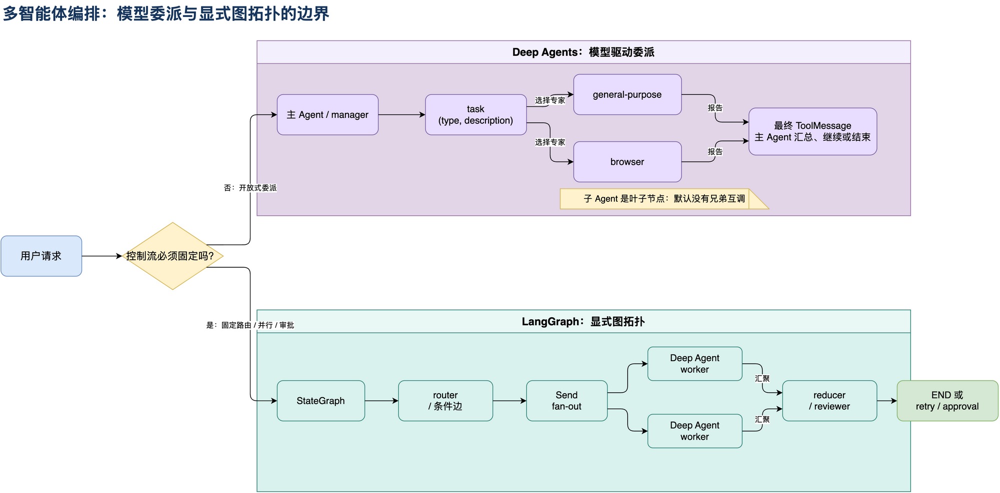

# 07：多智能体编排边界：Deep Agents 还是 LangGraph

这一篇回答一个核心架构问题：

> Deep Agents 能不能实现主从、路由、并行、协作等多智能体模式？是不是只能用 LangGraph 编排？

准确答案不是二选一：**Deep Agents 已经提供了一层“模型驱动的委派编排”；LangGraph 提供的是更底层、更确定的图拓扑编排。两者可以组合。**



## 1. 先看当前 Open SWE 属于哪一种

`agent/server.py:get_agent()` 当前注册的是：

```python
create_deep_agent(
    model=main_model,
    subagents=[
        _general_purpose_subagent(...),
        *([_browser_subagent(...)] if browser_tools else []),
    ],
    ...,
)
```

运行时拓扑是：

```text
主 Agent
  ├─ task("general-purpose", ...)
  └─ task("browser", ...)
       ↓
子 Agent 各自执行
       ↓
最终 ToolMessage 返回主 Agent
       ↓
主 Agent 汇总、验证、继续委派或结束
```

这属于**中心化主管模式（supervisor / manager pattern）**：主 Agent 是唯一的委派中心，子 Agent 是执行者。当前代码没有把 `general-purpose` 和 `browser` 编排成一张拥有直接边、条件边、汇聚节点的独立业务图。

相关实现：

- Open SWE 注册子 Agent：[agent/server.py:1182](../../../agent/server.py:1182)
- Deep Agents 注入 `task`：[deepagents/graph.py:827](../../../.venv/lib/python3.11/site-packages/deepagents/graph.py:827)
- `task` 按名称选择并调用子图：[deepagents/middleware/subagents.py:514](../../../.venv/lib/python3.11/site-packages/deepagents/middleware/subagents.py:514)

## 2. Deep Agents 能做什么

### 2.1 主 Agent 安排其他 Agent

这是 Deep Agents 最直接的能力。每个 `SubAgent` spec 提供：

```python
{
    "name": "browser",
    "description": "处理需要真实网页交互的任务",
    "system_prompt": "你是浏览器自动化专家",
    "model": subagent_model,
    "tools": browser_tools,
}
```

Deep Agents 将这些 spec 编译成独立 Runnable，再通过主图的 `task` 工具暴露给主模型。主模型看到名称和 description 后决定是否委派。

因此下面这种模式可以直接实现：

```text
主管 Agent
  ├─ 委派源码调查给 researcher
  ├─ 委派页面操作给 browser
  └─ 委派测试执行给 tester
```

但这里的“安排”是模型根据 prompt 和 description 作出的决定，不是一个由代码完全固定的调度表。

### 2.2 主 Agent 作为智能路由器

也可以把主 Agent 的主要职责限制为判断：

```text
用户请求
  -> 主模型读取各子 Agent description
  -> 选择 subagent_type
  -> task(description=...)
```

例如：

```python
task(
    subagent_type="browser",
    description="打开测试环境登录页，确认 OAuth 按钮是否存在，返回观察结果并关闭浏览器。",
)
```

这是一种**LLM 路由**。它的优点是灵活，缺点是非确定：相同输入不一定永远选同一个子 Agent，description 不清晰时还可能路由错误。

如果路由必须严格遵守业务规则，例如“包含 URL 必须进浏览器”“涉及生产写操作必须先审批”，就不应该只依赖模型判断，应把规则放进 LangGraph 节点或 middleware。

### 2.3 多个独立子任务并行

Deep Agents 的 `task` 工具描述允许模型在同一条 assistant message 中发起多个相互独立的 tool call：

```text
主 Agent
  ├─ task(researcher, 读取源码)
  └─ task(browser, 检查页面)
       ↓ 并行执行独立任务
主 Agent 收到多个 ToolMessage 后汇总
```

适合并行的任务必须互不依赖，且不要同时修改同一个共享资源。当前 Open SWE 的子 Agent 可能共享同一个 sandbox backend；并行写同一目录、同一 Git index 或同一浏览器 session 会发生竞争。因此“模型可以发多个 task”不等于“所有任务都应该并行”。

### 2.4 把自定义图作为子 Agent

Deep Agents 还支持 `CompiledSubAgent`：调用方可以先用 LangChain `create_agent()` 或 LangGraph 自己编译一张图，再把它作为 `runnable` 注册进 `task`。

```python
manager = create_deep_agent(
    model=manager_model,
    subagents=[
        {
            "name": "review-manager",
            "description": "执行固定的审查子流程",
            "runnable": review_workflow,
        }
    ],
)
```

这意味着 Deep Agents 并没有把 LangGraph 排除在外；它可以把 LangGraph 图当作一个有名字、有 description 的下属 Agent。自定义 runnable 的 state 必须包含 `messages`，否则无法把结果回传给父 Agent。依据见 [subagents.py:167](../../../.venv/lib/python3.11/site-packages/deepagents/middleware/subagents.py:167)。

## 3. Deep Agents 默认不能直接做什么

### 3.1 子 Agent A 不能自动调用子 Agent B

当前 `SubAgentMiddleware` 只安装在主图。`general-purpose` 和 `browser` 编译成自己的子图时，不会自动继承父图的 `task` 工具，所以它们不是天然的兄弟互调网络：

```text
主 Agent -> task -> general-purpose
主 Agent -> task -> browser

general-purpose -X-> browser
browser         -X-> general-purpose
```

若要实现两级委派，必须显式构造一个内部也包含 `SubAgentMiddleware` 的 manager 子图，再把它作为 `CompiledSubAgent` 注册给上层。这样能做，但已经不是当前 Open SWE 的默认能力。

### 3.2 默认不是固定状态机

Deep Agents 的主循环通常是：

```text
模型判断 -> 调工具或 task -> 读取结果 -> 再次判断
```

它不会自动表达这些业务约束：

```text
必须先做身份校验
然后并行调用三个 Agent
三个结果齐全后才能进入 reviewer
reviewer 拒绝时回到 coder，最多循环两次
最后必须人工审批
```

这些是确定的节点、边、条件、循环和终止条件，应由 LangGraph 图显式表达。

### 3.3 默认不是 Agent 之间的共享消息总线

`task` 会把子图输入消息重置成一条新的 `HumanMessage(description)`，父 Agent 只看到子图的最终报告 `ToolMessage`。子 Agent 的中间消息、工具结果和内部推理不会自动作为兄弟 Agent 的消息流转。

因此依赖关系应当这样传递：

```text
A 的最终报告
  -> 父 Agent 读取
  -> 父 Agent 把必要结论写入 B 的 description
  -> B 执行
```

而不是假设 B 能读取 A 的完整上下文。

## 4. 三类编排模式的边界

| 编排模式 | Deep Agents 原生支持 | LangGraph 显式支持 | 推荐做法 |
| --- | --- | --- | --- |
| 主 Agent 委派专家 | 支持，`task` | 也能做 | 简单开放式任务使用 Deep Agents。 |
| 主 Agent 作为智能路由 | 支持，模型根据 description 选类型 | 支持条件边和路由节点 | 规则可变用模型路由，规则必须稳定时用 LangGraph。 |
| 多个独立 Agent 并行 | 支持同轮多个 `task` 调用 | 支持 `Send`、并行分支和 reducer | 小规模开放式并行可用 Deep Agents；要求结果齐全、顺序固定时用 LangGraph。 |
| A -> B 直接 handoff | 默认不支持 | 可用节点边、`Command(goto=...)` | 需要显式图或嵌套 `CompiledSubAgent`。 |
| 固定 fan-out/fan-in | 不保证固定拓扑 | 原生支持 | 用 LangGraph。 |
| 审批、重试、循环、超时 | 可通过 middleware 和 prompt 部分实现 | 可作为图状态和边显式实现 | 关键业务控制放 LangGraph，模型能力放 Deep Agent。 |
| 多层主管树 | 可通过嵌套 compiled graph 实现 | 原生图组合 | 层级稳定、权限复杂时优先 LangGraph 外层编排。 |

## 5. 什么时候必须使用 LangGraph

出现下面任意一种需求，就不要只靠 `create_deep_agent(..., subagents=...)`：

1. **路由必须确定**：根据枚举、权限、风险等级、数据类型选择 Agent，不能让模型自由猜。
2. **执行顺序是合同**：A 完成后才能 B，B 完成后才能 C。
3. **必须等待所有分支**：三个 worker 都成功才进入汇总节点。
4. **需要共享结构化状态**：每个 Agent 写入不同字段，最后由 reducer 合并，而不是拼接自然语言报告。
5. **存在可恢复循环**：失败回到某个节点，带次数上限并持久化 checkpoint。
6. **必须人工审批**：在固定边上 interrupt，审批后才能继续。
7. **需要强审计**：每个节点、转移原因、重试次数和终止条件都要可追踪。

LangGraph 的价值是显式表达控制流，不是替代模型。一个典型外层图可以是：

```text
START
  -> router
  -> Send(worker, task_1)
  -> Send(worker, task_2)
  -> Send(worker, task_3)
  -> reducer
  -> reviewer
  -> END / retry
```

每个 `worker` 节点内部仍然可以调用一个 Deep Agent，让它负责开放式推理、工具选择和文件操作。

## 6. 推荐的混合架构

不要把“Deep Agents”和“LangGraph”理解成二选一。更稳妥的分层是：

```text
LangGraph 外层编排
  ├─ 鉴权、路由、状态校验
  ├─ 固定顺序、并行、汇聚、审批、重试
  ├─ Deep Agent worker：开放式研究/编码/浏览器操作
  └─ 结构化 reducer、审计和最终输出
```

最小伪代码：

```python
from typing import Annotated, TypedDict
import operator
from langgraph.graph import END, START, StateGraph
from langgraph.types import Send


class WorkflowState(TypedDict, total=False):
    request: str
    tasks: list[str]
    results: Annotated[list[str], operator.add]


def route(state: WorkflowState):
    # 这里放确定性业务规则，或者调用一个专门的分类模型。
    return {"tasks": [state["request"]]}


def fan_out(state: WorkflowState):
    return [Send("deep_agent_worker", {"task": task}) for task in state["tasks"]]


builder = StateGraph(WorkflowState)
builder.add_node("route", route)
builder.add_node("deep_agent_worker", deep_agent_worker)
builder.add_edge(START, "route")
builder.add_conditional_edges("route", fan_out)
builder.add_edge("deep_agent_worker", END)
workflow = builder.compile()
```

这里的 `deep_agent_worker` 可以是一个已经构建好的 `create_deep_agent(...)` Runnable，也可以是包装了它的节点函数。外层图决定“什么时候、调用几次、结果如何合并”；Deep Agent 决定“这一小块任务内部如何思考和用工具”。

## 7. 对当前项目的具体建议

Open SWE 当前的 `general-purpose + browser` 组合不需要改成一张复杂的 supervisor graph，原因是：

- 主 Agent 已经能根据 description 委派复杂任务；
- browser 是专用能力，工具边界已经收窄；
- 子 Agent 返回摘要，主 Agent 统一做后续决策；
- 代码修改、Git 操作、PR 创建等副作用仍由主 Agent 控制；
- `task` 有重试、超时和 trace 边界。

如果未来增加稳定的流水线，例如：

```text
需求分析 -> 代码实现 -> 测试 -> Reviewer -> 修复循环 -> 人工审批
```

建议新增一个 LangGraph workflow，把每个阶段作为节点；节点内部再按需使用 Deep Agent。这样流程可测试、可恢复、可审计，也不会把所有控制权交给一个模型的 prompt。

## 8. 最终判断

```text
Deep Agents 不是“只能有一个 Agent”。
它能做：主控委派、模型路由、独立并行、嵌套自定义子图。

Deep Agents 也不是完整的确定性工作流编排器。
它默认不做：兄弟 Agent 直连、固定拓扑、强制 fan-in、复杂状态机和审批回路。

LangGraph 不是 Deep Agents 的替代品。
LangGraph 负责显式控制流，Deep Agents 负责节点内部的开放式 Agent 行为。
```

一句话记忆：**让 LangGraph 决定“谁在什么时候工作”，让 Deep Agent 决定“这个 Agent 在工作时怎么解决问题”。**
