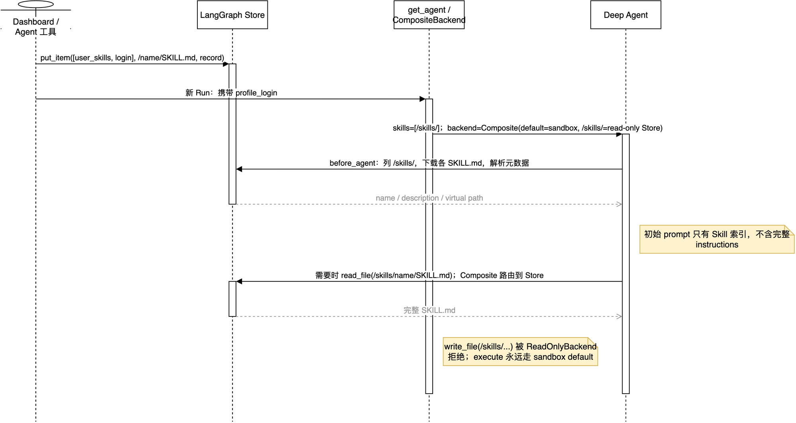

# 08：`skills=skill_sources` 与 `backend=agent_backend`

本篇只解释 `get_agent()` 的两个参数：

```python
skills=skill_sources,
backend=agent_backend,
```

它们经常同时出现，但职责完全不同：

| 参数 | 一句话职责 | 不是 |
| --- | --- | --- |
| `skills` | 告诉 Deep Agents 去哪个虚拟目录发现 `SKILL.md` | 工具函数列表，也不是自动执行的插件 |
| `backend` | 文件工具读、写、搜索、执行所使用的后端 | 单纯的 sandbox 路径字符串 |



可编辑源图：[20-user-skills-and-composite-backend.drawio](../architecture/premium/20-user-skills-and-composite-backend.drawio)。

## 1. 先看 `get_agent()` 的实际分支

调用位置在 [agent/server.py:1162](../../../agent/server.py:1162)：

```python
agent_backend: BackendProtocol = backend
skill_sources: list[str] | None = None

if profile_login:
    agent_backend = CompositeBackend(
        default=backend,
        routes={
            USER_SKILLS_ROUTE: ReadOnlyBackend(
                StoreBackend(
                    namespace=lambda _runtime, login=profile_login: (
                        SKILLS_NAMESPACE,
                        login,
                    )
                )
            )
        },
    )
    skill_sources = [USER_SKILLS_ROUTE]
```

其中：

```python
USER_SKILLS_ROUTE = "/skills/"
SKILLS_NAMESPACE = "user_skills"
```

两种结果很明确：

| 条件 | `skills` | `backend` |
| --- | --- | --- |
| 无法解析登录用户 | `None` | 原本的当前 thread sandbox backend |
| 有 `profile_login` | `['/skills/']` | `CompositeBackend`：sandbox 为默认后端，`/skills/` 为只读 Store 路由 |

所以 `profile_login` 不是模型的提示词字段，而是这里用于决定“加载哪位用户的 Skill 库”的业务身份。没有身份就没有用户级 Skill 入口，文件工具仍然可以正常使用 sandbox。

## 2. `skill_sources`：把 Skill 目录交给 `SkillsMiddleware`

`create_deep_agent()` 收到非空 `skills` 后，会自动加入：

```python
SkillsMiddleware(backend=backend, sources=skills)
```

当前项目传入的 source 只有 `'/skills/'`。运行前，`SkillsMiddleware` 做的是目录发现，而不是把每篇 Skill 正文直接塞进模型上下文：

```text
/skills/
  ├─ review-feedback/
  │   └─ SKILL.md
  └─ deslop/
      └─ SKILL.md
```

它的工作顺序是：

1. 通过 `backend.als('/skills/')` 列出一级目录。
2. 对每一个目录下载 `<目录>/SKILL.md`。
3. 解析 YAML frontmatter 的 `name` 与 `description`。
4. 将元数据保存到图的私有 `skills_metadata` state。
5. 把名称、描述、完整文件路径写入 system prompt。
6. 模型判断某个 Skill 适用时，才调用 `read_file('/skills/<name>/SKILL.md')` 读取完整 instructions。

这叫**渐进披露**：初始 prompt 有“技能索引”，没有全部正文。它避免用户累积很多 Skill 后，每次 Run 都占满上下文。

例如模型初始只会看到类似信息：

```text
review-feedback: Address PR review feedback
Path: /skills/review-feedback/SKILL.md
```

需要处理 PR 反馈时，模型再读取该文件。`skills` 因而只提供“发现来源”，不能保证模型必然采用某一项 Skill；是否读取仍由模型在当前任务中判断。

### 2.1 Skill 文件的格式

Dashboard 保存时会把表单字段合成为真正的 `SKILL.md` 内容：

```markdown
---
name: "review-feedback"
description: "Address PR review feedback"
---

Check every open comment.
```

`name` 必须是小写字母、数字和单连字符；项目在 [agent/dashboard/skills.py:21](../../../agent/dashboard/skills.py:21) 做长度与格式校验。frontmatter 提供索引信息，正文才是模型按需读取的工作规则。

### 2.2 不要误解“创建后立即可用”

`save_user_skill` 的工具说明写明变更用于 **future runs**。已在执行的 Run 已经完成了 Skill 元数据和 system prompt 的构造，写入 Store 不会反向修改它；而 `SkillsMiddleware` 发现 state 中已有 `skills_metadata` 时也不会重复扫描。

实际使用上，把“保存 Skill”理解为修改下一次任务可发现的用户资产。若要立即按新规则执行，应在保存后发起新的 Run，不应依赖当前模型自动刷新上下文。

## 3. `agent_backend`：不是一个目录，而是统一的文件能力接口

Deep Agents 收到 `backend=agent_backend` 后，会自动装配 `FilesystemMiddleware`。这也是 `read_file`、`write_file`、`edit_file`、`glob`、`grep`、`ls`、`execute` 等能力的实际数据面。

默认情况下，`backend` 是当前 `thread_id` 对应的 sandbox backend：

```text
read_file('/workspace/app.py')
write_file('/workspace/app.py', ...)
execute('pytest -q')
        │
        └─ 当前 thread 的 sandbox
```

它还被 Deep Agents 的自动摘要/过长结果卸载逻辑复用。因此这里必须传已经初始化的 backend 实例，不能传一个“以后再创建 backend”的函数。现有装配测试也专门约束了这一点。

## 4. 为什么改成 `CompositeBackend`

用户 Skill 与代码工作区需要两种不同的存储语义：

| 数据 | 生命周期与作用域 | 适合的后端 |
| --- | --- | --- |
| 仓库、命令、临时文件 | 当前 thread 的 sandbox | 默认 `backend` |
| 用户可复用 Skill | 跨 thread、按登录用户隔离 | `StoreBackend` |

`CompositeBackend` 通过路径前缀把它们组合成同一套文件工具接口：

```text
                agent_backend = CompositeBackend

/workspace/...  ──────────────────────────────> default: sandbox backend
/skills/...     ─> ReadOnlyBackend ─> StoreBackend(namespace=("user_skills", login))
execute(...)    ──────────────────────────────> default: sandbox backend
```

因此模型不需要学两套读取 API：它统一调用 `read_file`。Composite backend 会把 `/skills/` 前缀去掉后交给内部 Store backend，并在结果中恢复原始的 `/skills/...` 路径。

一个重要例外是 `execute()`：它不是路径操作，不能根据命令中出现的文件名来路由，所以始终委托给默认 sandbox backend。`execute('cat /skills/x/SKILL.md')` 不是读取用户 Skill 的受支持路径；应使用 `read_file('/skills/x/SKILL.md')`。

## 5. Skill 实际存在哪里

Skill 不存在 sandbox，也不在 Git 仓库中。它存到 LangGraph Store，位置由 namespace 与 key 共同确定：

```python
namespace = ["user_skills", login]
key = f"/{name}/SKILL.md"

await client.store.put_item(namespace, key, record)
```

对应实现见 [agent/dashboard/skills.py:62](../../../agent/dashboard/skills.py:62) 和 [agent/dashboard/skills.py:104](../../../agent/dashboard/skills.py:104)。例如 `octocat` 保存 `review-feedback`：

```text
namespace = ["user_skills", "octocat"]
key       = "/review-feedback/SKILL.md"
value     = {
  "name": "review-feedback",
  "description": "Address PR review feedback",
  "instructions": "Check every open comment.",
  "content": "--- ... SKILL.md 正文 ...",
  "encoding": "utf-8",
  ...
}
```

`StoreBackend` 在图执行期间通过 LangGraph Runtime 的 `get_store()` 取得实际 `BaseStore`，再把上述 item 适配为虚拟文件。这解释了两个问题：

- 它是跨对话的用户资产，不随某个 sandbox 删除而消失。
- 它是否落在内存、SQLite、Postgres 或托管存储，取决于部署时给 LangGraph Runtime 配置的 Store 实现；`StoreBackend` 本身不直接决定数据库类型。

## 6. 为什么 `/skills/` 是只读，但还能保存 Skill

`get_agent()` 给 `/skills/` 包了一层 `ReadOnlyBackend`：

```python
ReadOnlyBackend(StoreBackend(...))
```

这使文件工具只能读取、列目录、搜索和下载；`write_file('/skills/...')`、编辑或删除不会穿透到 Store。现有测试明确验证写入 `/skills/poison/SKILL.md` 会抛出 `NotImplementedError`。

这不是不能创建 Skill，而是把两类权限分开：

| 路径 | 调用者 | 写入方式 | 目的 |
| --- | --- | --- | --- |
| `read_file('/skills/...')` | 主 Agent 或带相同 sources 的子 Agent | 只读 backend | 使用已有 Skill |
| `save_user_skill(...)` | 模型明确调用的业务工具 | `langgraph_sdk` 的 `store.put_item` | 受控地创建或更新当前用户 Skill |
| Dashboard Skill CRUD | 已认证的 Dashboard 请求 | 同一份 `dashboard.skills` 函数 | 让用户管理自己的 Skill |

`save_user_skill` 不接收 `login` 参数。它从当前 Run 的 `RunnableConfig` 中解析触发用户身份，再写入该用户 namespace，见 [agent/tools/user_skills.py:21](../../../agent/tools/user_skills.py:21)。这避免模型把任意用户名拼进路径而写入他人 Skill 库。

## 7. 主 Agent 和子 Agent 谁能看到 Skill

| Agent | 是否传入 `skills` | 结果 |
| --- | --- | --- |
| 主 Agent | `skills=skill_sources` | 可发现并按需读取 `/skills/` |
| `general-purpose` | `_general_purpose_subagent(subagent_model, skill_sources, ...)` | 显式继承同一个 Skill source |
| `browser` | `_browser_subagent(...)` 未声明 `skills` | 当前实现不加载用户 Skill |

重点是：Skill 不是由于“主 Agent 有 backend”就自动传给所有子 Agent。主图传了 `skills`，通用子 Agent 又被 Open SWE 显式赋了同一份 sources；浏览器子 Agent 则没有。这是按职责做出的选择，不是 Deep Agents 的隐式全局继承。

## 8. 把两条链路串起来

### 8.1 保存链路

```text
用户在 Dashboard 创建 Skill，或 Agent 调用 save_user_skill
  -> 从 RunnableConfig / Dashboard 身份得到 login
  -> dashboard.skills 生成 frontmatter + instructions
  -> LangGraph SDK store.put_item(["user_skills", login], "/<name>/SKILL.md", record)
```

### 8.2 使用链路

```text
新的 Agent Run
  -> get_agent(profile_login)
  -> CompositeBackend(default=sandbox, /skills/=readonly StoreBackend)
  -> create_deep_agent(skills=["/skills/"], backend=composite)
  -> SkillsMiddleware 扫描 /skills/，向 prompt 注入 name/description/path
  -> 模型命中某项 Skill
  -> read_file('/skills/<name>/SKILL.md')
  -> CompositeBackend 路由到该 login 的 Store item
```

## 9. 常见误解

| 误解 | 正确理解 |
| --- | --- |
| `skills` 是可以直接调用的 tools | 它是 Skill 文件根目录；读取和采用由模型决定 |
| 有了 `backend` 就会自动加载所有 Skill | 必须额外传入 `skills=['/skills/']`，才会安装 `SkillsMiddleware` |
| `/skills/` 是 sandbox 的普通目录 | 它是 Composite backend 映射出的 Store 虚拟目录 |
| 只读 backend 让用户无法新增 Skill | 正常新增走受控业务工具或 Dashboard CRUD，不走通用文件写工具 |
| Skill 与当前 thread 绑定 | Skill 以 `login` namespace 隔离，设计目标是跨 thread 复用 |
| `execute` 会按 `/skills/` 自动路由 | 命令永远在默认 sandbox 执行；读取 Skill 要用文件工具 |

## 10. 最小验证

仓库已有两组针对本篇的单测：

```bash
uv run pytest -q tests/agent/test_skills.py tests/agent/test_agent_assembly_context.py
```

它们至少覆盖：

- Skill 写入 namespace `['user_skills', 'octocat']` 与 key `'/review-feedback/SKILL.md'`；
- 主 Agent 的 `skills == ['/skills/']`；
- `agent_backend` 是 `CompositeBackend`，其 `/skills/` route 为 `ReadOnlyBackend`；
- 普通文件写工具不能写入 `/skills/`；
- `general-purpose` 子 Agent 获得同一份 Skill source。

## 本篇结论

`skill_sources` 定义“从哪里发现可复用规则”；`agent_backend` 定义“文件工具实际上操作什么”。Open SWE 将用户 Skill 放进按 `login` 隔离的 LangGraph Store，再以 `/skills/` 这个只读虚拟目录挂到当前 thread 的 sandbox backend 旁边。这样同一个 Agent 可以在 sandbox 中改代码，同时跨对话安全地复用用户的工作规则。
