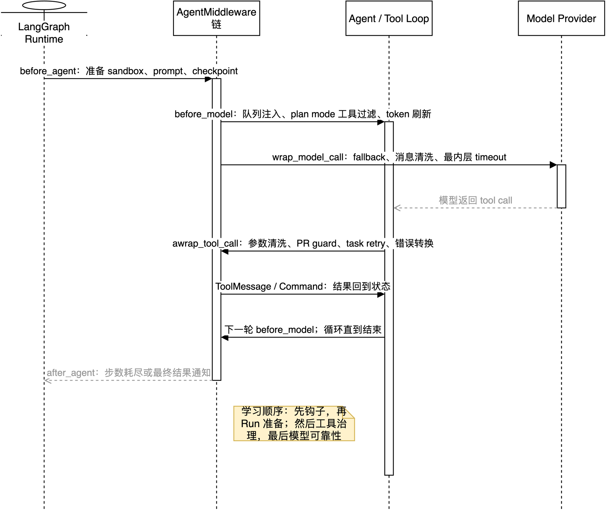

# 09：中间件应该如何学习

`get_agent()` 里的 middleware 很多，最容易犯的错误是从第一行开始背类名。正确方法是先问三个问题：

1. 它在哪个生命周期钩子运行？
2. 它修改的是状态、工具请求，还是模型请求？
3. 它是在解决业务准备、权限治理，还是故障恢复？



可编辑源图：[21-middleware-learning-roadmap.drawio](../architecture/premium/21-middleware-learning-roadmap.drawio)。

## 1. 先建立总模型：中间件不是一串普通函数

列表位于 [agent/server.py:1192-1235](../../../agent/server.py:1192)：

```python
middleware=[
    PrepareAgentRunMiddleware(...),
    dynamic_tool_middleware?,
    SanitizeToolInputsMiddleware(),
    ModelCallLimitMiddleware(...),
    ToolErrorMiddleware(),
    SubdirAgentsReadMiddleware(),
    ToolRetryMiddleware(...),
    PullRequestCreationGuardMiddleware(),
    refresh_github_proxy_before_model,
    check_message_queue_before_model,
    TimeoutWrapupMiddleware(),
    notify_step_limit_reached,
    fallback_middleware?,
    plan_mode_middleware?,
    SanitizeFireworksMessagesMiddleware(),
    SanitizeThinkingBlocksMiddleware(),
    ModelCallTimeoutMiddleware(),
]
```

它们实现的是 LangChain `AgentMiddleware` 的不同钩子：

| 钩子 | 发生时机 | 典型问题 |
| --- | --- | --- |
| `before_agent` / `abefore_agent` | 一次 Agent Run 开始 | sandbox、prompt、初始状态是否准备好 |
| `before_model` / `abefore_model` | 每次模型请求前 | 是否注入新消息、刷新 token、过滤工具 |
| `awrap_model_call` | 包住一次模型调用 | fallback、超时、消息清洗、动态 prompt |
| `awrap_tool_call` | 包住一次工具调用 | 参数清洗、错误转换、权限保护、重试 |
| `after_agent` / `aafter_agent` | Agent 结束后 | 步数耗尽时是否通知用户 |

因此列表不是简单的“从上到下依次执行一次”。一个 Run 会反复经历：

```text
before_agent
  -> before_model / wrap_model_call
  -> 模型返回 tool call
  -> wrap_tool_call
  -> 工具结果回到状态
  -> 再次 before_model / wrap_model_call
  -> ...
  -> after_agent
```

## 2. 用三条线学习，而不是按 17 个名字学习

### 2.1 第一条线：Run 准备线

先只学习：

```text
PrepareAgentRunMiddleware
  -> rendered_system_prompt
  -> work_dir / sandbox / token / turn checkpoint
```

它回答“本轮 Agent 在什么环境里工作”。源码基类 [agent/middleware/prepare_run.py:41](../../../agent/middleware/prepare_run.py:41) 用 `run_prepared_for` 和消息 fingerprint 保证恢复 Run 不重复做已经完成的准备；但下一条用户消息仍会触发新一轮准备。

第一阶段只需要掌握四个状态：

| 状态字段 | 学习重点 |
| --- | --- |
| `run_prepared` | 是否完成本轮准备 |
| `run_prepared_for` | 准备对应哪条最新消息 |
| `work_dir` | 模型和工具使用的工作目录 |
| `rendered_system_prompt` | 运行时最终系统提示词 |

不要一开始钻进 GitHub proxy 或 Linear 参数；那些是 `_prepare()` 里的业务细节，先把“before-agent 只做一次且可恢复”理解清楚。

### 2.2 第二条线：Agent/Tool 控制线

然后学习所有会影响工具调用的 middleware：

| 中间件 | 处理对象 | 先回答的问题 |
| --- | --- | --- |
| `DynamicToolMiddleware` | 工具集合 | 集成工具什么时候加载、何时可见 |
| `SanitizeToolInputsMiddleware` | 工具参数 | 为什么 `read_file.offset` 的字符串要修正 |
| `ToolErrorMiddleware` | 工具异常 | 异常如何变成模型可读的 `ToolMessage` |
| `SubdirAgentsReadMiddleware` | `read_file` 结果 | `AGENTS.md` 如何随目录规则注入 |
| `ToolRetryMiddleware` | `task` 工具失败 | 为什么只重试子 Agent 而不重试所有写操作 |
| `PullRequestCreationGuardMiddleware` | PR 创建工具 | 权限策略为什么必须在工具边界执行 |
| `PlanModeMiddleware` | 每次模型请求的工具列表 | plan mode 如何真正隐藏副作用工具 |

这一组要用一个具体事件串起来：

```text
模型生成 read_file(offset="1, 80")
  -> SanitizeToolInputsMiddleware 修正参数
  -> 文件工具执行
  -> SubdirAgentsReadMiddleware 补充 AGENTS.md
  -> ToolMessage 回到模型
```

再用另一个事件理解故障边界：

```text
模型调用 task
  -> 子 Agent 暂态失败
  -> ToolRetryMiddleware 判断 retry_on
  -> 最多重试 2 次并退避
  -> 仍失败才交给 on_failure / ToolErrorMiddleware
```

这里有一个安全原则：带外部副作用的工具不能因为“失败了”就盲目重试，否则可能重复创建 PR、Linear Issue 或发送消息。当前代码只把 `task` 放进 `tools=["task"]`。

### 2.3 第三条线：Model/Provider 保护线

最后学习模型边界的 middleware：

```text
check_message_queue_before_model
  -> TimeoutWrapupMiddleware
  -> fallback_middleware?
  -> plan_mode_middleware?
  -> provider message sanitizers
  -> ModelCallTimeoutMiddleware
  -> 真实 provider 请求
```

按问题分类：

| 问题 | 中间件 | 机制 |
| --- | --- | --- |
| Run 中来了新消息 | `check_message_queue_before_model` | 从 Store 消费队列并注入 HumanMessage |
| Run 太久需要收尾 | `TimeoutWrapupMiddleware` | 给 system message 加 wrap-up 指令 |
| 主模型暂时不可用 | `ModelFallbackMiddleware` | 在 primary/fallback 间切换并退避 |
| plan mode 已开启 | `PlanModeMiddleware` | 从本次 ModelRequest 的 tools 中剔除副作用工具 |
| provider 消息格式不兼容 | `SanitizeFireworksMessagesMiddleware`、`SanitizeThinkingBlocksMiddleware` | 请求发出前修正消息结构 |
| provider 卡死不返回 | `ModelCallTimeoutMiddleware` | `asyncio.wait_for` 把挂起变成可处理的超时异常 |

最后一个 timeout 必须放到模型调用链最内侧，才能包住真实 provider 请求；超时异常再向外传播，fallback 才有机会接住。它限制的是**单次模型调用**，不是整个 Run。

## 3. 学习顺序：四个最小章节

不要一次读完所有源文件，按下面顺序每次只解决一个问题：

### 第 1 章：钩子和嵌套

目标：能分辨 `abefore_agent`、`before_model`、`awrap_model_call`、`awrap_tool_call`。

最小验证：在一个假的 handler 前后记录日志，观察 `awrap_*` 是如何包住内部 handler 的。不要调用真实模型。

```python
async def awrap_model_call(request, handler):
    print("before provider")
    response = await handler(request)
    print("after provider")
    return response
```

### 第 2 章：一次 Run 的准备

本章讲义：[12：`PrepareAgentRunMiddleware`：一次 Run 如何准备并可恢复](12-prepare-run-lifecycle.md)。

目标：理解 `PrepareAgentRunMiddleware` 的 fingerprint、checkpoint 和动态 system prompt。

重点阅读：

- [agent/middleware/prepare_run.py](../../../agent/middleware/prepare_run.py)
- [agent/server.py:799](../../../agent/server.py:799)

验证问题：同一条恢复 Run 为什么不会重复创建 sandbox？新消息为什么又会重新准备？

### 第 3 章：工具失败与副作用治理

本章讲义：[13：工具失败与副作用治理](13-tool-failure-and-side-effect-governance.md)。

目标：理解“清洗参数、转换错误、重试 task、阻止 PR”是四个不同层次。

重点阅读：

- [agent/middleware/sanitize_tool_inputs.py](../../../agent/middleware/sanitize_tool_inputs.py)
- [agent/middleware/tool_error_handler.py](../../../agent/middleware/tool_error_handler.py)
- [agent/middleware/pr_creation_guard.py](../../../agent/middleware/pr_creation_guard.py)
- `agent/server.py` 中 `ToolRetryMiddleware` 与 `PLAN_MODE_EXCLUDED_TOOLS`

验证问题：为什么 `ToolErrorMiddleware` 不能替代 `ToolRetryMiddleware`？因为前者负责把异常变成消息，后者要在异常尚未被吞并前判断是否重试。

### 第 4 章：模型可靠性与协议适配

本章讲义：[14：模型可靠性与协议适配](14-model-reliability-and-protocol-adaptation.md)。

目标：理解消息队列、wrap-up、fallback、provider 清洗和单调用 timeout 的边界。

重点阅读：

- [agent/middleware/check_message_queue.py](../../../agent/middleware/check_message_queue.py)
- [agent/middleware/model_fallback.py](../../../agent/middleware/model_fallback.py)
- [agent/middleware/model_call_timeout.py](../../../agent/middleware/model_call_timeout.py)
- [agent/middleware/timeout_wrapup.py](../../../agent/middleware/timeout_wrapup.py)

验证问题：为什么 `ModelCallTimeoutMiddleware` 在最内层，而 `ModelFallbackMiddleware` 必须在它外层？因为 timeout 产生的异常必须冒泡到 fallback。

## 4. 学源码时使用“输入—变化—出口”模板

每读一个 middleware，只写三行，不要上来抄完整实现：

```text
输入：它拿到 state / ModelRequest / ToolCallRequest 的什么字段？
变化：它修改 state、tools、messages、异常，还是只做副作用？
出口：handler 返回什么；失败是重试、转 ToolMessage、切 fallback，还是结束？
```

示例：`PlanModeMiddleware`：

```text
输入：ModelRequest.state.plan_mode、ModelRequest.tools
变化：剔除 PLAN_MODE_EXCLUDED_TOOLS
出口：返回 override 后的 ModelRequest，模型看不到被排除的工具
```

示例：`ModelCallTimeoutMiddleware`：

```text
输入：一次 ModelRequest 和下游 handler
变化：用 asyncio.wait_for 包住 handler
出口：正常返回 ModelResponse；超时抛 ModelCallTimeoutError
```

## 5. 必须分清“列表顺序”和“业务时间顺序”

列表顺序重要，但不能机械地把它解释成“每项只执行一次”。同一个中间件可能在不同钩子运行多次；函数式 `before_model` 也和 `awrap_model_call` 不属于同一种包装层。

阅读时按这张表定位：

| 你要回答的问题 | 去看哪里 |
| --- | --- |
| Run 开始前准备什么 | `abefore_agent` / `_prepare` |
| 每次模型请求前注入什么 | `before_model` |
| provider 请求失败怎么办 | `awrap_model_call` 的异常分支 |
| 工具参数在哪里改 | `awrap_tool_call` |
| 工具异常谁处理 | `ToolErrorMiddleware` 与 `ToolRetryMiddleware` |
| 结束时用户为什么收到通知 | `aafter_agent` 或 `after_agent` |

## 6. 父图与子图要单独学习

父图这份列表不会原样复制给 `general-purpose` 子 Agent。子 Agent 是独立图，只显式获得自己的动态工具 middleware（如果有）和 `ModelCallTimeoutMiddleware`；Deep Agents 还会为它安装自己的文件、摘要、Skill 和 `task` 相关 middleware。

所以学习时必须问：

```text
这个 middleware 安装在主图，还是 general-purpose 子图？
它保护的是父 Agent 的 task 调用，还是子 Agent 内部的模型调用？
```

例如父图的 `ModelCallTimeoutMiddleware` 不会包住子 Agent 的 provider 请求，这就是 `_general_purpose_subagent()` 还要单独传 timeout 的原因。

## 7. 建议的验证方式

先跑不触发真实模型的测试：

```bash
uv run pytest -q tests/agent/test_skills.py tests/agent/test_agent_assembly_context.py
```

再针对中间件模块运行已有测试：

```bash
uv run pytest -q tests/middleware
```

最后才做一次真实 Run trace，观察以下事件是否符合预期：

```text
before_agent -> model -> tool -> model -> ... -> after_agent
```

真实模型验证不是第一步，因为它会把“中间件逻辑问题”和“provider、sandbox、凭据问题”混在一起。

## 8. 读完本篇后的掌握标准

你不需要背出每个类的所有代码；达到下面五点，就算掌握了这段装配：

1. 能按 `before_agent / before_model / model wrapper / tool wrapper / after_agent` 给中间件分类。
2. 能说明 `PrepareAgentRunMiddleware` 为什么必须先运行。
3. 能解释 `ToolRetryMiddleware` 为什么只重试 `task`。
4. 能画出 timeout 异常如何向外到达 fallback。
5. 能指出哪些父图策略不会自动继承到子图。

已有逐项源码讲解见 [02：middleware 列表与顺序](02-middleware-stack-line-by-line.md)。本篇负责“怎么学”，第 02 篇负责“每个实现具体做什么”。
