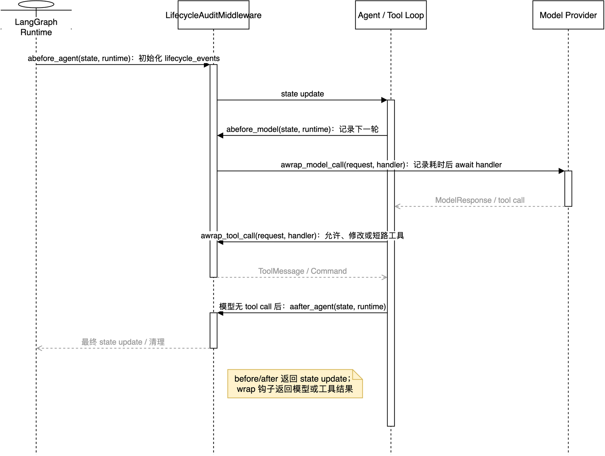

# 10：先写一个完整的 `create_deep_agent` 中间件

在研究 Open SWE 的 17 个 middleware 前，先自己写一个小而完整的中间件。目标不是做业务功能，而是把五种最基础的生命周期钩子放到同一个例子中：

```text
before_agent
before_model
awrap_model_call
awrap_tool_call
after_agent
```

本篇使用当前项目相同的异步模式。它适用于 `create_deep_agent(...).ainvoke(...)` 或 `astream(...)`；如果改用同步 `invoke()`，还需要实现对应的同步钩子，不能只复制 `async` 版本。



可编辑源图：[22-custom-middleware-lifecycle-basics.drawio](../architecture/premium/22-custom-middleware-lifecycle-basics.drawio)。

## 1. 先记住一个循环

一个 Agent Run 的最小过程是：

```text
before_agent（仅 Run 开始）
  -> before_model（每次模型调用前）
  -> awrap_model_call（包住本次模型请求）
  -> 模型决定是否调用工具
  -> awrap_tool_call（每个工具调用各执行一次）
  -> 工具结果进入 messages
  -> 回到 before_model，直到模型不再调用工具
  -> after_agent（仅 Run 结束）
```

`before_*` / `after_*` 的返回值是**状态更新字典**；`awrap_*` 的职责是决定怎样调用传入的 `handler`，并返回该 handler 的结果。

## 1.1 这些参数到底从哪里来

先看一个最常见的签名：

```python
async def abefore_agent(self, state, runtime):
    ...
```

| 参数 | 实际对象 | 作用 |
| --- | --- | --- |
| `self` | 当前 `LifecycleAuditMiddleware` 实例 | 访问中间件自己的配置和辅助方法；不要把并发 Run 的可变状态长期塞在这里 |
| `state` | 当前 Agent state，本例是 `LifecycleState` | 读取 `messages`、自定义字段，并返回要合并的 state update |
| `runtime` | `Runtime[ContextT]` | 访问本次执行的 context、Store、stream writer、heartbeat 等运行时能力 |

### `self`：中间件对象本身

它来自这里：

```python
middleware=[LifecycleAuditMiddleware()]
```

`create_deep_agent` 把这个实例注册到图的 middleware 链里。`self` 不是当前用户消息，也不是 LangGraph 的 `RunnableConfig`。适合在 `self` 上保存不随请求变化的配置，例如 `max_retries=2`；每个 Run 的计数、消息和结果应该放在 `state`，否则并发 Run 可能互相污染。

### `state`：图的可持久化状态快照

本例的 `LifecycleState` 继承 `DeepAgentState`，至少包含：

```python
{
    "messages": [...],
    "lifecycle_events": [...],
}
```

`messages` 是当前对话和工具结果；`lifecycle_events` 是我们自定义的 state channel。钩子返回：

```python
{"lifecycle_events": ["before_model: next model turn"]}
```

LangGraph 会把它合并回图状态。`state` 不是 `config`：`thread_id`、模型覆盖等运行配置通常从 `RunnableConfig`/`get_config()` 读取，不会自动出现在 `state`。

### `runtime`：本次执行的运行时能力

示例中的 `Runtime[None]` 表示“本例没有自定义 `context_schema` 类型”；它不表示没有 Runtime，也不表示 `runtime` 是 `None`。当前版本 `Runtime` 主要提供这些字段：

| 字段 | 用途 |
| --- | --- |
| `runtime.context` | 本次调用传入的 `context_schema` 数据；适合放调用级依赖 |
| `runtime.store` | 当前 LangGraph Store（可能为空）；用于跨 Run 数据读写 |
| `runtime.stream_writer` | 向流式消费者写自定义事件 |
| `runtime.heartbeat` | 长时间工作时发送 heartbeat |
| `runtime.previous` | 恢复/前一次执行相关信息，是否有值取决于运行方式 |
| `runtime.execution_info`、`server_info`、`control` | Runtime/部署/控制信息，按具体场景使用 |

`runtime.context` 不等于 `RunnableConfig["configurable"]`，也不等于 thread metadata。需要 `thread_id` 时，当前项目通常使用 `get_config()`；需要跨 thread 的业务数据时，使用 `runtime.store` 或 `get_store()`。

## 1.2 wrapper 钩子的参数

模型 wrapper 的签名是：

```python
async def awrap_model_call(self, request, handler):
    return await handler(request)
```

| 参数 | 实际对象 | 关键字段 |
| --- | --- | --- |
| `request` | `ModelRequest` | `model`、`messages`、`system_message`、`tools`、`state`、`runtime`、`response_format` |
| `handler` | 下游异步调用函数 | 调用它才会继续进入下一个 middleware/真实模型；可以修改 request、重试或短路 |

`request` 是“这一次模型请求”的完整视图，不是整个图 state。修改它要使用不可变风格的：

```python
request = request.override(tools=filtered_tools)
```

`handler(request)` 的返回值是 `ModelResponse`（简单场景也可以是 `AIMessage`）。正常 wrapper 应调用一次；fallback 或 retry 才会有意识地调用多次。

工具 wrapper 的签名是：

```python
async def awrap_tool_call(self, request, handler):
    return await handler(request)
```

这里的 `request` 是 `ToolCallRequest`，包含：

```python
{
    "tool_call": {"id": "call-1", "name": "get_status", "args": {}},
    "tool": <实际 BaseTool，可为空>,
    "state": <当前图状态>,
    "runtime": <ToolRuntime>,
}
```

`handler(request)` 才真正执行工具；正常结果是 `ToolMessage`，需要更新图控制流时也可能是 `Command`。日志中建议只记录 `name`、`id` 和 `args` 的键名，不要直接打印参数值。

## 2. 可运行的完整例子

下面的 `LifecycleAuditMiddleware` 做四件小事：

- 在 state 中累计生命周期事件；
- 每次模型调用前记录可见工具名；
- 测量一次 provider 调用耗时；
- 拒绝名为 `dangerous_delete` 的工具调用，演示工具短路。

它只演示机制，不是 Open SWE 的生产策略。

```python
from __future__ import annotations

import logging
import operator
import time
from collections.abc import Awaitable, Callable
from typing import Annotated, Any, NotRequired

from deepagents import DeepAgentState, create_deep_agent
from langchain.agents.middleware import AgentMiddleware
from langchain.agents.middleware.types import ModelRequest, ModelResponse
from langchain_core.messages import ToolMessage
from langchain_core.tools import tool
from langgraph.prebuilt.tool_node import ToolCallRequest
from langgraph.runtime import Runtime
from langgraph.types import Command

logger = logging.getLogger(__name__)


class LifecycleState(DeepAgentState):
    # operator.add 让每个钩子提交的列表追加到既有 state，而不是覆盖它。
    lifecycle_events: NotRequired[Annotated[list[str], operator.add]]


class LifecycleAuditMiddleware(AgentMiddleware[LifecycleState, None, Any]):
    state_schema = LifecycleState

    async def abefore_agent(
        self,
        state: LifecycleState,
        runtime: Runtime[None],
    ) -> dict[str, Any]:
        return {"lifecycle_events": ["before_agent: run started"]}

    async def abefore_model(
        self,
        state: LifecycleState,
        runtime: Runtime[None],
    ) -> dict[str, Any]:
        return {"lifecycle_events": ["before_model: next model turn"]}

    async def awrap_model_call(
        self,
        request: ModelRequest[None],
        handler: Callable[[ModelRequest[None]], Awaitable[ModelResponse[Any]]],
    ) -> ModelResponse[Any]:
        tool_names = [getattr(tool, "name", "anonymous") for tool in request.tools]
        started_at = time.monotonic()
        try:
            return await handler(request)
        finally:
            elapsed = time.monotonic() - started_at
            logger.info("model call finished in %.2fs; visible tools=%s", elapsed, tool_names)

    async def awrap_tool_call(
        self,
        request: ToolCallRequest,
        handler: Callable[[ToolCallRequest], Awaitable[ToolMessage | Command[Any]]],
    ) -> ToolMessage | Command[Any]:
        tool_name = request.tool_call["name"]
        if tool_name == "dangerous_delete":
            # 不调用 handler：这就是在工具边界短路并拒绝操作。
            return ToolMessage(
                content="dangerous_delete is disabled by LifecycleAuditMiddleware",
                tool_call_id=request.tool_call["id"],
                status="error",
            )

        logger.info("executing tool=%s", tool_name)
        return await handler(request)

    async def aafter_agent(
        self,
        state: LifecycleState,
        runtime: Runtime[None],
    ) -> dict[str, Any]:
        event_count = len(state.get("lifecycle_events", []))
        logger.info("agent finished; recorded %s lifecycle events", event_count)
        return {"lifecycle_events": ["after_agent: run finished"]}


@tool
async def get_status() -> str:
    """Return a harmless status value."""
    return "ok"


agent = create_deep_agent(
    model="openai:gpt-4.1-mini",  # 替换为你项目已配置的模型
    tools=[get_status],
    middleware=[LifecycleAuditMiddleware()],
    state_schema=LifecycleState,
)


async def main() -> None:
    result = await agent.ainvoke(
        {"messages": [{"role": "user", "content": "调用 get_status，然后说明结果"}]}
    )
    print(result["lifecycle_events"])
```

运行命令：

```bash
uv run python 10_middleware_basics.py
```

预期现象：日志会显示一次或多次 model call，以及实际调用的工具；最终 state 的 `lifecycle_events` 至少含有 `before_agent`、一次 `before_model` 和 `after_agent`。模型是否调用 `get_status` 仍由模型决定。

仓库中的可直接运行版本位于 [10_middleware_basics.py](10_middleware_basics.py)。它会加载仓库根目录 `.env`，使用 OpenAI 兼容的 `ChatOpenAI` 直连 `DEEPSEEK_BASE_URL`，默认模型名为服务端实际暴露的 `DeepSeek-V4-Flash`（可用 `MIDDLEWARE_MODEL_NAME` 覆盖），不经过 Gateway。真实运行需要有效 provider 凭据，且会产生调用费用；当前环境只完成了模型构造、类定义和 API 签名校验。

## 3. 五个钩子分别该做什么

### 3.1 `abefore_agent`：本次 Run 的一次性准备

```python
async def abefore_agent(self, state, runtime):
    return {"lifecycle_events": ["before_agent: run started"]}
```

适合做：生成本 Run 的临时状态、建立幂等准备标记、计算运行时 prompt 所需上下文。

不适合做：每轮模型调用都要刷新的工作。它只在 Agent Run 的开始阶段运行一次。

### 3.2 `abefore_model`：每一轮模型调用前改 state

```python
async def abefore_model(self, state, runtime):
    return {"lifecycle_events": ["before_model: next model turn"]}
```

适合做：从队列取新消息、把 Run 状态同步进 state、决定下一轮是否终止。

它返回的是 state update，不直接拿到 `request.tools`。如果需求是删除或替换当前模型可见的工具，应使用下一节的 `awrap_model_call`。

### 3.3 `awrap_model_call`：包住真实 provider 请求

```python
async def awrap_model_call(self, request, handler):
    request = request.override(tools=filtered_tools)  # 可选：修改请求
    response = await handler(request)                 # 真正调用模型
    return response                                   # 也可检查或替换响应
```

`handler` 是后续中间件和最终模型调用的组合。可以：

- 在调用前用 `request.override(...)` 修改模型、tools、system message；
- 用 `try/except` 做 fallback；
- 用 timeout 包住 `await handler(request)`；
- 调用多次 handler 做可控重试；
- 不调用 handler，直接返回 `AIMessage` 来短路。

多个 wrapper 会嵌套，**middleware 列表中靠前的 wrapper 在最外层**。这就是 Open SWE 把 `ModelCallTimeoutMiddleware()` 放在最后，以便它紧贴 provider 调用、让超时异常向外传播给 fallback 的原因。

### 3.4 `awrap_tool_call`：包住每一个工具调用

```python
async def awrap_tool_call(self, request, handler):
    if request.tool_call["name"] == "dangerous_delete":
        return ToolMessage(..., status="error")
    return await handler(request)
```

可以做三类事情：

| 目标 | 做法 |
| --- | --- |
| 改参数 | `request.override(tool_call=modified_call)` 后调用 handler |
| 阻止调用 | 不调用 handler，返回带相同 `tool_call_id` 的 `ToolMessage(status="error")` |
| 重试或统一错误 | 围绕 handler 处理异常或 error `ToolMessage` |

不要在这里对有外部副作用的工具做无条件重试。对于创建 PR、付款、发消息等操作，必须先有幂等键或业务确认机制。

### 3.5 `aafter_agent`：最终收尾

```python
async def aafter_agent(self, state, runtime):
    return {"lifecycle_events": ["after_agent: run finished"]}
```

适合做最终审计、发送“步数已耗尽”通知、清理本次 Run 的临时资源。不要把“无论模型是否完成都强行再调用模型”的逻辑塞在这里；它是结束钩子，不是新的 Agent loop。

### 3.6 同步 `invoke()` 怎么实现

`AgentMiddleware` 为同步和异步执行提供两套名字对应的钩子：

| 异步 Run | 同步 Run |
| --- | --- |
| `abefore_agent` | `before_agent` |
| `abefore_model` | `before_model` |
| `awrap_model_call` | `wrap_model_call` |
| `awrap_tool_call` | `wrap_tool_call` |
| `aafter_agent` | `after_agent` |

同步版本的关键差别只有一个：没有 `await`，`handler` 也不返回 awaitable：

```python
def wrap_model_call(self, request, handler):
    started_at = time.monotonic()
    try:
        return handler(request)
    finally:
        logger.info("sync model call finished in %.2fs", time.monotonic() - started_at)

def wrap_tool_call(self, request, handler):
    if request.tool_call["name"] == "dangerous_delete":
        return ToolMessage(
            content="blocked",
            tool_call_id=request.tool_call["id"],
            status="error",
        )
    return handler(request)
```

如果类只实现 `awrap_model_call` / `awrap_tool_call`，再调用 `agent.invoke()`，基类会抛出 `NotImplementedError`，因为它不会偷偷把异步 handler 改成同步 handler。当前 `10_middleware_basics.py` 同时实现两套方法，因此可以这样运行：

```bash
# 默认异步：调用 ainvoke()
uv run python docs/open-swe-learning/17-create-deep-agent-call/10_middleware_basics.py

# 同步：调用 invoke()
MIDDLEWARE_MODE=sync uv run python docs/open-swe-learning/17-create-deep-agent-call/10_middleware_basics.py
```

在本项目的生产代码中仍然坚持 async-only；这里补齐同步实现是为了教学和对比，不代表 Open SWE 主图要同时维护两套业务逻辑。

## 3.7 如何观察中间件动态

`10_middleware_basics.py` 已在四个边界添加日志：

| 日志前缀 | 观察内容 |
| --- | --- |
| `before_agent` / `before_model` | 当前 messages 数、已记录事件数 |
| `model_call_start` | 模型名、消息数、当前可见工具 |
| `model_call_response` | 返回类型、模型是否产生 tool call |
| `tool_call_start` / `tool_call_end` | 工具名、调用 ID、参数键、结果状态、耗时 |
| `model_call_error` / `tool_call_error` | 异常边界和完整 traceback |
| `after_agent` | Run 结束时的 state 摘要 |

推荐先看这一条链：

```text
model_call_start
  -> model_call_response(tool_calls=["get_status"])
  -> tool_call_start(name=get_status)
  -> tool_call_end(status=success)
  -> model_call_start
  -> model_call_response(tool_calls=[])
  -> after_agent
```

日志只打印工具名、调用 ID 和参数名，不打印 prompt、参数值、消息正文或 API key。生产环境不要为了调试直接把完整 `request.messages` 写入日志，里面可能包含用户代码、凭据或仓库内容。

## 4. 两种返回值，千万别混

| 钩子 | 正确返回值 | 含义 |
| --- | --- | --- |
| `abefore_agent`、`abefore_model`、`aafter_agent` | `dict[str, Any]` 或 `None` | 要合并进 LangGraph state 的更新 |
| `awrap_model_call` | `ModelResponse`、`AIMessage` 等模型结果 | 下游模型调用的结果 |
| `awrap_tool_call` | `ToolMessage` 或 `Command` | 当前工具调用的结果或 state command |

常见错误是从 `awrap_model_call` 返回 `{"my_state": ...}`，或者从 `abefore_model` 返回 `ToolMessage`。类型看似接近，生命周期语义却完全不同。

## 5. 自定义 state 为什么需要 reducer

本例的状态声明是：

```python
lifecycle_events: NotRequired[Annotated[list[str], operator.add]]
```

默认情况下，后一次 state update 会覆盖前一个列表。`operator.add` 告诉 LangGraph 把列表连接起来，因此每个钩子分别返回一个事件，最终仍能保留完整轨迹。

如果字段只应保存最新值，例如 `current_workspace`，就不要加 reducer：直接声明 `NotRequired[str]`，让新值覆盖旧值即可。

## 6. 先写什么，后写什么

第一次给项目增加 middleware，推荐按这个最小过程进行：

1. 写清触发阶段：它是 Run 级、模型级、工具级，还是结束级？
2. 先只观察：日志或增加一个 state 字段，不改变请求和结果。
3. 写一个失败用例：例如被禁止的工具必须返回 error `ToolMessage`。
4. 再加入一个变化：过滤 tools、改参数、timeout 或 fallback，四选一。
5. 最后把它放进真实 middleware 列表，并检查前后 wrapper 的嵌套关系。

不要一开始就写一个同时负责鉴权、prompt、重试、指标和错误转换的“万能 middleware”。那会让顺序和失败语义无法验证。

## 7. 与当前 Open SWE 的对应关系

这个基础例子与项目代码的映射如下，下一篇开始逐个展开：

| 基础钩子 | Open SWE 的代表实现 |
| --- | --- |
| `abefore_agent` | `PrepareAgentRunMiddleware` |
| `abefore_model` | `check_message_queue_before_model`、`refresh_github_proxy_before_model` |
| `awrap_model_call` | `PlanModeMiddleware`、`ModelFallbackMiddleware`、`ModelCallTimeoutMiddleware` |
| `awrap_tool_call` | `SanitizeToolInputsMiddleware`、`ToolRetryMiddleware`、`PullRequestCreationGuardMiddleware`、`ToolErrorMiddleware` |
| `aafter_agent` | `notify_step_limit_reached` |

接下来阅读 [09：中间件学习路线](09-middleware-learning-roadmap.md)，再回到 [02：middleware 列表与顺序](02-middleware-stack-line-by-line.md)。顺序应当是“先会写一个 -> 再理解项目如何组合它们”，不要反过来。
