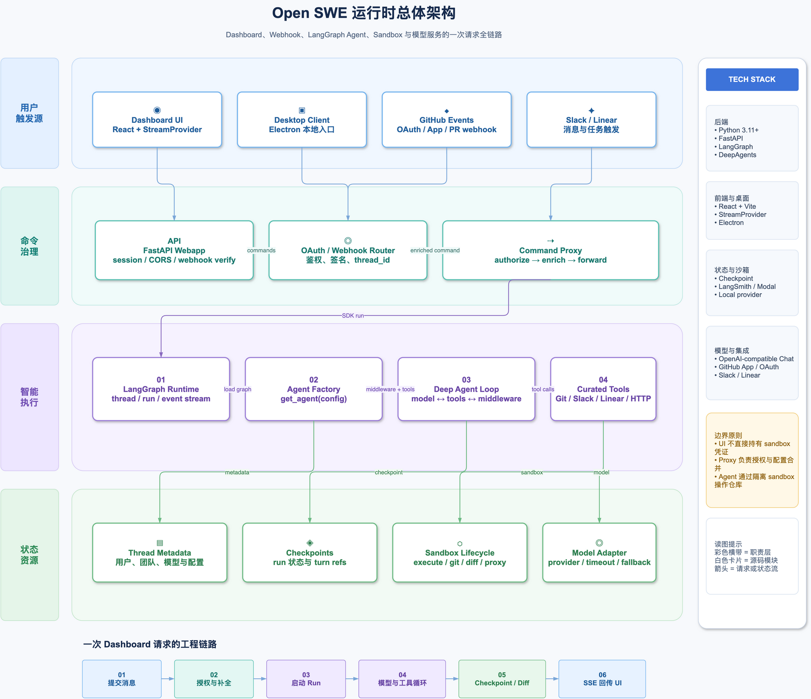

# Open SWE 架构图谱

这组图是学习 Open SWE 的“地图”，按 C4、时序和状态边界拆分。不要把它们当成部署拓扑图：图中的容器是运行职责边界，外部系统是依赖或触发源，源码映射才是最终事实。

## 高级视觉样稿

当前候选主题采用企业架构海报式编排：白底、浅色分层横带、左侧职责标签、中心源码模块卡片、右侧技术栈栏和底部请求链路。颜色只用于区分职责层，避免把所有信息堆进一张深色总览图。它尚未批量替换整套图，用于确认后续图谱的视觉方向。

[打开可交互 HTML](style-samples/11-layered-open-swe-architecture.html) · [打开可编辑 Draw.io](style-samples/11-layered-open-swe-architecture.drawio) · [打开嵌入源码的高清 PNG](style-samples/11-layered-open-swe-architecture.drawio.png)

## 可复用画图提示词

后续调用 `$drawio-skill` 时，可以直接粘贴下面这段提示词：

> 请使用“高级企业架构海报风”绘制这张技术架构图：采用白色或近白色画布，深海军蓝粗体中文标题和简洁副标题；按职责组织 4–5 条浅色横向分层带，每层左侧放纵向分类标签，中心放白色圆角源码模块卡片，卡片包含模块名、真实职责和关键源码符号；右侧放窄技术栈与运行边界栏，底部放 5–8 步真实请求或生命周期链路。用户/入口使用浅蓝，接入/控制使用青绿色，Agent/执行使用浅紫，状态/资源使用浅绿，决策或边界提示使用浅琥珀，中性外部系统使用浅灰蓝。使用少量单色线性图标，所有节点和技术名必须有源码证据；使用正交箭头、短边标签和充足留白，命令流与 SSE/事件流明确区分。禁止大面积渐变、霓虹暗黑、装饰光球、无语义云朵和过密文字。请同时生成可编辑 Draw.io 源文件、普通预览 PNG、嵌入 XML 的高清 PNG 和自包含 HTML，并运行结构校验与视觉检查；图必须嵌入对应学习章节，紧跟源码映射表、接线图和与真实控制流一致的伪代码。

## 先记住四个平面

Open SWE 不是“UI 直接调用一个 Agent 函数”。它把一次任务拆成四个互相连接、但职责不同的平面：

| 平面 | 负责什么 | 主要实现 |
| --- | --- | --- |
| 命令平面 | 接收 `run.start`、追加消息、取消和鉴权 | `agent/dashboard/routes.py`、`agent/dashboard/thread_api.py` |
| 执行平面 | 在 LangGraph Runtime 中加载图并驱动模型/工具循环 | `langgraph.json`、`agent/server.py`、`agent/reviewer.py` |
| 状态平面 | 让 thread 可恢复，让 sandbox 和 Git diff 可追踪 | LangGraph checkpoint、thread metadata、`sandbox_state.py`、`turn_checkpoint.py` |
| 集成平面 | 对接 GitHub、Slack、Linear、模型和 sandbox provider | `agent/webapp.py`、`agent/tools/`、`agent/integrations/` |

这也是为什么“命令代理”和“事件流”要分成两个 endpoint：命令平面快速确认 run 已接受，执行平面继续运行，UI 再通过 SSE 观察执行平面产生的事件。

## 一次真实调用如何穿过图

以 Dashboard 中用户第一次发送消息为例：

1. `useSubmitAgentMessage.ts` 发送 `run.start` 到 `/dashboard/api/threads/{thread_id}/commands`。
2. `routes.py` 把请求交给 `proxy_dashboard_thread_commands`；`thread_api.py` 校验当前用户，必要时创建 thread，并由 `_enrich_run_start_command` 合并用户、团队和 thread 级配置。
3. 代理调用 LangGraph SDK 的 `/threads/{id}/commands`，立即拿到 `run_id`，然后更新 `latest_run_id`。这里不会等待模型完成。
4. Runtime 加载 `traced_agent`；本次图实例进入 `get_agent(config)`，解析 GitHub token、profile/model/effort，连接或创建 thread 对应的 sandbox，装配工具和 middleware。
5. Agent 在 sandbox 中执行读写、shell、Git 操作，并在模型和工具之间循环；每个重要步骤写入 checkpoint，运行开始还会创建 `refs/open-swe/turns/{user-message-id}` 快照。
6. `AgentThreadStreamProvider.tsx` 通过 `/stream/events` 建立 SSE；代理只负责转发事件，UI 再把 message、tool、生命周期事件映射为聊天和运行状态。

因此，Dashboard 代理确实会对请求做一层“重建和权限处理”，但不会把 Agent 结果改写成另一种业务协议；它把命令交给 LangGraph，再把后续事件流透传给 UI。

## 为什么要拆成多张图

- C4 图回答“系统有哪些边界”，适合第一次建立目录结构。
- 时序图回答“调用先后顺序是什么”，适合跟读函数调用和 HTTP/SSE 分界。
- 状态图回答“数据活多久、失败后怎么办”，适合理解 thread 与 sandbox 的复用保护。
- 安全图回答“哪个凭证能到哪一层”，适合排查 OAuth、GitHub App 和 proxy 配置。
- 模块图回答“源码文件之间谁依赖谁”，适合从 `routes.py` 反查存储、配置和审查功能。

不要用一张总图同时回答这五类问题；那会把层次、时间和权限混成一团，学习时反而难以定位。

## 阅读顺序

正文入口：[第 0 章：架构地图与一次请求的全链路](../00-architecture-overview.md)。先读正文，再打开下面的可编辑图或 HTML 查看器。

1. `premium/01-c4-overview.drawio`：三页 C4 总览。先看系统上下文，再点击带下钻标记的节点进入容器视图和组件视图。
2. `premium/02-dashboard-run-sequence.drawio`：浏览器发送 `run.start` 后，Dashboard 如何重建配置并转发到 LangGraph，随后通过 SSE 回传。
3. `premium/03-webhook-sequence.drawio`：GitHub、Slack、Linear webhook 如何推导 thread_id 并进入同一条 Agent 执行链。
4. `premium/04-agent-factory-sequence.drawio`：`get_agent(config)` 一次调用中 token、sandbox、profile、model、middleware 和 tools 的装配顺序。
5. `premium/05-state-lifecycle.drawio`：Thread、Run、Checkpoint、sandbox 与 `refs/open-swe/turns/*` 的生命周期。
6. `premium/06-security-boundary.drawio`：OAuth、GitHub App installation token、sandbox GitHub proxy 和 UI 权限边界。
7. `premium/07-reviewer-analyzer.drawio`：主 Agent、Reviewer、Analyzer 三类图的职责和共享状态。
8. `premium/08-dashboard-module-map.drawio`：从 AST 导入关系生成的 Dashboard 模块地图，适合在源码阅读时反查“谁依赖谁”。
9. `premium/09-model-config-sequence.drawio`：模型选择、WawAPI Chat Completions、timeout 和 fallback 的时序。
10. `premium/10-deep-agent-assembly-sequence.drawio`：Deep Agent 工厂如何装配 backend、工具、提示词、middleware、subagent，并进入模型/工具循环。
11. `premium/11-sandbox-lifecycle-sequence.drawio`：聚焦 `ensure_sandbox_for_thread()` 的缓存命中、metadata 重连、不可达保护和 reviewer 替换例外。
12. `premium/12-dashboard-auth-stream-queue-sequence.drawio`：聚焦 OAuth state/session、线程权限、`run.start` 命令代理、`stream/events` SSE 和 busy thread Store 队列注入。
13. `premium/13-sdk-command-event-protocol-sequence.drawio`：把 `stream.submit`、命令代理、SSE channels、SDK 投影和 busy queue 放在同一条协议级时序中。
14. `premium/14-dashboard-ui-event-projection.drawio`：从 `StreamProvider` 的消息、工具、子 Agent、lifecycle 投影，追踪到 `streamMessagesToUi`、工作日志、子 Agent 卡片和运行按钮。
15. `premium/15-review-chat-sequence.drawio`：PR Chat 的命令控制面、PR 虚拟文件注入、只读 GitHub 查询和 SSE 观察面。
16. `premium/16-main-agent-loop.drawio`：从主 Agent 已取得任务开始，查看模型判断、工具执行、`ToolMessage` 回流、子 Agent 汇总和结束条件；不包含服务入口或存储链路。
17. `premium/17-deepagents-prompts-and-delegation.drawio`：主模型何时直接调用工具、何时通过 `task` 启动 general-purpose，以及子结论如何回到主模型；同时解释提示词边界。
18. `premium/18-subagent-task-coordination.drawio`：`task` 如何按名称选择子图、主 Agent 如何扇出/扇入多个独立子任务，以及子 Agent 之间没有直接调用边的原因。
19. `premium/19-multi-agent-orchestration-boundaries.drawio`：Deep Agents 的模型驱动委派与 LangGraph 的显式 router、fan-out、reducer、reviewer 和 retry 边界。
20. `premium/20-user-skills-and-composite-backend.drawio`：用户 Skill 如何进入 LangGraph Store，在新 Run 中被 `SkillsMiddleware` 发现，并经由只读 `/skills/` 虚拟目录按需读取。
21. `premium/21-middleware-learning-roadmap.drawio`：按 Run 准备、工具治理、模型可靠性三条线学习 middleware，并标出一次 Run 的循环边界。
22. `premium/22-custom-middleware-lifecycle-basics.drawio`：从 `abefore_agent` 到 `aafter_agent` 展示自定义 middleware 的 state update 与 wrapper 返回值边界。

## 文件约定

- `.drawio`：可编辑源文件。
- `png/`：不嵌入 XML 的检查预览，便于快速查看布局。
- `html/`：自包含交互查看器，可在浏览器中缩放、搜索和切换页面。
- `premium/`：已确认的高级企业架构风格版本；内部同时保留可编辑源文件、预览 PNG、嵌入 XML 的高清 PNG 和 HTML。
- `c4-overview.json`：C4 图的可重复生成输入，修改模型后运行 `c4.py` 即可重建。
- `dashboard-imports.json`：由 `pyimports.py agent/dashboard --group` 生成的导入关系输入。

## 生成与校验

生成器使用 Draw.io 31.1.5、Graphviz `dot`。每张图都运行了 `validate.py --score`：

- C4 总览：0 个节点重叠，2 条边交叉（布局工具保留的长链路交叉）。
- 业务时序图和状态图：0 个结构错误、0 个边交叉、0 个节点重叠。
- Dashboard 模块图：0 个结构错误、0 个节点重叠、1 条导入边交叉。

另外用 `graphify extract agent/dashboard --no-cluster` 做了只读 AST 交叉检查，得到 33 个 Python 文件、938 个符号节点和 2993 条结构边；结果放在 `/tmp/open-swe-graphify-dashboard`，不属于项目运行时依赖。

## C4 总览源码映射

| 图中区域 | 主要源码 | 关键符号 |
| --- | --- | --- |
| Dashboard API | `agent/dashboard/routes.py` | `/threads/{id}/commands`, `/stream/events` |
| 命令代理 | `agent/dashboard/thread_api.py` | `_enrich_run_start_command`, `proxy_dashboard_thread_commands` |
| FastAPI / Webhook | `agent/webapp.py`、`agent/utils/{github_comments,slack,linear}.py` | webhook handler、deterministic thread_id |
| 主 Agent 工厂 | `agent/server.py` | `get_agent`, `PrepareAgentRunMiddleware` |
| 模型 | `agent/utils/model.py` | `make_model`, `provider_model_kwargs` |
| 沙箱 | `agent/utils/sandbox_state.py`、`agent/utils/sandbox.py` | `ensure_sandbox_for_thread`, `SANDBOX_BACKENDS` |
| 图入口 | `langgraph.json`、`agent/graphs/*.py` | `traced_agent`, `traced_reviewer_agent`, `traced_analyzer` |
| UI 流 | `ui/src/features/agents/lib/AgentThreadStreamProvider.tsx` | `StreamProvider` |

## 当前明确的学习缺口

第 10 章已经完成 LangGraph SDK command schema、SSE channel/event schema 和 `StreamProvider` 的协议级源码分析。后续 UI 章节继续追踪组件交互、子 Agent namespace、interrupt 卡片和更细的事件兼容分支。
