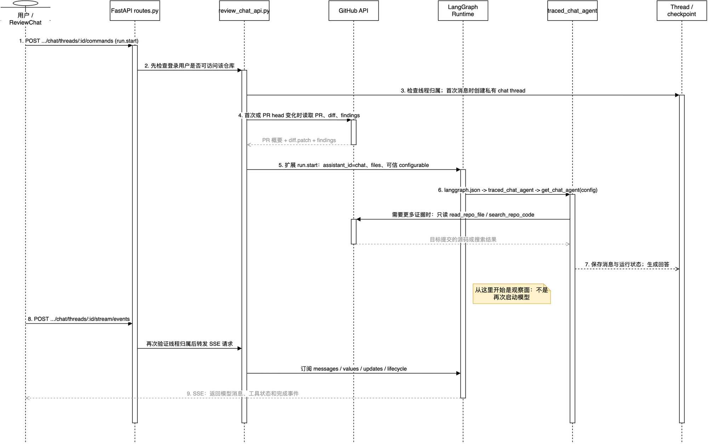

# `traced_chat_agent` 通俗讲解

## 一句话定位

`traced_chat_agent` 是 Review 页面里的“和这个 PR 聊聊”助手。

它只回答**某一个 Pull Request**相关的问题，例如：这次改动做了什么、Reviewer 为什么报这个问题、这段 diff 周围的代码会受什么影响，以及应怎样修改某条 finding。

它不是主 Agent 的简化版，更不会替你改代码。可以把它理解成一位拿着 PR diff、评审结论和仓库只读地图的讲解员。

```text
主 Agent：接任务，进 sandbox 改代码、跑命令、开 PR
Reviewer：检查一个 PR，产出 findings
PR Chat：解释一个 PR 和已有 findings，不能改任何东西
```

## 它在哪里注册

[`langgraph.json`](../langgraph.json) 注册了名为 `chat` 的 LangGraph 图：

```json
"chat": "agent.graphs.chat:traced_chat_agent"
```

[`agent/graphs/chat.py`](../agent/graphs/chat.py) 只是稳定的导出层。真正实现位于 [`agent/chat.py`](../agent/chat.py)：

```python
traced_chat_agent = traced_graph_factory(get_chat_agent, AGENT_TRACING_PROJECT)
```

拆开看就是：

```text
traced_chat_agent
  -> get_chat_agent(config) 组装 PR 问答 Agent
  -> traced_graph_factory(...) 给本次运行套 LangSmith 追踪上下文
  -> LangGraph Runtime 执行这张 Deep Agents 生成的图
```

这里的 `traced` **不是说它用来分析 trace**。它只表示运行记录会写入 LangSmith 的 `open-swe-agent` 项目，便于观察调用耗时、模型请求和工具调用。真正决定“能问什么、能做什么”的是 `get_chat_agent()`。

## 它与其他三个 Agent 的边界

| 角色 | 面向什么对象 | 主要产物 | 是否有 sandbox | 能否改代码 |
| --- | --- | --- | --- | --- |
| 主 Agent | 用户的开发任务 | 代码、测试、PR、回复 | 有 | 能 |
| Reviewer | 一个待审 PR | finding、GitHub review | 有，供只读 checkout 使用 | 不能 |
| Analyzer | 一个仓库的历史评审习惯 | Reviewer 风格提示词 | 有，供历史查询使用 | 不能 |
| `traced_chat_agent` | 一个已完成评审的 PR | 对话式解释 | **没有** | **不能** |

最关键的差异是：PR Chat 不需要克隆仓库和运行命令。它只需读取 PR 资料，必要时通过 GitHub API 补查源码。因此项目刻意不为它创建 sandbox，少一层资源，也少一层误操作风险。

## 先看完整链路



可编辑源文件：[`15-review-chat-sequence.drawio`](open-swe-learning/architecture/premium/15-review-chat-sequence.drawio)。离线缩放、搜索版本：[`15-review-chat-sequence.html`](open-swe-learning/architecture/premium/html/15-review-chat-sequence.html)。

读图时从上到下看：

- 实线箭头是**命令面**，即“请创建/执行这一轮 PR 问答”。
- 虚线箭头是**返回或事件面**，即“把资料、回答和运行状态传回来”。
- 第 8、9 步是 SSE 观察面。它不会再次运行 Agent，只是订阅已经启动的那次 Run 的输出。

| 图中模块 | 实际源码 | 它在图中的工作 |
| --- | --- | --- |
| `ReviewChat` | `ui/src/features/reviews/components/ReviewChat.tsx` | 维护 PR 下的聊天标签页，用 `StreamProvider` 发送消息、显示流式回答。 |
| FastAPI routes | `agent/dashboard/routes.py` | 验证 Dashboard 登录会话和仓库访问权限，再调用 PR Chat 代理。 |
| Chat proxy | `agent/dashboard/review_chat_api.py` | 创建私有 thread、注入可信配置和 PR 虚拟文件、转发 command/SSE。 |
| Chat graph | `agent/chat.py:get_chat_agent` | 选择模型、限制工具、装配只读 Deep Agent。 |
| LangGraph Runtime | `langgraph.json` | 根据 `assistant_id="chat"` 找到图，维护 Run、消息状态和事件流。 |

## 第一段：前端不是直接调用 Agent

用户打开一个 PR 页面后，前端组件 [`ReviewChat.tsx`](../ui/src/features/reviews/components/ReviewChat.tsx) 先请求：

```text
GET /dashboard/api/reviews/{owner}/{repo}/{number}/chat
```

后端会确认该 PR 是否已有 canonical Reviewer thread；没有该线程时，页面不开放对话。前端在这种情况下提示“评审完成后才能聊天”。

用户发送问题时，`@langchain/react` 的 `StreamProvider` 发出的不是“调用 Python 函数”的请求，而是一条 LangGraph 协议命令：

```text
POST /dashboard/api/reviews/{owner}/{repo}/{pr}/chat/threads/{thread_id}/commands
body: run.start + 用户消息
```

这里的 `thread_id` 是浏览器为每个聊天标签页生成的 UUID。首次发送前它只是前端的草稿 id；后端收到 `run.start` 才懒创建真正的 LangGraph thread。

这样一个用户可以在同一 PR 下保留多段不同主题的对话，例如一段问整体设计，另一段专门追问某条 finding。不同用户则不能读取彼此的对话。

## 第二段：Dashboard 先做权限和上下文准备

真正的核心不在前端，而在 [`agent/dashboard/review_chat_api.py`](../agent/dashboard/review_chat_api.py) 的 `proxy_review_chat_commands()` 和 `_enrich_chat_command()`。

它先检查两层权限：

1. `routes.py` 用当前登录 session 调用 `require_repo_access_for_user()`，确认用户能访问这个仓库。
2. `assert_chat_thread_access()` 再确认客户端传来的 `thread_id` 的确属于这个用户、这个仓库、这个 PR，而且 `kind` 必须是 `review_chat`。

第二层很重要。浏览器提供的 thread id 不能被无条件相信，否则只要猜中别人的 id 就可能读到别人的 PR 对话。

然后代理把浏览器传来的内容补成可信的 `configurable`：

```text
thread_id
github_login
chat_repo_owner / chat_repo_name / chat_pr_number
reviewer_thread_id
chat_model_id / chat_effort（仅在合法时保留）
```

前端不能自行指定 GitHub Token、任意仓库或任意 Reviewer thread。这些关键信息都由服务端根据 URL 和登录会话重新计算。

## 第三段：PR 资料为什么看起来像文件

首次聊天，或者 PR 的最新提交 SHA 变化后，代理会从 GitHub/Reviewer 数据中整理三份资料：

| 虚拟文件 | 内容 | 用途 |
| --- | --- | --- |
| `/pr/overview.md` | 标题、描述、作者、分支、提交 SHA、改动统计 | 让 Agent 知道讨论的是哪一个 PR。 |
| `/pr/diff.patch` | 当前 PR 的 unified diff，最多 400,000 字符 | 让 Agent 直接定位本次修改。 |
| `/pr/findings.md` | 已发布的 finding、严重级别、位置、建议、处理状态 | 让回答基于真实评审结论，而不是凭空再造问题。 |

这些内容被放进本轮输入的 `files` state channel，不是在服务器磁盘真的创建 `/pr/` 目录。Deep Agents 的内置 `read_file`、`ls`、`glob` 和 `grep` 因此仍能像读文件一样使用它们。

```text
Dashboard 取 PR / diff / findings
       -> run.start.input.files
       -> LangGraph thread 状态
       -> Deep Agents 的虚拟文件系统
       -> read_file("/pr/diff.patch")
```

服务端会在 thread metadata 保存 `chat_head_sha`。后续提问前只做一次轻量 PR 查询：SHA 没变就复用已有资料；变了才重新抓完整 diff 和 findings，防止它继续按旧版本 PR 回答。

如果老对话重抓资料临时失败，且原来已有资料，代码会保留上次成功注入的上下文继续回答；但全新的对话没有任何旧资料可用，则会返回错误。这是在“尽量不中断已有聊天”和“不把空上下文伪装成正确答案”之间的取舍。

## 第四段：`get_chat_agent()` 实际装配了什么

[`agent/chat.py`](../agent/chat.py) 中的 `get_chat_agent(config)` 每次运行会新装配一张图：

```python
return create_deep_agent(
    model=...,
    tools=[...],
    subagents=[_chat_general_purpose_subagent()],
    middleware=[...],
).with_config(config)
```

所以它和主 Agent 一样，底层仍然是：

```text
LangChain：模型、工具和 middleware 的基础接口
      -> Deep Agents：create_deep_agent() 组装循环、文件工具和子 Agent
      -> LangGraph：把结果作为可运行、可持久化、可流式的图执行
```

项目没有直接调用 LangChain 的 `create_agent()`；使用的是更适合带文件上下文和子 Agent 的 `create_deep_agent()`。它最终生成的是 LangGraph 的编译图，而不是一个简单的聊天函数。

如果运行时只是加载图的元信息，缺少 `thread_id` 或 `configurable["__is_for_execution__"]`，`get_chat_agent()` 会返回一个空的 Deep Agent，避免在启动/探测阶段申请 Token 或创建完整模型。真正执行 Run 时这个标记由 Runtime 传入，才开始完整装配。

### 模型怎样选择

模型优先级比较简单：

```text
本次聊天显式传入、且服务端验证过的 chat_model_id + chat_effort
  -> 团队的 review-chat 默认模型
  -> 团队主 Agent 默认模型
```

`get_team_default_model("chat")` 明确规定：没有单独配置 Chat 模型时，继承 Agent 默认模型。`PrepareChatRunMiddleware` 会在每轮运行前把最终仓库信息写进 system prompt，并申请一个仅限该仓库的 GitHub App installation token。

## 第五段：它能读什么，不能做什么

### 1. 允许的能力

| 能力 | 工具 | 通俗解释 |
| --- | --- | --- |
| 阅读 PR 上下文 | Deep Agents 内置 `read_file`、`ls`、`glob`、`grep` | 读前面注入的 `/pr/` 三份虚拟文件。 |
| 阅读某个提交的源码 | `read_repo_file(path, ref)` | 经 GitHub Contents API 读文件或目录；默认读取 PR 的 head SHA。 |
| 在仓库中找符号 | `search_repo_code(query)` | 经 GitHub code search 查定义/引用，再配合读文件确认。该搜索按 GitHub 默认分支索引，不保证覆盖任意 PR head。 |
| 获取最新 finding | `list_review_findings(status_filter)` | 从该 PR 的 canonical Reviewer thread 获取 open/resolved/dismissed finding。 |
| 查询外部资料 | `web_search`、`fetch_url` | 辅助核对公开文档或标准。 |
| 拆分只读调查 | `task` 子 Agent | 子 Agent 同样只保留文件读取工具和模型超时保护。 |

### 2. 明确禁止的能力

`create_deep_agent()` 原本会给 Agent 注入文件系统和子 Agent 工具。PR Chat 额外使用 `ExcludeToolsMiddleware`，在模型看到工具前移除：

```text
execute
write_file
edit_file
delete
```

同时 `_chat_general_purpose_subagent()` 显式只给子 Agent 开放 `read_file`、`ls`、`glob`、`grep`。因此“主 Agent 的子 Agent 不能改”这条限制不会被 `task` 绕过去。

这就是为什么 system prompt 直接写明：不能运行测试、不能执行命令、不能提交、不能开 PR。它可以提出精确的修改建议，但只能由人或主 Agent 去实施。

## 第六段：中间件在保护什么

PR Chat 使用的中间件比主 Agent 短，但每个仍有明确作用：

| 中间件 | 作用 |
| --- | --- |
| `PrepareChatRunMiddleware` | 为当前 PR 渲染系统提示词，获取仓库范围 GitHub App Token。 |
| `SanitizeToolInputsMiddleware` | 规范化工具输入，减少模型拼错参数导致的异常。 |
| `ModelCallLimitMiddleware(run_limit=100)` | 最多允许 100 次模型调用，到上限时结束，防止无限循环。 |
| `ToolErrorMiddleware` | 把工具失败转成 Agent 可见的结果，而不是让整轮聊天直接崩掉。 |
| `ExcludeToolsMiddleware` | 从模型可见工具列表剔除写入/执行工具。 |
| `SanitizeFireworksMessagesMiddleware` / `SanitizeThinkingBlocksMiddleware` | 修正特定模型提供商不能接受的消息格式。 |
| `ModelCallTimeoutMiddleware` | 单次模型调用卡住时超时失败，而不是让页面一直转圈。 |

注意：`CHAT_MODEL_CALL_LIMIT = 100` 是“模型可调用的次数上限”，不是“用户一次最多问 100 个问题”。正常问一个 PR 问题通常远到不了这个上限。

## 第七段：回答怎样回到浏览器

启动 Run 的 command 返回后，`StreamProvider` 会再建立：

```text
POST /dashboard/api/reviews/{owner}/{repo}/{pr}/chat/threads/{thread_id}/stream/events
```

对应的 `proxy_review_chat_stream_events()` 仍会检查 chat thread 归属，然后把请求透明转发给 LangGraph Runtime。Runtime 以 SSE 持续发送消息、状态和工具执行事件；前端把它们投影成聊天气泡和 “Thinking...” 状态。

因此要分清：

```text
commands：控制面，负责开始 run.start
stream/events：观察面，负责观看同一个 Run 的增量输出
state / history：恢复某个已有聊天标签页的内容
```

未发送第一条消息时，LangGraph 里还没有对应 thread。`state` 和 `history` 接口把此时的 404 转成空状态/空数组，使前端把它当成一个正常的新聊天标签页，而不是报错。

## 一次提问的伪代码

下面省略框架细节，只保留真实数据方向：

```python
# 浏览器
send_run_start(thread_id, human_question)
open_sse_stream(thread_id)

# Dashboard proxy
assert_user_can_access_repo(login, owner_repo)
assert_thread_belongs_to_this_user_and_pr(thread_id, login, owner_repo, pr)

if first_message or pr_head_changed:
    files = {
        "/pr/overview.md": load_overview(),
        "/pr/diff.patch": load_diff(),
        "/pr/findings.md": load_published_findings(),
    }
    store_chat_head_sha(thread_id)

start_langgraph_run(
    assistant_id="chat",
    files=files,
    configurable=trusted_pr_context,
)

# traced_chat_agent
chat_graph = get_chat_agent(config)
answer = chat_graph.run(question)
# 它只能读 /pr 虚拟文件和 GitHub API，不能执行或写入。

# Runtime -> 浏览器
stream_sse(answer_chunks, tool_status, completion)
```

## 常见误解

### 误解 1：它是 Reviewer 的聊天模式，会重新审查 PR

不是。它会读取现有 findings，并且 prompt 要求围绕真实 finding 作答；它的主要职责是解释和帮助调查。它可能从 diff 发现风险并提出建议，但不会调用 `add_finding`、`publish_review` 或修改 GitHub review。

### 误解 2：没有 sandbox 就不能看仓库源码

不对。Diff 已经作为虚拟文件注入。需要看 diff 之外的调用方或定义时，它使用 `read_repo_file()` 和 `search_repo_code()` 调 GitHub API。代价是它不能运行测试，也不能像本地 `rg` 那样随意在任意 checkout 搜索。

### 误解 3：PR 更新后，旧聊天必然回答旧 diff

不对。每次新的 `run.start` 会轻量检查 PR head SHA。若 SHA 改了就重新注入三份 PR 上下文；若检查或重抓临时失败，已有聊天宁可继续用最后一次成功的上下文，也不会把空资料当新资料。

### 误解 4：聊天 thread 公开复用了 Reviewer thread

不对。Reviewer thread 是一个 PR 的 canonical 评审记录；PR Chat 则是“每个用户、每段对话”各自独立的 `review_chat` thread。Chat 只保存 `reviewer_thread_id` 来读取该 PR 的 findings。

## 源码与测试证据

| 主题 | 关键源码/测试 |
| --- | --- |
| 图注册和 tracing 包装 | [`langgraph.json`](../langgraph.json)、[`agent/chat.py`](../agent/chat.py)、[`agent/utils/tracing.py`](../agent/utils/tracing.py) |
| 私有线程、上下文注入、SSE 代理 | [`agent/dashboard/review_chat_api.py`](../agent/dashboard/review_chat_api.py)、[`agent/dashboard/routes.py`](../agent/dashboard/routes.py) |
| 前端对话入口 | [`ui/src/features/reviews/components/ReviewChat.tsx`](../ui/src/features/reviews/components/ReviewChat.tsx) |
| GitHub 只读工具 | [`agent/tools/read_repo_file.py`](../agent/tools/read_repo_file.py)、[`agent/tools/search_repo_code.py`](../agent/tools/search_repo_code.py)、[`agent/tools/list_review_findings.py`](../agent/tools/list_review_findings.py) |
| 权限、重抓、虚拟文件和工具行为 | [`tests/reviewer/test_review_chat.py`](../tests/reviewer/test_review_chat.py) |
| 图装配时不改调用方配置 | [`tests/reviewer/test_factory_config_isolation.py`](../tests/reviewer/test_factory_config_isolation.py) |

## 验证边界

本说明已按当前源码完成静态核对：图入口、上下文注入、工具白名单、线程归属检查和前端 `StreamProvider` 的调用关系均有源码或单测位置可追溯。

本次没有启动 LangGraph 开发服务，也没有调用真实 GitHub、模型或 LangSmith。因此它不宣称验证了真实 Token、远端 SSE 重连或模型回答质量；这些需要可用的外部配置后再做端到端验证。
