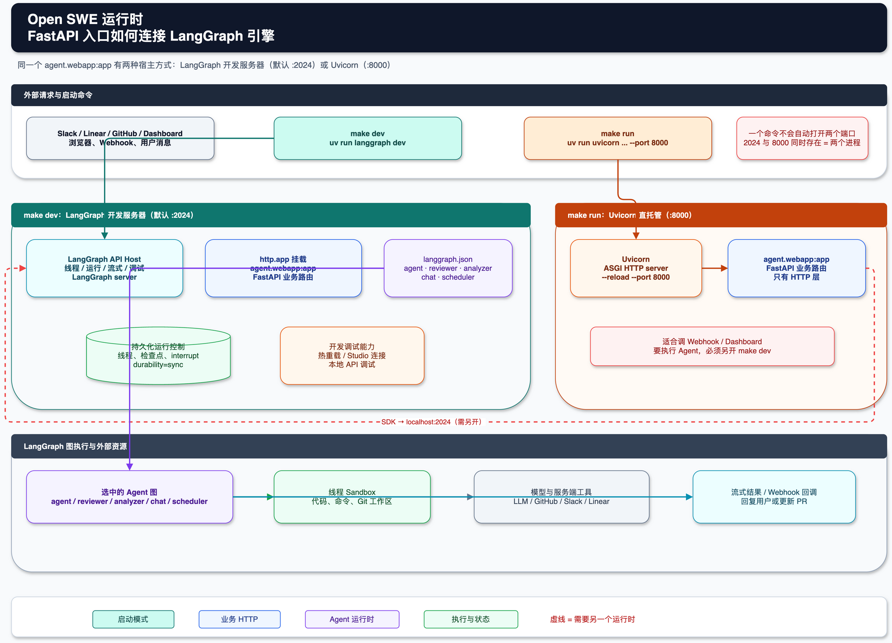

# 开发、部署、测试与评审评估

## 本地运行时

仓库使用 Python 3.11+、`uv`、带异步模式的 pytest 和 Ruff。根目录 `Makefile` 提供基线命令：

```bash
make install              # uv sync
make dev                  # uv run langgraph dev
make run                  # 仅 FastAPI，端口 8000
make lint                 # Ruff 检查 + 格式化差异
make format-check         # 格式检查
make test                 # pytest -vvv tests/
```

日常 Agent/仪表盘开发使用 `make dev`：它会提供 `langgraph.json` 中声明的图和 FastAPI 应用。`make run` 仅处理 HTTP，不提供正常 Agent 执行所需的 LangGraph 运行时。[运行时架构](runtime-architecture-zh.md)解释了 `make dev` 暴露的单元。

UI 在 `ui/package.json` 中有独立的 `pnpm` 脚本：`dev`、`build`、`test`（Vitest）、`lint` 和 `typecheck`。现有安装指南记录了本地 UI/API 基础 URL 与 CORS 设置；不要把真实提供商值写入文档或测试。

## `make dev` 与 `make run` 的功能分工

两者都提供 HTTP 服务，但负责的层次不同：FastAPI 是项目自己的业务接口；LangGraph 运行时负责加载图并管理 Agent 的执行过程。LangGraph 服务内部也使用 Web/ASGI 服务机制，但它不是 `agent.webapp:app` 这个业务 FastAPI 应用的替代品。

### FastAPI 业务应用

`agent.webapp:app`（实际由 `agent/api/app.py` 组装）负责：

- 仪表盘 API、用户会话、管理员操作和工作区设置；
- GitHub、Slack、Linear Webhook 接收与校验；
- 计划审批、工作流文件审批和健康检查；
- CORS、启动配置校验，以及关闭时释放缓存模型。

直接运行它的命令是：

```bash
uv run uvicorn agent.webapp:app --reload --port 8000
```

这就是 `make run`。它适合单独调试 HTTP 路由，但 Webhook 触发 Agent 时，仍需要另一个 LangGraph 服务（默认 `http://localhost:2024`）来执行图。

### LangGraph 运行时

`uv run langgraph dev` 负责：

- 读取 `langgraph.json`，注册 `agent`、`reviewer`、`analyzer`、`chat` 和 `scheduler`；
- 提供线程、运行、流式输出、暂停/恢复和检查点等标准 Agent API；
- 根据 `assistant_id` 选择要执行的图；
- 调用沙箱、模型和外部集成，保存每个线程的执行状态；
- 按配置把 `agent.webapp:app` 作为 `http.app` 挂载到开发服务中。

这就是 `make dev`。它是正常开发所需的完整入口，因此通常不需要再单独运行 `make run`。只有在需要把业务 FastAPI 单独放到 `8000` 调试时，才同时启动两个进程：`make dev` 提供 `2024`，`make run` 提供 `8000`。



图中的调用顺序是：外部请求进入 FastAPI；FastAPI 通过 `dispatch_agent_run` 使用 LangGraph SDK 请求 `localhost:2024`；LangGraph 运行时选择具体 Agent 图，管理检查点，并在沙箱中执行代码和工具。可编辑的图源文件见 [`langgraph-fastapi-runtime.drawio`](langgraph-fastapi-runtime.drawio)。

## 测试分层

| 层级 | 证据与目的 | 常用命令 |
|---|---|---|
| Python 测试 | `tests/` 按 Agent、仪表盘、认证、GitHub、Slack、评审器、沙箱、工具、中间件和 Webhook 组织。 | `make test` 或 `uv run pytest -vvv tests/reviewer/...` |
| UI 测试 | Vitest 测试位于 UI 工具/组件附近。 | `cd ui && pnpm run test` |
| UI 静态检查 | TypeScript、ESLint 和 Vite 构建验证客户端集成。 | `cd ui && pnpm run typecheck && pnpm run lint && pnpm run build` |
| E2E | Playwright 驱动真实运行时和构建后的仪表盘，围绕虚假的外部 SaaS/LLM 边界运行。 | `cd tests/e2e && npm install && npx playwright install chromium && npx playwright test` |
| 评审质量 | LangSmith 基准将已发布的评审发现与冻结的参考数据集比较。 | `uv run python -m evals.reviewer.run_eval --limit 3` |

E2E 工具的信号刻意保持较高：它运行真实 Webhook、Agent 图、工具、中间件、本地临时沙箱和本地 Git；只有 LLM 及外部 GitHub/Slack HTTP 边界是伪造的。它还会构建真实仪表盘并使用真实签名的会话 Cookie，从而验证[工作流](workflows-zh.md)和[仪表盘](dashboard-zh.md)中描述的跨领域行为。

## 持续集成与发布

`.github/workflows/ci.yml` 在 Pull Request、推送到 `main` 和手动触发时运行。它安装锁定依赖，依次运行 Lint、格式检查、单元测试和 Playwright E2E，并上传失败报告/追踪。修改共享流程前先运行最接近的等价检查。

其他仓库自动化包括语义化 PR 标题检查、针对部署的手动评审器评估、从 `main` 到 `prod` 的定时/手动推广，以及定时 OpenWiki 更新工作流。OpenWiki 工作流会创建文档 PR，并包含 `openwiki`、`AGENTS.md`、`CLAUDE.md` 及其工作流文件；生成页面应继续放在 `openwiki/` 下。

## 评审器评估

`evals/reviewer/` 实现基于 LangSmith 的离线评估，使用 `withmartian/code-review-benchmark` 中的 50 个 PR 和 136 条参考发现。`run_eval.py` 驱动评审图，裁判为最终呈现/发布的发现打分。冒烟运行：

```bash
uv run python -m evals.reviewer.run_eval --limit 3
```

完整运行通常通过 `.github/workflows/reviewer_eval.yml` 针对已部署评审器触发。它会把实时状态报告到仪表盘的“管理员 → 评审器评估”页面。评估运行会标记自身，因此评审发布不会向 GitHub 发帖。由于评审风格提示词也会影响评估，验证风格分析变更时必须结合[工作流](workflows-zh.md)考虑。

## 沙箱与运维资源

`Dockerfile` 定义基础沙箱镜像：Python、Git/GitHub CLI、Docker CLI、`uv`、Node/Yarn、Socket `sfw`、供本地 Stagehand 使用的 Chromium、Go、Rust 和构建工具。该镜像用于任务执行，不是应用服务器的部署定义。

脚本包括沙箱快照创建/列出、PR 合并状态检查，以及清理过期的一次性唤醒 cron 记录（`scripts/purge_wakeup_crons.py`）。提供商和凭据配置有意留给 `docs/INSTALLATION.md` 与[集成与安全](integrations-security-zh.md)，其中会描述安全边界而不暴露具体值。

## 变更清单

- **后端行为：**运行针对性的 pytest 模块，以及 `make lint`、`make format-check` 和相关端到端或 Webhook 路径。
- **UI/API 工作：**运行 UI 类型/Lint/构建/测试和针对性的仪表盘测试；流式、会话或线程行为改变时考虑 Playwright。
- **评审变更：**运行评审器测试；影响发现质量、发布或风格上下文的变更使用基准冒烟运行。
- **沙箱/集成变更：**在 `tests/sandbox/` 或 `tests/tools/` 下测试启动/配置校验和失败/恢复场景；复查[集成与安全](integrations-security-zh.md)中的边界要求。
